# Hybrid Learning and Training Effectiveness at Union Bank of India

## Second Thesis Draft — Chapters 1 to 5

This source file supports the editable Word manuscript and review PDF. It contains all five chapters, the consolidated references, and two appendices. Chapters 1–3 carry the same content as the approved first draft, with Chapter 3 updated to report the completed data collection (105 eligible responses) in place of the earlier pre-collection target language. Chapters 4 and 5 report the completed analysis. Summary figures (construct means, demographic charts, the correlation matrix) remain in Chapter 4; the 26 individual item-level response charts and their frequency tables are placed in Appendix B to keep the chapter to a readable length.

---

# Chapter 1 — Introduction

## 1.1 Background and Context

Training is an everyday requirement in banking, not an occasional activity outside normal work. Employees may need to understand revised procedures, digital systems, products, compliance requirements, risk controls, and customer-service practices while continuing to manage their regular responsibilities. For this reason, a training programme is useful only when employees can access the material, understand why it matters, participate in the learning process, and apply relevant learning in their work.

Digital learning has made it easier for organisations to provide common learning material across locations. Through a digital platform, employees may receive modules, reading material, short videos, virtual sessions, assessments, and job aids without having to attend every activity in one physical location. This can be particularly useful when work schedules, travel, and the need to maintain customer service make conventional attendance difficult. At the same time, digital access alone does not ensure that learning has taken place. An employee may complete a module without understanding a new procedure, may be unable to locate material when it is needed, or may require a trainer to explain how a policy applies in an actual work situation.

Face-to-face learning continues to serve a different but equally important purpose. A trainer-led session can give employees an opportunity to ask questions, discuss a case, observe a demonstration, practise a task, receive feedback, and learn from colleagues facing similar work situations. This does not mean that every topic needs classroom delivery. Basic information, short assessments, refresher material, and reference resources may be well suited to a digital platform. The practical issue is whether the digital and face-to-face activities are connected in a way that helps employees move from information to understanding and then to use at work.

Hybrid learning, also called blended learning, is the planned combination of digital and face-to-face learning within one programme. It is not simply a programme that happens to contain both an online activity and a classroom session. A meaningful hybrid programme gives each activity a clear role. Digital material may prepare an employee before a session or remain available for revision later. A trainer-led session may then focus on clarification, practice, discussion, and work-related application. When the two parts are disconnected, training can feel like a set of separate requirements. When they are connected, employees can see why they are completing each activity and how it supports their work.

The present study is situated at Union Bank of India, with data collection among eligible employees connected with Regional Office Chennai South in Royapettah, Chennai. Union Bank's annual reports describe a learning and development system that includes Union Vidya, the Bank's Learning Management System (LMS), along with e-books, podcasts and audiobooks, microlearning resources, virtual workshops, role-based learning, mandatory e-learning modules for officers, and a Training Management System (Union Bank of India, 2024, 2025). These arrangements show that the Bank has both digital-learning resources and trainer-led learning activity. They do not show that every programme is hybrid or that every employee has the same experience. The study therefore asks employees to consider one recent programme in which both digital and face-to-face learning were used.

The study examines four constructs. **Hybrid Learning** refers to the employee's experience of how the digital and face-to-face parts of the programme were connected, including platform access, availability of material, and opportunities to revisit learning. **Trainer Competence** refers to the trainer's knowledge, clarity, ability to connect activities across modes, use of relevant digital tools, encouragement of participation, and feedback. **Learner Engagement** refers to the employee's attention, effort, interest, participation, and willingness to seek clarification. **Training Effectiveness** refers to the employee's perception that the programme produced useful, understandable, relevant, and applicable learning for the current role.

The proposed framework is:

    Hybrid Learning ─┐
                     ├──→ Learner Engagement ───→ Training Effectiveness
    Trainer Competence ┘

The framework is intended to examine reported relationships, not to prove a causal sequence. It asks whether employees who report a more positive experience of Hybrid Learning and Trainer Competence also report higher Learner Engagement, and whether employees who report higher Learner Engagement also report higher Training Effectiveness. Employee perception is important because employees are the people who use the platform, attend sessions, interact with trainers, and decide whether learning is useful in their work. However, these responses are not treated as a substitute for examination scores, supervisor ratings, system records, customer information, or organisation-level performance data.

Three complementary base papers provide the academic foundation for the study. Sosnova et al. (2025) provide the guide-suggested conceptual anchor by examining hybrid education methods and learning effectiveness in higher education. Kim (2022) provides corporate evidence from automotive sales training and shows why training delivery, instructor involvement, practice, and design should be evaluated rather than assumed to be effective. Bahl, Kiran and Sharma (2024) provide the Indian banking anchor through an open-access study of 402 managerial and non-managerial bank employees using Kirkpatrick's Reaction, Learning, Behaviour, and Results framework. None of these papers reproduces the present Union Bank model. Together, they provide a justified conceptual, corporate, and banking basis for examining employee training effectiveness.

The topic is relevant to human-resource management because training design affects the employee's experience of learning. If the digital and face-to-face parts are poorly connected, employees may see training as an additional task alongside their work. If a trainer cannot explain the purpose of an activity or respond to questions, employees may find it difficult to participate fully. In contrast, when learning activities are accessible, connected, and supported, employees may be better placed to understand and apply relevant knowledge. The study therefore focuses on practical conditions that can help the Bank design training that supports both employee capability and the continuity of work.

## 1.2 Key Concepts and Definitions

### Hybrid Learning

Hybrid Learning is the purposeful combination of digital and face-to-face learning within one training programme. The two modes are designed to support each other rather than operate as separate alternatives. In a banking programme, the digital component may include an LMS module, video, online assessment, virtual session, downloadable reference material, or short refresher. The face-to-face component may include a classroom session, demonstration, case discussion, role play, group exercise, or supervised practice.

In this study, Hybrid Learning is measured through the employee's view of whether the two modes formed one connected programme, whether the digital platform and learning material were accessible, and whether digital material could be revisited when revision was needed. The study does not evaluate Union Vidya as a technology product, prescribe one fixed balance between digital and face-to-face learning, or compare online-only and classroom-only programmes.

### Trainer Competence

Trainer Competence refers to the ability of a trainer to support employee learning. It includes subject knowledge, clear explanation, effective use of relevant digital tools, the ability to connect digital and face-to-face activities, encouragement of participation, and useful feedback. These abilities matter in a hybrid programme because employees may need help in understanding why an online activity comes before a session, how a task will be discussed later, or how a new process applies in their own role.

Trainer Competence is treated separately from Hybrid Learning. A platform may be accessible, yet an employee may still need clear guidance and feedback. Similarly, a competent trainer may face limitations if learning material is difficult to access. Keeping the two constructs separate allows the study to examine the distinct relationships of programme design and trainer support with Learner Engagement.

### Learner Engagement

Learner Engagement is the employee's active involvement in the selected programme. It includes attention, effort to understand the content, participation in activities, interest in completing the programme, and willingness to seek clarification. Engagement is more than attendance or recorded completion. An employee may be physically present in a session or logged into a platform without concentrating on the content. An engaged employee makes an effort to understand, participates in discussion or practice, and asks questions when necessary.

The study measures engagement as the employee's reported learning behaviour during one selected hybrid-training programme. It does not measure general work engagement, organisational commitment, motivation, or metacognitive skill as separate variables.

### Training Effectiveness

Training Effectiveness is the extent to which employees believe that a programme produced useful learning for their current work. It includes understanding the knowledge or skill taught, seeing its relevance to the role, feeling capable of using it, applying it in day-to-day tasks, handling related problems more effectively, and gaining confidence in relevant responsibilities.

This definition is informed by training-evaluation and training-transfer literature. It moves beyond immediate satisfaction, but it remains within the limits of employee self-report. The present study does not measure the Bank's overall productivity, customer satisfaction, reputation, financial performance, or objective change in individual performance.

### Learning Management System

A Learning Management System, or LMS, is a digital system that helps an organisation organise, deliver, monitor, or support learning. It may host modules, reading material, videos, quizzes, virtual sessions, announcements, and learning records. Union Bank identifies Union Vidya as its LMS and places it within a wider learning and development system that includes e-learning, virtual training, staggered programmes, and role-based learning (Union Bank of India, 2024, 2025).

In the present study, Union Vidya is part of the Hybrid Learning context, not a separate construct. The questionnaire refers to the digital platform used for the selected programme and names Union Vidya as an example. This avoids assuming that every programme uses the same system or that all employees encounter the same platform features.

## 1.3 Need, Scope and Significance of the Study

### Need for the Study

The study addresses a practical question: when employees attend a programme that combines digital and face-to-face learning, how are the quality of the programme and the competence of the trainer related to their engagement and their perception of training effectiveness? This question matters because employees may be expected to learn while also managing regular work, responding to customers, following procedures, and keeping pace with digital change. Training that is difficult to access or poorly connected may increase the burden on employees rather than support them.

Research supports the importance of examining this issue, but a context gap remains. Much blended-learning research has been conducted with students. Those studies are helpful for understanding how learning environments can be designed, yet employees in banks learn under different conditions. They may need to balance learning with operational schedules, customer responsibilities, compliance work, and changing systems. Corporate evidence is available, but verified evidence on the combined relationships of Hybrid Learning, Trainer Competence, Learner Engagement, and Training Effectiveness among employees of an Indian public-sector bank remains limited.

Union Bank provides a suitable context because it has a documented digital-learning system and a broader training infrastructure. Public reporting confirms the availability of digital and trainer-led learning arrangements. It does not show how employees experience a particular programme. The present study focuses on this narrower employee-level question rather than making assumptions about the effectiveness of the complete training system.

### Scope of the Study

The study is limited to eligible employees connected with Union Bank of India Regional Office Chennai South who have attended at least one programme during the previous 12 months that included both digital and face-to-face learning. Respondents answer with reference to one recent programme. Employees who have attended only a digital programme or only a face-to-face programme are not eligible because they cannot comment meaningfully on the connection between the two learning modes.

The research examines Hybrid Learning, Trainer Competence, Learner Engagement, and Training Effectiveness. It does not treat knowledge retention, job performance, organisation-level results, supervisor support, employee agility, digital literacy, or the technical performance of Union Vidya as separate variables. These areas may matter for training generally, but including all of them would make the survey and analysis too broad for the proposed sample.

The study uses a structured five-point agreement questionnaire. It is quantitative, descriptive, correlational, and cross-sectional. The findings describe the selected respondent group and relationships among reported perceptions. They do not establish that training caused later changes in work behaviour or bank performance.

### Significance of the Study

For Union Bank, the study may provide structured employee feedback on the connection between digital and face-to-face learning, the role of trainer support, and the conditions that encourage active engagement. The findings may identify practical areas for attention, such as the timing of digital modules, access to learning resources, clarity of trainer guidance, feedback, or opportunities for participation.

For trainers and learning-and-development staff, the study recognises that training is not limited to delivering content. Employees may need to understand how a digital module connects with a classroom activity, why a new procedure matters, and where they can obtain clarification after the session. Trainer preparation and programme design can therefore influence whether learning feels relevant and manageable alongside work responsibilities.

For academic research, the study contributes evidence from an underrepresented public-sector banking context. It brings together a guide-suggested conceptual study, corporate training evidence, and Indian banking evidence while using a transparent, literature-informed questionnaire. The instrument is not presented as a ready-made Union Bank scale. Its content basis, academic-guide review, and final-sample reliability checks are stated clearly so that the study's contribution remains realistic and defensible.

## 1.4 Statement of the Problem

Union Bank of India has a documented learning and development system that includes digital resources and trainer-led training activity. These arrangements create the possibility of hybrid learning. However, the availability of a learning platform and training programmes does not show whether employees experience the digital and face-to-face activities as one connected learning process. It also does not show whether trainers provide the clarity and feedback employees need, whether employees participate actively, or whether the learning is seen as useful in their current work.

The problem addressed by this study is the limited verified evidence on the relationships among Hybrid Learning, Trainer Competence, Learner Engagement, and Training Effectiveness among Union Bank employees. Existing research offers useful findings from higher education, corporate training, and other workplace settings. It does not directly examine this four-construct framework in the selected public-sector banking setting or in relation to the Union Vidya/LMS context.

The study therefore examines whether more positive employee perceptions of Hybrid Learning and Trainer Competence are associated with higher Learner Engagement, and whether higher Learner Engagement is associated with greater Training Effectiveness.

## 1.5 Research Questions

1. What are employees' perceptions of Hybrid Learning, Trainer Competence, Learner Engagement, and Training Effectiveness?
2. Are Hybrid Learning and Trainer Competence associated with Learner Engagement?
3. Is Learner Engagement associated with Training Effectiveness?

## 1.6 Industry and Company Context

### Banking Industry Context

Banking is a regulated, technology-enabled service industry. Employees need to keep up with revised procedures, compliance requirements, risk controls, products, customer-service practices, and digital systems while continuing their daily work. In a public-sector bank, learning must also reach employees across functions and locations without interrupting the continuity of customer service. Training therefore needs to provide accessible common material while still giving employees opportunities to ask questions, practise relevant tasks, receive guidance, and revisit learning when a work need arises.

This setting explains the value of a connected hybrid approach. A short policy update may be supported by a digital module and knowledge check. A procedural change may need digital preparation followed by a trainer-led demonstration and practice. Customer-facing topics may require discussion and role play, with digital material available later for revision. The purpose is not to use technology for every activity, but to connect each activity to the employee's learning need and current work.

### Union Bank of India Context

Union Bank of India was registered in Mumbai on 11 November 1919 and became a nationalised bank in 1969. Andhra Bank and Corporation Bank were amalgamated into Union Bank on 1 April 2020 (Union Bank of India, n.d.-a). The Bank's public profile reports more than 8,700 domestic branches and more than 73,900 employees as at June 2026. This large, geographically distributed setting makes consistent access to current learning material and trainer support important for employee development.

The Bank has developed a wider learning system that includes the Union Learning Academies, Staff Training Centres, Union Vidya, e-learning, virtual workshops, role-based learning, mandatory e-learning modules for officers, and the Training Management System within Union Vidya. The Bank launched nine Union Learning Academies in 2022 as specialised Learning and Development Centres of Excellence, and it publishes a nationwide network of Staff Training Centres (Union Bank of India, 2022; Union Bank of India, n.d.-b). Its annual reports also describe classroom and locational programmes alongside digital resources, virtual training, and staggered learning arrangements (Union Bank of India, 2024, 2025).

A staff circular dated 9 September 2026 provides a current example of how these arrangements may connect. It states that selected classroom sessions at Union Learning Academies and Zonal Learning Centres can be live-streamed through Microsoft Teams, with schedules and recordings made available through Union Vidya. Employees joining virtually may raise questions through the chat function, while the programme coordinator facilitates responses at suitable intervals (Union Bank of India, 2026). This shows an organisational arrangement for extending selected trainer-led sessions through digital access. It does not show that every programme is hybrid, that every employee uses the same facilities, or that this arrangement produces better employee outcomes.

The empirical focus is deliberately narrow: eligible employees connected with Regional Office Chennai South and their experience of one recent hybrid-training programme. This focus keeps the research close to employee experience and avoids unsupported conclusions about the entire Bank or the wider banking sector.

## 1.7 Chapterisation

Chapter 1 introduces the topic, defines the four study constructs, explains the need, scope, and significance of the study, states the research problem and research questions, and presents the industry and company context.

Chapter 2 reviews literature on Hybrid Learning, Trainer Competence, Learner Engagement, and Training Effectiveness. It explains the role of the three selected base papers, presents the theoretical and conceptual framework, describes the Union Bank case context, and identifies the workplace, banking, LMS, and measurement gaps addressed by the study.

Chapter 3 presents the research methodology. It explains the objectives, relationship hypotheses, variable definitions, research design, sample approach, data-collection procedure, questionnaire, scoring method, reliability and validity plan, ethical considerations, and limitations, and reports how the completed data collection was cleaned.

Chapter 4 presents the completed data analysis and interpretation, including respondent profile, descriptive statistics, reliability, correlation, regression results, and their practical implications.

Chapter 5 reports the conclusions, contributions, limitations, and future research directions arising from the completed analysis.

---

# Chapter 2 — Review of Literature

## 2.1 Review of Relevant Literature

### Hybrid Learning as an Integrated Training Design

Hybrid learning is generally understood as the intentional combination of digital and face-to-face learning within one programme. In an employee-training setting, this is not simply a question of dividing training hours between an online module and a classroom session. It is a question of design. Employees need to understand how one activity prepares them for the next and how the complete programme relates to a work task.

Digital learning can make basic information, reference resources, short assessments, and revision material available across locations. Face-to-face learning can create space for discussion, demonstration, feedback, practice, and clarification. These modes serve different purposes. A programme is more likely to feel coherent when employees can see why a digital activity comes before or after a trainer-led session, rather than experiencing both as separate requirements.

Garrison and Kanuka (2004) describe the potential of blended learning as arising from the thoughtful integration of online and face-to-face learning. Graham (2006) similarly explains blended learning through the combination of delivery modes, teaching methods, and learning approaches. Both sources are rooted mainly in education, yet their design principle is useful in a workplace: the two modes should complement one another rather than duplicate or contradict one another.

Educational evidence supports the broad value of purposeful integration, although it cannot be treated as direct evidence for bank employees. Vo, Zhu and Diep (2017) synthesised 51 effect sizes from higher-education courses and reported a small positive average effect for blended learning compared with conventional classroom teaching (*g* = 0.385). Yu, Yu, Li and Wang (2025) reviewed 133 empirical studies involving 18,464 student participants and reported an upper-medium effect on learning performance (*g* = 0.651). These findings suggest that a well-designed blended environment can support learning. However, students and employees work under different conditions. Employees may need to learn alongside customer service, routine operational work, deadlines, and changing procedures. Therefore, the present study treats these meta-analyses as background evidence, not as proof that the same effect will occur in Union Bank.

Kumar and Pande (2017) examine technology-mediated learning for working professionals. Their study is relevant because it does not treat technology as the sole reason for successful learning. It identifies institutional, facilitator, learner, and pedagogical conditions within a blended-learning ecosystem. In practice, an accessible platform may still be of limited use when employees do not see the relevance of the content, cannot obtain guidance, or do not understand how the learning connects with later work.

Mulaudzi (2021) studied blended teaching for workplace training in the South African transport sector. The study is a Master's dissertation rather than a journal article, but it gives useful workplace-level insight into flexibility, digital access, time management, learning materials, and practical barriers. These conditions are relevant to employees who must complete training alongside their regular responsibilities. Mulaudzi does not provide a ready-made corporate scale for the present study; instead, the study helps explain why the present questionnaire uses workplace language about access, materials, and connected learning.

Han and Ellis (2020) developed the Perceptions of the Blended Learning Environment Questionnaire. Their work is important because it treats a blended environment as more than a general positive or negative opinion. It considers how learners experience the relationship between modes and the contribution of online learning. The scale was developed in higher education, so its student wording cannot be transferred unchanged to bank employees. Nevertheless, it supports the decision to treat integration, access, material availability, and the opportunity to revisit learning as related aspects of Hybrid Learning.

Sosnova, Hlianenko, Sosnova, Tsyna and Tsyna (2025) provide the guide-suggested conceptual anchor for the present study. The authors examined hybrid education methods and learning effectiveness through an experiment involving 64 higher-education students. The hybrid condition combined online platforms, practice-oriented activity, problem-based learning, interactive methods, and project work. The hybrid group reported stronger learning outcomes than the comparison group. The study does not use a corporate population, measure employee training effectiveness, or provide a questionnaire suitable for Union Bank employees. Its value lies in its direct conceptual proposition: a carefully designed hybrid approach can be examined in relation to learning effectiveness.

### Hybrid Training and Effectiveness in Corporate Settings

Kim (2022) provides the main corporate base paper for this study. The paper reports a South Korean automotive sales-training programme that shifted across three delivery methods: traditional training, fully digital training, and hybrid training. The analysis included 583 training instances from 2019 and 2020: 325 traditional, 140 fully digital, and 118 hybrid. The hybrid format included online and offline learning, whereas the fully digital format relied more heavily on self-directed learning.

Kim uses the Content, Instructional Design, Programmed Learning, and Recommendation framework, referred to as CIP-R, to evaluate training effectiveness. The framework includes content, instructional design, personalised learning, perceived competence, and recommendation. The study reported that effectiveness declined after the move from traditional to fully digital delivery and improved after the introduction of the hybrid format. It also identified instructor engagement, training duration, personalised learning, confidence and competence, and job-related skill level as factors associated with the reported training outcome.

Kim's result needs a careful reading. The paper does not state that a hybrid programme is always better than a classroom programme. Traditional training had the highest estimated effectiveness mean, hybrid delivery was in the middle, and fully digital delivery had the lowest mean. The reported difference between hybrid and fully digital delivery was not statistically significant. The practical contribution is therefore not a claim that all corporate training should become hybrid. It is the finding that delivery mode, instructor involvement, practice, and programme design all matter when employees judge the value of training.

This evidence guides three decisions in the present study. First, Training Effectiveness is treated as more than immediate satisfaction. Second, Hybrid Learning is measured through the quality and integration of the employee's experience, rather than only by asking whether an employee attended an online session. Third, Trainer Competence is retained as a separate construct because employees may need human guidance and feedback even when the digital component is accessible.

Uddin, Ahamed, Jakowan, Islam and Nahar (2026) provide additional corporate evidence from 150 employees with prior blended-learning experience. Their study examines whether blended learning influences employee performance through soft-skill development and knowledge acquisition. The authors found positive relationships between blended learning and the two learning-related variables, while the direct relationship with employee performance was not significant after those pathways were considered. The paper reinforces the view that work outcomes should not be assumed simply because a programme uses more than one delivery mode.

The present study does not reproduce the Uddin model. Soft-skill development, knowledge acquisition, and employee performance would broaden the model and require additional evidence and questionnaire items. Uddin et al. are used as supporting literature for the workplace relevance of blended learning, while the present study remains focused on programme experience, trainer competence, engagement, and employee-reported training effectiveness.

### Trainer Competence in Hybrid Training

Trainer competence is particularly important when a programme is spread across digital and face-to-face activity. Employees may need a trainer who can explain the subject clearly, connect an online module with a later session, use relevant digital tools, invite questions, and provide useful feedback. Without this support, an employee may complete the required activity without understanding how it relates to a current work responsibility.

Trainer competence should not be confused with the technical quality of an LMS. A platform may work well, yet a trainer may not explain the connection between its content and the learning objective. Similarly, a knowledgeable trainer may find it difficult to support learners if the material is inaccessible. These are related conditions, but they are not the same condition. The present study therefore treats Hybrid Learning and Trainer Competence as separate antecedent constructs.

The selected base papers do not provide one open workplace study that measures Trainer Competence and Learner Engagement together in the exact present model. This limitation is stated openly. Kim (2022) identifies instructor engagement, training design, participation, and practice as relevant to corporate training effectiveness. Mulaudzi (2021) discusses access, facilitation, material use, and practical barriers in workplace blended learning. Ansari et al. (2023) show, in a university setting, that blended-learning training was associated with improved lecturer and student competence and satisfaction. The population differs from the present study, but the paper supports the practical view that facilitation across digital and face-to-face modes requires competence rather than mere availability of technology.

These studies do not prove the present hypotheses. They provide a reasoned basis for distinguishing what the trainer does from how the employee participates. In the questionnaire, Trainer Competence covers subject knowledge, clarity, digital facilitation, connection of activities, participation support, and feedback. Learner Engagement covers attention, effort, participation, involvement, clarification-seeking, and interest. This distinction prevents a favourable view of the trainer from being treated as the same thing as the employee's own active involvement in learning.

### Learner Engagement

Learner engagement refers to active involvement in the learning process. It may include attention, effort, persistence, participation, interest, and a willingness to seek clarification. Engagement is different from attendance. An employee may sit through a session, log into a platform, or appear as having completed a module without making a serious effort to understand the material. For a programme that deals with changing procedures or work practices, completion alone is therefore an incomplete indication of learning.

Schaufeli, Bakker and Salanova (2006) describe engagement in the work context through vigour, dedication, and absorption. The present study does not transfer their work-engagement scale directly to training. It uses the broader principle that engagement involves active effort and involvement. Employees are asked whether they stayed attentive, made an effort to understand, participated in activities, felt involved, sought clarification, and remained interested in completing the selected programme.

Learner Engagement is placed between the antecedent constructs and Training Effectiveness for a practical reason. A connected programme and a competent trainer may create better conditions for learning, but employees still need to invest attention and effort. When employees take part in discussion or practice, ask questions, and relate content to their work, they may be better able to understand why a procedure matters and how it can be used. The study does not claim that engagement is a proven mediator. It treats engagement as an intervening construct and tests its reported relationships with the antecedents and outcome.

### Training Effectiveness

Training Effectiveness can be understood at different levels. Kirkpatrick's framework distinguishes reaction, learning, behaviour, and results. This is useful because it shows why a positive immediate reaction is not enough to establish that training was effective. Employees may enjoy a session but fail to understand the material. They may understand the material but lack an opportunity to use it. They may apply a skill but be unable to identify an organisation-level result.

Bahl, Kiran and Sharma (2024) provide the most relevant banking base paper. Their open-access study used 402 managerial and non-managerial employees from public, private, and foreign-sector banks in India. Using Kirkpatrick's Reaction, Learning, Behaviour, and Results framework, the study evaluates employee training effectiveness in a banking setting. It does not study Hybrid Learning, Trainer Competence, Learner Engagement, or Union Vidya. Its role in the present study is therefore specific: it confirms that training effectiveness is a substantive and measurable issue among bank employees, while leaving the present four-construct combination unexamined.

Holton (1996) argues that evaluation levels alone do not explain why learning is or is not transferred to practice. Individual factors, training design, and the work environment can affect later application. Baldwin and Ford (1988) describe transfer as the generalisation and maintenance of learned capability in work situations. Blume et al. (2010) provide meta-analytic evidence that individual characteristics, training design, and work-environment conditions are related to transfer. Together, these sources support a careful employee-level view of training effectiveness.

In the present study, Training Effectiveness includes understanding the content, seeing its relevance to the current role, feeling capable of using it, applying learning in relevant tasks, dealing with related work problems more effectively, and gaining confidence in responsibilities. The study does not ask employees to judge the Bank's productivity, customer satisfaction, reputation, or financial results. Those outcomes require organisation-level data and a different design.

Aziz (2015) developed a General Training Effectiveness Scale for Malaysian workplace learning. The study is useful because it separates learning and individual performance from organisation-level outcomes. The present questionnaire follows this employee-level logic while omitting organisation-level items. It is not presented as Aziz's scale or as a validated Union Bank instrument. It is a short, literature-informed questionnaire whose content validity and reliability must be checked before findings are interpreted.

### Workplace Implementation Conditions

The literature indicates that hybrid learning should be treated as a learning design, not as a technology purchase. An LMS can make content available, but it cannot decide which material employees need before a session, which issue requires discussion, or when someone needs feedback. Similarly, a classroom session can allow discussion, but it may not give employees an easy way to revisit a policy, procedure, or demonstration later. The quality of the connection between these activities is central to the present Hybrid Learning construct.

Mubayrik (2018) reviewed workplace blended-learning studies in adult education and identified recurring themes such as flexible access, authentic learning activities, collaboration, learner satisfaction, and support for technology use. The review is useful because it shows that workplace blended learning has been studied through varied populations, measures, and designs. It also explains why a broad claim that hybrid learning is automatically effective would be misleading. The type of work, learning objective, technology, trainer, and opportunity to participate can all shape an employee's experience.

Learning sequence is especially relevant in a workplace. In some programmes, a digital activity may introduce terminology, policy content, background information, or a short demonstration before a trainer-led session. The later session can then focus on questions, case analysis, problem solving, and practice. In other programmes, a trainer-led session may introduce a complex issue and digital material may be used later for revision or a knowledge check. The present study does not test which sequence is best. It asks whether employees experienced the modes as connected and whether the platform and material were accessible when needed.

A practical learning sequence can be understood as digital preparation, trainer-led engagement and practice, workplace application, and digital reinforcement. This is an illustrative design principle, not a second research model or an additional questionnaire section. It is useful because it gives every activity a clear role and helps employees see how learning can be used beyond the session.

### Use of the Literature in Practical Recommendations

The reviewed literature can guide recommendations after the survey findings are available, but it cannot predetermine those recommendations. If employees report lower Hybrid Learning scores for access or material availability, the Bank may need to review the timing and availability of digital resources. If Trainer Competence is lower for explaining the connection between modes or giving feedback, trainer preparation may need attention. If engagement is lower for participation or clarification-seeking, programme design may need to provide more opportunities for questions, practice, and follow-up.

These are possible areas for interpretation, not conclusions in advance. A cross-sectional survey shows how selected employees report one recent programme. It does not establish that a particular LMS feature, trainer action, or learning sequence caused a later improvement. The literature provides a sound framework for interpreting employee feedback and considering practical improvements after the completed data are analysed.

### Summary of the Empirical Review

The literature supports the study while also showing its limits. Sosnova et al. (2025) provide a conceptual hybrid-learning and effectiveness link in higher education. Kim (2022) shows why corporate hybrid training should be evaluated through programme design, instructor involvement, practice, and employee outcomes. Bahl, Kiran and Sharma (2024) establish the relevance of training-effectiveness evaluation among Indian bank employees. Han and Ellis (2020), Mulaudzi (2021), and Aziz (2015) support the structure and workplace wording of the present questionnaire.

No single source provides a ready-made questionnaire or the complete present model for Union Bank employees. The study therefore combines complementary evidence in a transparent way. It adapts the ideas to a focused employee-perception survey, documents the basis of the questionnaire, and limits conclusions to reported relationships in the selected sample.

### Literature Summary

**Table 2.1: Literature supporting the present study**

| Study | Context and contribution | Use in the present study |
| --- | --- | --- |
| Sosnova et al. (2025) | Hybrid education experiment with higher-education students; examines learning effectiveness. | Conceptual anchor for examining Hybrid Learning and learning effectiveness. |
| Kim (2022) | Corporate automotive sales-training study comparing delivery methods. | Corporate evidence on training design, instructor involvement, participation, and Training Effectiveness. |
| Bahl, Kiran and Sharma (2024) | Open Indian banking study of 402 employees using Kirkpatrick's framework. | Banking-sector anchor for employee-level Training Effectiveness. |
| Han and Ellis (2020) | Validated blended-learning-environment instrument in higher education. | Supports the structure of Hybrid Learning items, adapted for the workplace. |
| Mulaudzi (2021) | Workplace blended-learning study in the transport sector. | Supports workplace wording on access, materials, flexibility, and facilitation. |
| Aziz (2015) | Workplace training-effectiveness scale development. | Supports employee-level learning, relevance, and application items. |

## 2.2 Theoretical Framework

### Blended-Learning Integration

The first theoretical perspective is that Hybrid Learning works through the meaningful integration of learning modes. Garrison and Kanuka (2004) and Graham (2006) provide the conceptual basis for this view. A programme should not ask employees to complete digital work and attend a session without explaining the relationship between them. When learning activities have a clear sequence, employees may be more likely to understand the purpose of the programme and participate actively.

### Trainer-Supported Learner Engagement

The second perspective is that trainer support may create better conditions for engagement. Kim (2022) highlights instructor engagement in corporate training, while Ansari et al. (2023) and Mulaudzi (2021) provide additional evidence that facilitation and access conditions matter when learning is distributed across digital and face-to-face modes. A trainer cannot guarantee engagement, because the employee must still invest attention and effort. However, clear explanation, opportunities to participate, and useful feedback may make active involvement more likely.

### Training Evaluation and Transfer

The third perspective is drawn from training evaluation and transfer literature. Kirkpatrick (1994) explains why evaluation should move beyond immediate reaction. Holton (1996), Baldwin and Ford (1988), and Blume et al. (2010) show that learning and later application are affected by individual, design, and environmental conditions. The present study does not measure organisation-level results. It examines employees' own perception that learning was understandable, relevant, useful, and applicable in their current role.

### Conceptual Framework

The theoretical perspectives support the following framework:

    Hybrid Learning ─┐
                     ├──→ Learner Engagement ───→ Training Effectiveness
    Trainer Competence ┘

Hybrid Learning and Trainer Competence are expected to be positively related to Learner Engagement. Learner Engagement is expected to be positively related to Training Effectiveness. The arrows represent relationship hypotheses, not proof that one construct causes another. The study uses correlations and regression models suitable for a cross-sectional self-report survey.

## 2.3 Case Study: Union Bank of India

The study is situated at Union Bank of India, with data collection among employees connected with Regional Office Chennai South. Bank employees may need current knowledge of products, procedures, compliance requirements, risk controls, digital systems, and customer-service practices. Training is therefore relevant to employee development as well as the consistent delivery of work.

Union Bank's annual reports describe a broad Learning and Development system. The 2023–24 report records the launch of Union Vidya as the Bank's LMS and identifies digital resources and virtual workshops available through the platform. It also records classroom and locational training delivered through the wider training system. The 2024–25 report describes a Master Policy on Learning and Development that includes e-learning, virtual training, and staggered programmes. It reports ten mandatory e-learning modules for officers, role-based training, and the Training Management System in Union Vidya as a one-stop digital platform (Union Bank of India, 2024, 2025).

The Bank launched nine Union Learning Academies in 2022 as specialised Learning and Development Centres of Excellence (Union Bank of India, 2022). A 9 September 2026 internal staff circular further states that selected classroom sessions conducted through Union Learning Academies and Zonal Learning Centres may be live-streamed through Microsoft Teams. The circular states that schedules and recordings are available through Union Vidya and that virtual participants can raise questions through Teams chat (Union Bank of India, 2026). This is direct organisational evidence of a delivery arrangement that can connect trainer-led and digital access.

This documented infrastructure explains why Union Bank is a suitable setting for the present study. It shows that the organisation has digital-learning resources and trainer-led learning arrangements from which a connected hybrid programme may be designed. It does not establish that every employee has the same experience, every programme uses the same design, or digital resources are equally accessible in every setting. The survey addresses this employee-level question by asking eligible respondents about one specific recent programme that included both modes.

The case study is deliberately limited to actual employee experience. Respondents are not asked to judge the complete training system or compare several programmes from memory. The questionnaire avoids collecting customer information, internal system records, confidential details, or Bank-wide performance data.

## 2.4 Gaps in the Study

The first gap is a **workplace-context gap**. Important blended-learning literature and measurement scales come from higher education. Employee training occurs alongside job roles, schedules, customer expectations, and work pressures. Corporate studies exist, but direct evidence on how employees experience hybrid training remains less extensive than the education literature.

The second gap is a **banking-sector gap**. Bahl, Kiran and Sharma (2024) show that Training Effectiveness can be evaluated among Indian bank employees, but their study does not examine Hybrid Learning, Trainer Competence, Learner Engagement, or Union Vidya. Union Bank has documented digital-learning infrastructure, yet published organisational material does not show how employees experience the integration of digital and face-to-face learning, trainer support, engagement, and training effectiveness.

The third gap is a **mechanism gap**. Sosnova examines hybrid methods and learning effectiveness in education. Kim examines training effectiveness across delivery methods in a corporate setting. Bahl, Kiran and Sharma evaluate training effectiveness in Indian banking through Kirkpatrick's model. These papers are complementary, but none examines the present focused framework in which Hybrid Learning and Trainer Competence are associated with Learner Engagement and Learner Engagement is associated with employee-level Training Effectiveness in a public-sector bank.

The fourth gap is a **measurement gap**. A validated blended-learning environment scale is available in a student setting, while a workplace training-effectiveness scale includes organisation-level outcomes. Neither can be used unchanged for a short survey of Union Bank employees. The present study uses a literature-informed questionnaire that separates programme design, trainer competence, learner engagement, and employee-level training effectiveness. The instrument was reviewed by the academic guide, piloted online with 20 eligible employees on 15–16 September 2026, and assessed again for internal consistency using the final survey data. The pilot did not identify a systematic issue requiring deletion of a scored item.

These gaps do not mean that no related research exists. They show that evidence at the intersection of hybrid learning, trainer competence, learner engagement, training effectiveness, public-sector banking, and Union Vidya/LMS experience remains limited and fragmented. The present study addresses this focused intersection.

---

# Chapter 3 — Research Methodology

## 3.1 Objectives of the Study

The study examines how eligible respondents from Union Bank of India experience hybrid training and how that experience is related to Trainer Competence, Learner Engagement, and Training Effectiveness. In a public-sector bank, employees may use digital resources and attend trainer-led sessions while continuing to manage operational responsibilities. The study therefore considers how one selected training programme was experienced, rather than assuming that the availability of a platform alone makes training effective.

The primary objective is:

**To examine the relationships among Hybrid Learning, Trainer Competence, Learner Engagement, and Training Effectiveness among eligible respondents of Union Bank of India.**

The specific objectives are:

1. To assess respondents' perceptions of Hybrid Learning, Trainer Competence, Learner Engagement, and Training Effectiveness.
2. To examine the relationship of Hybrid Learning and Trainer Competence with Learner Engagement.
3. To examine the relationship between Learner Engagement and Training Effectiveness.

These objectives follow the four-construct framework developed in Chapter 2. They are expressed as relationships because the study uses a single cross-sectional questionnaire. The design can identify patterns in reported perceptions; it cannot establish that one factor caused another.

## 3.2 Hypotheses of the Study

The study tests three relationship hypotheses at the 5 per cent level of significance.

**Table 3.1: Relationship hypotheses**

| No. | Null hypothesis (H₀) | Alternative hypothesis (H₁) |
| --- | --- | --- |
| H1 | There is no significant relationship between Hybrid Learning and Learner Engagement among eligible respondents of Union Bank of India. | There is a significant positive relationship between Hybrid Learning and Learner Engagement among eligible respondents of Union Bank of India. |
| H2 | There is no significant relationship between Trainer Competence and Learner Engagement among eligible respondents of Union Bank of India. | There is a significant positive relationship between Trainer Competence and Learner Engagement among eligible respondents of Union Bank of India. |
| H3 | There is no significant relationship between Learner Engagement and Training Effectiveness among eligible respondents of Union Bank of India. | There is a significant positive relationship between Learner Engagement and Training Effectiveness among eligible respondents of Union Bank of India. |

H1 and H2 examine whether a connected hybrid-learning experience and trainer support are associated with engagement. H3 examines whether active engagement is associated with respondents' perception that training was understandable, relevant, useful, and applicable to their work.

The hypotheses do not test a formal mediation effect. The study does not state that Hybrid Learning or Trainer Competence causes Training Effectiveness through Learner Engagement. Such a claim would require a more demanding design, stronger evidence of time order, and analysis beyond a cross-sectional self-report survey.

## 3.3 Definition of Variables

The study uses four constructs.

**Hybrid Learning** is the planned combination of digital and face-to-face learning within one programme. It is measured through connected design, access to the digital platform, availability of learning material, and the ability to revisit digital learning. Questions 5–11 measure this construct.

**Trainer Competence** is the trainer's ability to support learning through subject knowledge, clear explanation, connected facilitation across learning modes, effective use of relevant digital tools, encouragement of participation, and feedback. Questions 12–17 measure this construct.

**Learner Engagement** is the respondent's active involvement in the selected training programme. It includes attention, effort, participation, involvement, clarification-seeking, and interest in completing the programme. Questions 18–23 measure this construct.

**Training Effectiveness** is the respondent's perception that the programme produced useful learning for the current role. It includes understanding, work relevance, capability, application, support for related work tasks, and confidence. Questions 24–30 measure this construct.

**Table 3.2: Construct operationalisation and item allocation**

| Construct | Questions | Number of items |
| --- | ---: | ---: |
| Hybrid Learning | 5–11 | 7 |
| Trainer Competence | 12–17 | 6 |
| Learner Engagement | 18–23 | 6 |
| Training Effectiveness | 24–30 | 7 |
| **Total Likert-scale items** | **5–30** | **26** |

The questionnaire has 30 numbered questions. Questions 1–4 confirm eligibility and describe the respondent group. Questions 5–30 are five-point agreement items. The study does not measure Knowledge Retention, Job Performance, organisation-level results, employee agility, supervisor support, metacognitive skills, or technical performance of Union Vidya as separate variables.

## 3.4 Research Design

The study follows a quantitative, descriptive, and correlational research design. It is quantitative because it uses structured response options and numerical analysis. It is descriptive because it reports respondents' views of each construct. It is correlational because it examines the direction and strength of the relationships proposed in the hypotheses.

The study is cross-sectional. Each respondent completed the questionnaire once and answered with reference to one hybrid-training programme attended during the previous 12 months. This approach asks employees to consider a specific programme rather than compare several programmes from memory. The unit of analysis is the individual response record.

The model is:

    Hybrid Learning ─┐
                     ├──→ Learner Engagement ───→ Training Effectiveness
    Trainer Competence ┘

The arrows show the relationships examined through correlation and regression analysis. They do not state that the survey proves a causal process. Other conditions, including workload, opportunity to apply learning, digital confidence, supervisor support, and the nature of the selected programme, may also influence engagement and training effectiveness.

## 3.5 Population, Sample and Sampling Method

The study population comprises Union Bank of India employees connected with Regional Office Chennai South who had attended a training programme that included both digital or online learning and face-to-face learning during the previous 12 months.

Non-probability purposive sampling was used. An employee was eligible only when the employee had attended hybrid training in the stated period. This condition was necessary because employees who had experienced only one delivery mode could not comment meaningfully on the connection between digital and face-to-face activity.

The initial target was approximately 80 eligible respondents. The final data set contains 132 submitted records: 70 printed questionnaires and 62 Google Forms submissions. After eligibility screening, 105 eligible response records were retained for analysis. This number includes 56 retained paper responses and 49 retained online responses.

The questionnaire was anonymous and did not collect employee names or numbers. Therefore, the analysis treats each eligible submitted form as one response record. Similar answer patterns were recorded during data cleaning but were not treated as proof of duplicate respondents without identifying evidence.

The questionnaire collects limited profile information: age group, length of service, and job level. These details describe the respondent group. They are not additional predictors and are not used for group-difference testing in the present model.

## 3.6 Data Collection Procedure and Data Cleaning

Data were collected through printed questionnaires and an approved Google Form. The online form recorded 62 submissions between 19 September 2026 and 21 September 2026. The final data set also includes 70 paper questionnaires. The paper forms are preserved as scanned records, while their responses were manually transcribed, rectified where necessary through direct checking of the forms, and retained as verified JSON records.

Eligible participants received a short explanation of the academic purpose of the study, the voluntary nature of participation, and the confidential handling of responses. They were asked to select one recent hybrid-training programme and answer every scale item with that programme in mind. The questionnaire introduced Union Vidya as an example of the digital platform used in a programme. It did not assume that every programme used Union Vidya or that every employee had access to identical digital features.

The questionnaire did not ask for names, employee numbers, customer details, account information, internal passwords, or other confidential Bank information. Responses are reported in aggregate form.

Question 1 screened for eligibility. Only records marked "Yes" were retained. Table 3.3 presents the final response disposition.

**Table 3.3: Response disposition after eligibility screening**

| Collection mode | Received | Retained | Excluded |
| --- | ---: | ---: | ---: |
| Printed questionnaire | 70 | 56 | 14 |
| Google Forms | 62 | 49 | 13 |
| **Total** | **132** | **105** | **27** |

Of the 27 exclusions, 16 respondents marked "No" to the eligibility question. Eleven printed forms had a blank or illegible eligibility response. They were excluded because eligibility could not be confirmed. All 105 retained records contained the required 26 scored-item fields.

The five-point scale was coded from 1 for Strongly Disagree to 5 for Strongly Agree. Two otherwise eligible printed forms contained one unclear scored item each. In accordance with the stated cleaning rule, the unclear item was replaced by the arithmetic mean of that respondent's remaining items in the same construct: HL6 in Manual-25 was recorded as 3.333, and HL4 in Manual-46 was recorded as 4.000. No eligible record contained two or more unclear scored items. Profile fields were not imputed: two retained records had a missing age group and one had a missing service-length category. These records remain in the construct analysis because their scored responses were complete; the relevant profile tables use valid-response denominators.

All retained item values were checked to confirm that they fell within the permitted 1–5 range. Repeated anonymous answer patterns were noted but not removed because a matching pattern alone does not demonstrate that two forms came from the same respondent.

## 3.7 Research Instrument and Scoring

The research instrument is a structured, self-administered questionnaire placed in Appendix A. It has 30 numbered questions. Questions 1–4 screen for eligibility and describe the respondent group. Questions 5–30 use a five-point agreement scale from Strongly Disagree to Strongly Agree. Each eligible respondent answered about one hybrid-training programme attended during the preceding 12 months.

The instrument is literature-informed and adapted to the Union Bank context. It does not claim to be a ready-made Union Bank scale. Its content basis is documented through the selected base papers and supporting measurement literature. Union Vidya is named only as the Bank's LMS and as an example platform that may have been used in the selected programme.

For Questions 5–30, response categories are coded from 1 for Strongly Disagree to 5 for Strongly Agree. Each construct score is calculated as the arithmetic mean of the assigned items, using the two documented imputed values described in Section 3.6. Higher scores indicate a more positive perception of the relevant construct.

## 3.8 Research Questions

1. What are respondents' perceptions of Hybrid Learning, Trainer Competence, Learner Engagement, and Training Effectiveness?
2. Are Hybrid Learning and Trainer Competence associated with Learner Engagement?
3. Is Learner Engagement associated with Training Effectiveness?

## 3.9 Data Analysis Techniques

The analysis has four stages.

**Table 3.4: Data-analysis plan**

| Stage | Technique | Purpose |
| --- | --- | --- |
| Respondent and item description | Frequency, percentage, mean, and standard deviation | To describe the retained respondent group and the pattern of responses. |
| Reliability | Cronbach's alpha for each construct | To assess the internal consistency of the Hybrid Learning, Trainer Competence, Learner Engagement, and Training Effectiveness item sets. |
| Association | Pearson correlation | To examine the direction and strength of the relationships among the four construct scores. |
| Hypothesis testing | Pearson correlation and regression analysis | To test the stated relationships and examine the two regression models. |

The first regression model is:

    Learner Engagement = b₀ + b₁(Hybrid Learning) + b₂(Trainer Competence) + e

This multiple-regression model examines whether Hybrid Learning and Trainer Competence are each associated with Learner Engagement while the other predictor is held statistically constant.

The second regression model is:

    Training Effectiveness = b₀ + b₁(Learner Engagement) + e

This simple-regression model examines the relationship between Learner Engagement and Training Effectiveness.

The three hypotheses are stated as relationships. Pearson correlation is therefore the primary test for deciding whether each reported relationship is positive and statistically significant. The null hypothesis is rejected when the relevant *p*-value is below .05. Regression analysis provides supporting model-level evidence. Chapter 4 presents correlation coefficients, regression coefficients, test statistics, *p*-values, and explained variance, together with tolerance and Variance Inflation Factor values for the two-predictor model. Because predictor overlap is present, Chapter 4 does not claim that one predictor has a stronger independent relationship than the other. A statistically significant finding is described as an association in the retained sample, not proof that one construct caused another.

The analysis does not compare online-only and classroom-only programmes, use structural-equation modelling, calculate a formal indirect effect, or evaluate Bank-level performance. These analyses would require a different design or additional data.

## 3.10 Questionnaire Review, Reliability and Validity

Before main data collection, the academic guide-approved questionnaire was piloted online with 20 eligible employees on 15–16 September 2026. The pilot checked clarity, completion burden, Union Vidya wording, relevance, and repetition. Preliminary Cronbach’s alpha values ranged from .879 to .929 across Hybrid Learning, Trainer Competence, Learner Engagement, and Training Effectiveness. Feedback did not identify a systematic issue requiring deletion of a scored item, so the approved 30-question instrument was retained. Pilot records were stored separately and excluded from the final analysis. The questionnaire was prepared from the documented questionnaire evidence map, the selected base papers, and supporting measurement literature.

Cronbach's alpha was calculated separately for the four item sets in the final eligible sample of 105 response records. A value of .70 or above is treated as an indication of acceptable internal consistency. Alpha values are interpreted with item distributions, response-pattern checks, and the size of the final sample in Chapter 4; they are not treated as proof that the instrument is a fully validated Union Bank scale.

Content relevance is supported by the questionnaire evidence map. Hybrid Learning items are based on blended-learning integration and workplace-access literature. Trainer Competence and Learner Engagement items are based on workplace blended-learning and engagement literature. Training Effectiveness items are based on corporate training evaluation and transfer literature, including Bahl, Kiran and Sharma's (2024) banking evaluation context. Bahl does not provide the present item set or model. The academic guide's review supports the practical suitability of the wording for this academic study.

The questionnaire is literature-informed and adapted to the selected Union Bank setting. It is not presented as a ready-made or fully validated bank-specific scale. Its limitations are stated in Chapter 5 alongside the final reliability results.

## 3.11 Ethical Considerations and Limitations

Participation was voluntary, and the survey avoided personal identifiers and confidential Bank data. Respondents were informed that the study was for academic use and that only combined results would be reported.

The study has several limitations. It uses a non-probability sample, so findings cannot be generalised statistically to all Bank employees. It is cross-sectional and relies on employee perceptions, so it cannot prove causation. The same respondent reports the programme experience, trainer competence, engagement, and training effectiveness; this common response condition may influence the reported relationships. The study also does not use objective test scores, system logs, supervisor ratings, customer outcomes, or organisation-level performance records.

These limitations do not remove the value of the study. They define its contribution: a focused account of how a selected group of eligible respondents experience hybrid training, trainer support, engagement, and training effectiveness in the Union Bank context. This can provide a practical starting point for understanding employee learning experience without making unsupported claims about the complete organisation.

---

# Chapter 4 — Data Analysis and Interpretation

> This chapter reports the final descriptive and inferential analysis of 105 eligible responses. The results describe the selected respondents' reported experience of one recent hybrid-training programme. They do not establish causation or formal mediation.

## 4.1 Descriptive Analysis

### 4.1.1 Response Disposition

**Table 4.1: Response Disposition**

| Record category | Number |
| --- | ---: |
| Paper questionnaires received | 70 |
| Google Forms responses received | 62 |
| **Total responses received** | **132** |
| Excluded because the respondent answered "No" to the eligibility question | 16 |
| Excluded because eligibility was blank or illegible on a paper form | 11 |
| Excluded for two or more unclear scored answers | 0 |
| Records with one documented item imputation | 2 |
| **Final eligible responses analysed** | **105** |

*Source: Primary data.*

The questionnaire asked respondents whether they had attended, during the previous 12 months, a programme containing both digital or online learning and face-to-face learning. Only those who met this condition were included. Of 132 received records, 105 were eligible for analysis. Two retained paper records had one unclear Likert response each. Following the pre-specified procedure, each was replaced with that respondent's mean for the remaining items in the same construct. No record had two or more unclear scored answers.

### 4.1.2 Respondent Profile

**Table 4.2: Age Group of Respondents**

| Category | Frequency | Percentage |
| --- | ---: | ---: |
| 25–34 | 30 | 29.1% |
| 35–44 | 56 | 54.4% |
| 45–54 | 13 | 12.6% |
| 55 and above | 4 | 3.9% |
| Missing | 2 | — |
| **Valid responses** | **103** | **100.0%** |

*Source: Primary data. Percentages are based on valid responses to this profile question.*

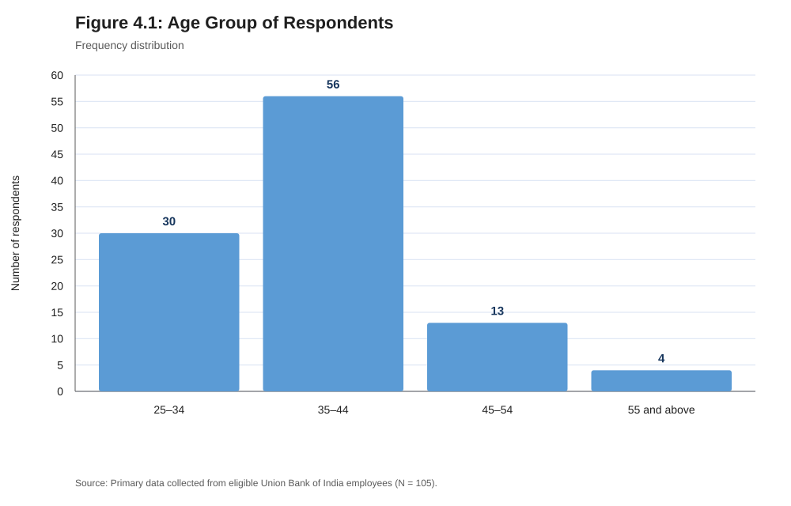

More than half of the respondents who reported age were in the 35–44 age group (54.4%, n = 56). The next largest group was 25–34 years (29.1%, n = 30). Two respondents did not report age, so the percentages in Table 4.2 use 103 valid age responses.

**Table 4.3: Length of Service of Respondents**

| Category | Frequency | Percentage |
| --- | ---: | ---: |
| Below 5 years | 8 | 7.7% |
| 5–10 years | 29 | 27.9% |
| 11–20 years | 56 | 53.8% |
| Above 20 years | 11 | 10.6% |
| Missing | 1 | — |
| **Valid responses** | **104** | **100.0%** |

*Source: Primary data. Percentages are based on valid responses to this profile question.*

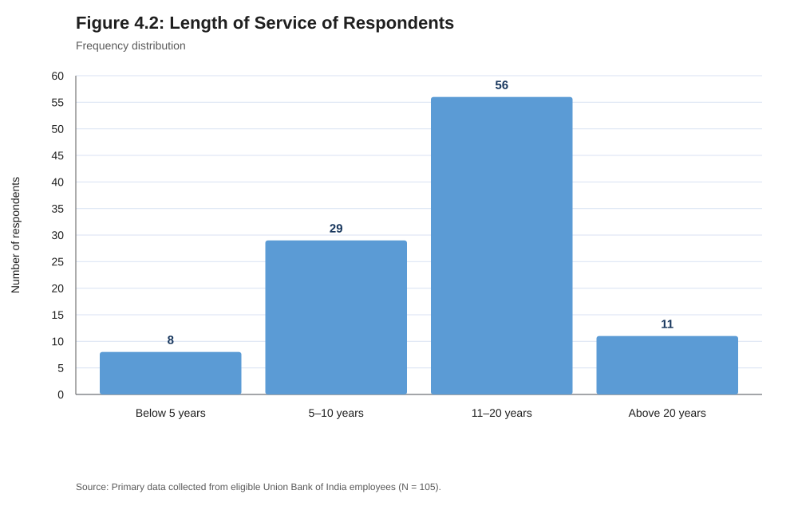

Among the 104 respondents who reported length of service, 53.8% (n = 56) had worked in the Bank for 11–20 years. A further 27.9% (n = 29) had 5–10 years of service. This shows that the selected sample included a substantial proportion of employees with several years of Bank experience.

**Table 4.4: Job Level of Respondents**

| Category | Frequency | Percentage |
| --- | ---: | ---: |
| Clerical | 22 | 21.0% |
| Officer | 57 | 54.3% |
| Managerial | 26 | 24.8% |
| **Valid responses** | **105** | **100.0%** |

*Source: Primary data. Percentages are based on valid responses to this profile question.*

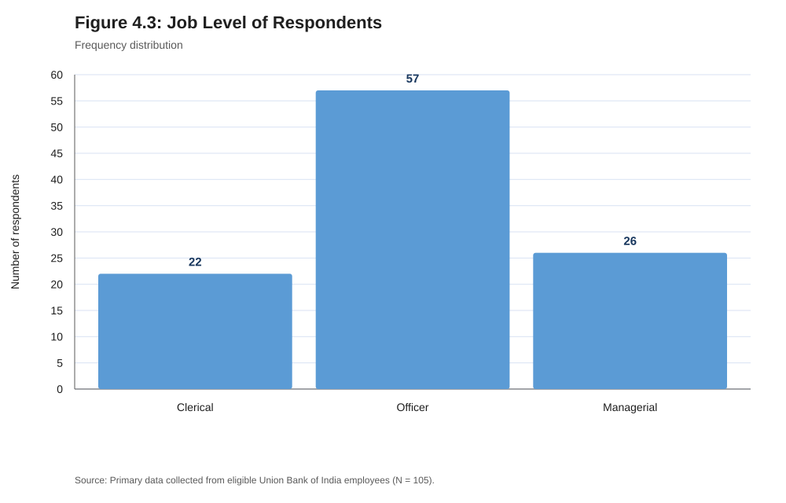

Officers formed the largest group in the sample (54.3%, n = 57), followed by managerial employees (24.8%, n = 26) and clerical employees (21.0%, n = 22). All eligible respondents reported a job level.

### 4.1.3 Construct-Level Descriptive Statistics

**Table 4.5: Construct-Level Descriptive Statistics**

| Construct | Items | Mean | Standard deviation | Rank |
| --- | ---: | ---: | ---: | ---: |
| Learner Engagement | 6 | 4.305 | 0.799 | 1 |
| Training Effectiveness | 7 | 4.238 | 0.840 | 2 |
| Trainer Competence | 6 | 4.165 | 0.853 | 3 |
| Hybrid Learning | 7 | 4.142 | 0.850 | 4 |

*Source: Primary data, N = 105. Construct scores are arithmetic means of their assigned 1–5 Likert items.*

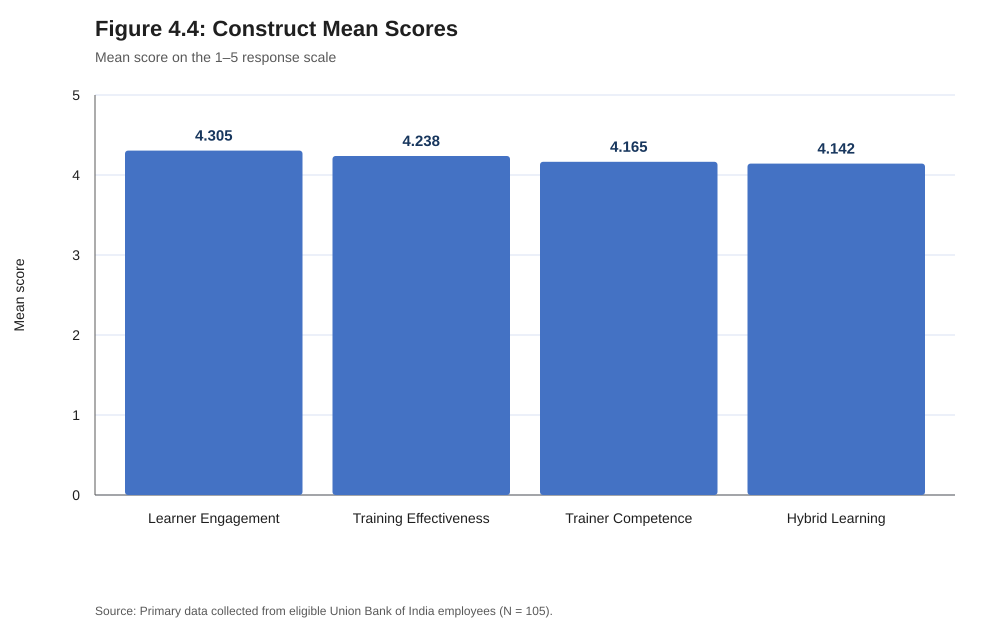

All four construct means were above the neutral midpoint of the five-point scale. Learner Engagement had the highest descriptive mean (M = 4.305, SD = 0.799), followed by Training Effectiveness (M = 4.238, SD = 0.840), Trainer Competence (M = 4.165, SD = 0.853), and Hybrid Learning (M = 4.142, SD = 0.850). These rankings describe the responses in this sample only; they do not test the proposed relationships.

### 4.1.4 Item-Wise Responses

The full five-category response table and bar chart for every Likert statement are provided in **Appendix B**, to keep this chapter to a readable length. Tables 4.6–4.9 below provide a compact item-wise summary for the four constructs.

**Table 4.6: Hybrid Learning — Item-Wise Descriptive Statistics**

| Code | Statement focus | Mean | Standard deviation |
| --- | --- | ---: | ---: |
| HL1 | Connected design | 4.095 | 0.966 |
| HL2 | Digital preparation | 3.990 | 0.935 |
| HL3 | Clarification/application | 4.162 | 0.942 |
| HL4 | Platform access | 4.181 | 0.907 |
| HL5 | Platform navigation | 4.086 | 1.020 |
| HL6 | Material availability | 4.222 | 0.937 |
| HL7 | Revision access | 4.257 | 0.899 |

*Source: Primary data, N = 105.*

The Hybrid Learning item means ranged from 3.990 to 4.257. The lowest mean was for digital activities preparing respondents for face-to-face sessions (HL2, M = 3.990, SD = 0.935). The highest was for revision access to digital modules or materials (HL7, M = 4.257, SD = 0.899). This identifies digital preparation as an area that can be examined further when practical suggestions are developed. Item-level response frequencies and charts for HL1–HL7 are provided as Tables B.1–B.7 in Appendix B.

**Table 4.7: Trainer Competence — Item-Wise Descriptive Statistics**

| Code | Statement focus | Mean | Standard deviation |
| --- | --- | ---: | ---: |
| TC1 | Subject knowledge | 4.210 | 0.895 |
| TC2 | Clear explanation | 4.229 | 0.923 |
| TC3 | Explains connection | 4.095 | 0.894 |
| TC4 | Digital-tool use | 4.143 | 0.914 |
| TC5 | Encourages participation | 4.219 | 0.899 |
| TC6 | Helpful feedback | 4.095 | 0.976 |

*Source: Primary data, N = 105.*

Trainer Competence item means ranged from 4.095 to 4.229. Clear explanation of content (TC2, M = 4.229, SD = 0.923) was the highest-rated item. Explaining the connection between activities (TC3) and providing helpful feedback (TC6) had the joint lowest mean (M = 4.095), while remaining above the scale midpoint. Item-level response frequencies and charts for TC1–TC6 are provided as Tables B.8–B.13 in Appendix B.

**Table 4.8: Learner Engagement — Item-Wise Descriptive Statistics**

| Code | Statement focus | Mean | Standard deviation |
| --- | --- | ---: | ---: |
| LE1 | Attention | 4.276 | 0.935 |
| LE2 | Effort | 4.295 | 0.909 |
| LE3 | Participation | 4.276 | 0.860 |
| LE4 | Involvement | 4.362 | 0.786 |
| LE5 | Clarification-seeking | 4.257 | 0.877 |
| LE6 | Interest in completion | 4.362 | 0.900 |

*Source: Primary data, N = 105.*

Learner Engagement had the highest construct mean. Feeling involved in the learning process (LE4) and remaining interested in completing the programme (LE6) had the joint highest item mean (M = 4.362). Seeking clarification (LE5, M = 4.257) was the lowest engagement item, although it remained above the neutral midpoint. Item-level response frequencies and charts for LE1–LE6 are provided as Tables B.14–B.19 in Appendix B.

**Table 4.9: Training Effectiveness — Item-Wise Descriptive Statistics**

| Code | Statement focus | Mean | Standard deviation |
| --- | --- | ---: | ---: |
| TE1 | Understanding | 4.257 | 0.899 |
| TE2 | Useful knowledge/skills | 4.257 | 0.910 |
| TE3 | Work relevance | 4.238 | 0.861 |
| TE4 | Capability | 4.238 | 0.915 |
| TE5 | Work application | 4.238 | 0.904 |
| TE6 | Task/problem support | 4.152 | 0.918 |
| TE7 | Confidence | 4.286 | 0.958 |

*Source: Primary data, N = 105.*

Training Effectiveness item means ranged from 4.152 to 4.286. Confidence in carrying out relevant responsibilities (TE7, M = 4.286, SD = 0.958) received the highest mean. Support in dealing with relevant work tasks or problems (TE6, M = 4.152, SD = 0.918) received the lowest mean and may be useful when considering later recommendations. Item-level response frequencies and charts for TE1–TE7 are provided as Tables B.20–B.26 in Appendix B.

## 4.2 Inferential Analysis

### 4.2.1 Reliability Analysis

**Table 4.10: Internal Consistency of the Study Constructs**

| Construct | Number of items | Cronbach's alpha | Interpretation |
| --- | ---: | ---: | --- |
| Hybrid Learning | 7 | 0.961 | Excellent internal consistency |
| Trainer Competence | 6 | 0.969 | Excellent internal consistency |
| Learner Engagement | 6 | 0.958 | Excellent internal consistency |
| Training Effectiveness | 7 | 0.971 | Excellent internal consistency |

*Source: Primary data, N = 105.*

All four item sets showed high internal consistency, with Cronbach's alpha values from 0.958 to 0.971. This supports using the defined item sets as construct scores in the planned association tests. Since all coefficients are very high, the results should also be read with the study's common self-report format in mind; closely related items can contribute to high internal-consistency values.

### 4.2.2 Pearson Correlation and Hypothesis Decisions

**Table 4.11: Pearson Correlations among the Four Constructs**

| Construct | 1 | 2 | 3 | 4 |
| --- | ---: | ---: | ---: | ---: |
| 1. Hybrid Learning | 1.000 | 0.817*** | 0.715*** | 0.660*** |
| 2. Trainer Competence | 0.817*** | 1.000 | 0.726*** | 0.648*** |
| 3. Learner Engagement | 0.715*** | 0.726*** | 1.000 | 0.765*** |
| 4. Training Effectiveness | 0.660*** | 0.648*** | 0.765*** | 1.000 |

***p < .001, two-tailed. Source: Primary data, N = 105.***

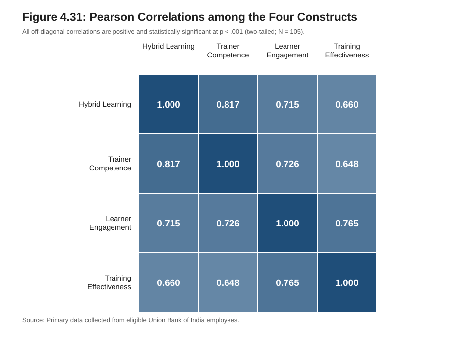

All reported relationships were positive and statistically significant at the 5% level. Hybrid Learning was positively associated with Learner Engagement (r = 0.715, p < .001). Trainer Competence was also positively associated with Learner Engagement (r = 0.726, p < .001). Learner Engagement was positively associated with Training Effectiveness (r = 0.765, p < .001).

**Table 4.12: Hypothesis Decisions**

| Hypothesis | Pearson r | p value | Decision |
| --- | ---: | ---: | --- |
| H1: Hybrid Learning and Learner Engagement | 0.715 | < .001 | Reject H₀; alternative hypothesis supported |
| H2: Trainer Competence and Learner Engagement | 0.726 | < .001 | Reject H₀; alternative hypothesis supported |
| H3: Learner Engagement and Training Effectiveness | 0.765 | < .001 | Reject H₀; alternative hypothesis supported |

*Source: Primary data, N = 105.*

The three null hypotheses were rejected because each reported two-tailed p value was below 0.05 and the observed correlation was positive. This supports the three stated relationship hypotheses within the selected sample. It does not establish that one factor caused the other.

### 4.2.3 Regression Models

**Table 4.13: Multiple Regression Model for Learner Engagement**

| Model statistic | Value |
| --- | ---: |
| R | 0.756 |
| R² | 0.572 |
| Adjusted R² | 0.564 |
| Standard error of estimate | 0.528 |
| F(2, 102) | 68.218 |
| p value | < .001 |

*Dependent variable: Learner Engagement. Source: Primary data, N = 105.*

The model including Hybrid Learning and Trainer Competence was statistically significant, F(2, 102) = 68.218, p < .001. Together, the two predictors accounted for 57.2% of the observed variation in Learner Engagement (R² = 0.572).

**Table 4.14: Coefficients for the Learner Engagement Model**

| Predictor | B | Standard error | β | t | p value | Tolerance | VIF |
| --- | ---: | ---: | ---: | ---: | ---: | ---: | ---: |
| Constant | 1.213 | 0.270 | — | 4.500 | < .001 | — | — |
| Hybrid Learning | 0.345 | 0.105 | 0.367 | 3.270 | = 0.001 | 0.333 | 3.005 |
| Trainer Competence | 0.399 | 0.105 | 0.426 | 3.798 | < .001 | 0.333 | 3.005 |

*Dependent variable: Learner Engagement. Source: Primary data, N = 105.*

When both predictors were considered together, Hybrid Learning (β = 0.367, p = .001) and Trainer Competence (β = 0.426, p < .001) each had a positive coefficient in the fitted model. The tolerance value of 0.333 and VIF of 3.005 indicate predictor overlap that should be kept in view, but do not indicate severe multicollinearity under the common VIF = 5 screening rule.

**Table 4.15: Simple Regression Model for Training Effectiveness**

| Model statistic | Value |
| --- | ---: |
| R | 0.765 |
| R² | 0.585 |
| Adjusted R² | 0.581 |
| Standard error of estimate | 0.544 |
| F(1, 103) | 145.452 |
| p value | < .001 |

*Dependent variable: Training Effectiveness. Predictor: Learner Engagement. Source: Primary data, N = 105.*

The simple regression model was statistically significant, F(1, 103) = 145.452, p < .001. Learner Engagement accounted for 58.5% of the observed variation in Training Effectiveness (R² = 0.585).

**Table 4.16: Coefficients for the Training Effectiveness Model**

| Predictor | B | Standard error | β | t | p value |
| --- | ---: | ---: | ---: | ---: | ---: |
| Constant | 0.774 | 0.292 | — | 2.649 | = 0.009 |
| Learner Engagement | 0.805 | 0.067 | 0.765 | 12.060 | < .001 |

*Dependent variable: Training Effectiveness. Source: Primary data, N = 105.*

Learner Engagement had a positive coefficient in the fitted model (β = 0.765, p < .001). This is consistent with the positive Pearson correlation reported for H3. The regression result is a supporting association analysis; it does not establish that engagement causes training effectiveness.

## 4.3 Interpretation of Results

The descriptive and inferential results show a consistent positive pattern in the selected sample. Respondents who reported more positive Hybrid Learning experiences and stronger Trainer Competence also tended to report higher Learner Engagement. Respondents reporting higher Learner Engagement also tended to report higher Training Effectiveness. The regression results show that the planned predictor sets were statistically associated with their respective dependent construct scores. These findings remain limited to the selected respondents, their recalled programme experience, and the common self-report questionnaire format.

## 4.4 Comparison with Previous Studies

The positive relationship between Hybrid Learning and Learner Engagement is consistent with the broad design argument in the reviewed literature. Garrison and Kanuka (2004) and Graham (2006) describe blended learning as the purposeful connection of online and face-to-face learning. In the present study, the Hybrid Learning items asked whether respondents experienced the digital and face-to-face parts as connected, accessible, and available for revision. The positive H1 result therefore fits the view that employees may engage more actively when the two modes are experienced as parts of one programme. It does not show that the programme design produced engagement.

Sosnova et al. (2025) found stronger learning outcomes in a hybrid condition among higher-education students. The present result is similar only at a broad conceptual level: both studies link hybrid learning with a learning-related outcome. The populations, designs, measures, and outcomes differ. Sosnova et al. used a student experiment, while the present study used a cross-sectional employee questionnaire. The current result should therefore not be presented as a replication of that study.

Kim (2022) is the closest corporate comparison. Kim's automotive sales-training analysis showed that fully digital delivery had lower reported effectiveness than the hybrid arrangement, while also showing that hybrid training should be evaluated through programme design, instructor involvement, participation, and perceived competence. The present results are compatible with that practical emphasis. The positive correlations show that respondents who reported a more connected hybrid-learning experience and stronger trainer competence also tended to report higher engagement. However, the present study does not compare traditional, fully digital, and hybrid groups, and it cannot determine which delivery mode is best.

The H2 finding is also consistent with the literature that distinguishes facilitation from technology availability. Kim (2022) identifies instructor engagement as relevant in corporate training, while Mulaudzi (2021) discusses facilitation, access, materials, and workplace barriers. In the present sample, Trainer Competence was positively related to Learner Engagement. The regression model retained a positive coefficient for both Hybrid Learning and Trainer Competence when they were considered together. This supports the practical value of explaining content clearly, connecting activities across modes, encouraging participation, and giving useful feedback. It does not establish that trainer behaviour caused engagement.

The positive H3 relationship is consistent with training-evaluation and transfer literature. Kirkpatrick (1994) explains why understanding and application matter in training evaluation, while Holton (1996), Baldwin and Ford (1988), and Blume et al. (2010) describe the role of individual, design, and work-environment conditions in later use of learning. Bahl, Kiran and Sharma (2024) likewise demonstrate that Training Effectiveness is a meaningful employee-level issue in Indian banking. Their study uses Kirkpatrick's framework with a broader banking sample; it does not test Hybrid Learning, Trainer Competence, Learner Engagement, or Union Vidya. The present study adds an employee-experience perspective to this banking context rather than reproducing Bahl et al.'s model.

The results also align with the measurement logic used in the present study. Han and Ellis (2020) support viewing the blended environment as a set of related conditions rather than one general opinion. Mulaudzi (2021) supports workplace attention to access, materials, and facilitation. Aziz (2015) supports an employee-level view of Training Effectiveness that includes learning and work relevance without claiming organisation-level results. The high internal-consistency values support the use of the four item sets in this sample, while the high correlations and common self-report format mean that the associations should be interpreted carefully.

## 4.5 Theoretical and Practical Implications

The results support a practical interpretation of hybrid training as a connected learning experience. The programme should make clear what employees need to do before, during, and after a trainer-led session. The lowest Hybrid Learning mean was for whether digital activities prepared respondents for face-to-face sessions (HL2, M = 3.990). This item remained above the neutral midpoint, but it suggests a useful area for attention. Training teams can state the purpose of a pre-session module, link it directly to the discussion or practice that follows, and refer back to it during the trainer-led session.

Union Vidya can support this connection when it is used as a place for timely material, revision resources, and follow-up information. Revision access was the highest-rated Hybrid Learning item (HL7, M = 4.257), while platform navigation was lower (HL5, M = 4.086). The finding does not evaluate the technical quality of Union Vidya or prove that platform changes would improve training. It suggests that training teams can keep material locations clear, use simple programme-specific instructions, and ensure that employees know where to revisit relevant content after a session.

Trainer Competence was positively associated with Learner Engagement. Clear explanation was the highest trainer item (TC2, M = 4.229), whereas explaining how digital and face-to-face activities connect (TC3, M = 4.095) and helpful feedback (TC6, M = 4.095) were comparatively lower. Trainers can be supported with a short facilitation plan that identifies the link between the digital activity, the live session, a relevant work example, and any follow-up material. Where a live-streamed or virtual element is used, the plan can also state how employees may raise questions and when responses or feedback will be provided.

Learner Engagement was the highest-rated construct, but clarification-seeking (LE5, M = 4.257) was its lowest item. Programmes can therefore include planned opportunities for questions, short case discussions, practice activities, and follow-up clarification. This should be treated as a way of inviting participation rather than as an assumption that every employee will learn in the same way.

Training Effectiveness was positively associated with Learner Engagement. The lowest Training Effectiveness item was help in dealing with relevant work tasks or problems (TE6, M = 4.152). Training teams can consider short work-based examples, problem cases, or post-session application prompts that help employees connect learning with routine responsibilities. This is a practical suggestion based on the response pattern. The present study does not test whether any specific intervention will cause improved work performance.

These implications are relevant to Union Bank's documented combination of Union Vidya, virtual learning, trainer-led activity, Union Learning Academies, and training centres. They should be used as focused points for review rather than as proof that the Bank must adopt one uniform training design. Different programmes may require different combinations of digital preparation, live explanation, practice, and later revision.

---

# Chapter 5 — Conclusion

## 5.1 Summary of Findings

This study examined the reported relationships among Hybrid Learning, Trainer Competence, Learner Engagement, and Training Effectiveness among employees of Union Bank of India. It was conducted in the Chennai context through paper questionnaires and a Google Forms link. The questionnaire asked each eligible respondent to think about one training programme attended during the previous 12 months that included both digital or online learning and face-to-face learning.

A total of 132 responses were received. Sixteen respondents answered "No" to the eligibility question and 11 paper records had blank or illegible eligibility responses; these 27 records were excluded. The final analysis used 105 eligible responses. Two retained paper records had one unclear Likert response. In line with the stated data-cleaning rule, each response was replaced with the respondent's arithmetic mean for the remaining items in that construct and documented in the data audit.

The profile results show that officers formed the largest respondent group (54.3%, n = 57). Among respondents who reported age, the largest group was 35–44 years (54.4%, n = 56). Among those who reported length of service, the largest group had 11–20 years of service (53.8%, n = 56). These figures describe the selected respondents and are not intended to represent the complete Union Bank workforce.

All four construct means were above the neutral midpoint of the five-point scale. Learner Engagement had the highest mean (M = 4.305), followed by Training Effectiveness (M = 4.238), Trainer Competence (M = 4.165), and Hybrid Learning (M = 4.142). The four item sets showed high internal consistency, with Cronbach's alpha values from 0.958 to 0.971.

The three relationship hypotheses were supported in the selected sample. Hybrid Learning was positively associated with Learner Engagement (r = 0.715, p < .001), and Trainer Competence was positively associated with Learner Engagement (r = 0.726, p < .001). Learner Engagement was positively associated with Training Effectiveness (r = 0.765, p < .001). The two-predictor regression model for Learner Engagement was statistically significant and accounted for 57.2% of the observed variation. The simple regression model for Training Effectiveness was also statistically significant and accounted for 58.5% of the observed variation. These results identify associations in respondents' reported perceptions. They do not establish causation or a formal mediation effect.

## 5.2 Contributions and Limitations

The study contributes a focused employee-learning perspective to the Union Bank and public-sector banking context. Union Bank has documented digital-learning and trainer-led learning infrastructure, including Union Vidya, virtual-learning arrangements, Union Learning Academies, and training centres. However, organisational infrastructure alone does not show how employees experience a particular programme. This study addresses that employee-level question by examining the connection between digital and face-to-face learning, trainer competence, engagement, and perceived Training Effectiveness.

The study also brings together complementary literature. Sosnova et al. (2025) provide a conceptual Hybrid Learning and effectiveness link; Kim (2022) provides corporate evidence on hybrid training, instructor involvement, and training evaluation; and Bahl, Kiran and Sharma (2024) establish the relevance of Training Effectiveness evaluation in Indian banking. The present study does not claim to replicate any of these papers. It adapts their compatible ideas to a short, literature-informed questionnaire for a selected Union Bank employee group.

Several limitations should guide the interpretation. First, purposive data collection through Chennai South Regional Office, associated collection points, branches, paper forms, and Google Forms does not permit statistical generalisation to all Union Bank employees. Second, the study is cross-sectional: the survey captures reported experience at one point in time and cannot show time order or cause and effect. Third, the same respondent reported Hybrid Learning, Trainer Competence, Learner Engagement, and Training Effectiveness. This shared response method may strengthen observed associations. Fourth, the online pilot involved only 20 eligible employees and was used as a small pre-test of clarity and preliminary internal consistency; it did not provide full scale validation. Fifth, the study did not use test scores, Union Vidya system logs, supervisor ratings, customer outcomes, or organisation-level performance data. Finally, the very high reliability coefficients and the positive correlations show that the constructs are closely related in this sample, so the findings should not be treated as independent proof of separate causal processes.

## 5.3 Suggestions and Future Directions

The findings suggest several practical areas that Union Bank's learning and development teams may consider when reviewing hybrid programmes.

1. **Make the learning sequence visible.** At the start of a programme, state what employees should complete on Union Vidya or another authorised platform, how that activity will be used in the trainer-led session, and how learning will be revisited afterwards. This responds to the comparatively lower score for digital preparation before face-to-face learning.

2. **Keep materials easy to find and revisit.** Revision access was rated positively, but navigation scored comparatively lower. A simple programme page, clear naming of modules, and direct links to relevant material can help employees find the content required before and after a session.

3. **Prepare trainers to connect the two modes.** Trainer preparation can include explaining how the digital activity, discussion, case example, and work application fit together. The plan can also cover feedback and question handling when employees join through a virtual or live-streamed arrangement.

4. **Create structured opportunities for clarification and practice.** Short question periods, practical cases, demonstrations, peer discussion, and follow-up clarification can support employees who may otherwise complete digital material without discussing how it applies to their work.

5. **Connect learning with routine work.** A post-session example, checklist, or manager-supported application prompt may help employees use training in relevant work tasks. This is particularly relevant because support in dealing with work tasks or problems had the lowest Training Effectiveness item mean.

These are suggestions for review, not tested interventions. Future studies can use a larger and more systematically selected sample, compare different roles or regions, collect data before and after a programme, and combine employee perceptions with knowledge assessments, supervisor observations, or relevant system records. A future study could also compare particular training designs, such as digital preparation followed by face-to-face practice, with other sequences. Such designs would provide stronger evidence about learning processes and later application.

## 5.4 Conclusion

Among the 105 eligible respondents in this study, more positive Hybrid Learning and Trainer Competence perceptions were associated with higher Learner Engagement, and higher Learner Engagement was associated with higher perceived Training Effectiveness. The findings support a practical view of hybrid training in which digital resources, trainer-led explanation, participation, practice, and revision are connected parts of one employee-learning experience. They provide a focused basis for reviewing how Union Bank employees experience hybrid programmes, while remaining limited to the selected cross-sectional self-report sample.

---

# References

Ansari, B. I., Junaidi, J., Maulina, S., Herman, H., Kamaruddin, I., Rahman, A., & Saputra, N. (2023). The effect of blended-learning training on lecturers' and students' competence and satisfaction. *Journal of Intercultural Communication, 23*(4), 155–164. https://doi.org/10.36923/jicc.v23i4.201

Aziz, S. F. A. (2015). Developing general training effectiveness scale for the Malaysian workplace learning. *Mediterranean Journal of Social Sciences, 6*(4S1), 47–56. https://doi.org/10.5901/mjss.2015.v6n4s1p47

Bahl, K., Kiran, R., & Sharma, A. (2024). Evaluating the effectiveness of training of managerial and non-managerial bank employees using Kirkpatrick's model for evaluation of training. *Humanities and Social Sciences Communications, 11*, 508. https://doi.org/10.1057/s41599-024-02973-y

Baldwin, T. T., & Ford, J. K. (1988). Transfer of training: A review and directions for future research. *Personnel Psychology, 41*(1), 63–105. https://doi.org/10.1111/j.1744-6570.1988.tb00632.x

Blume, B. D., Ford, J. K., Baldwin, T. T., & Huang, J. L. (2010). Transfer of training: A meta-analytic review. *Journal of Management, 36*(4), 1065–1105. https://doi.org/10.1177/0149206309352880

Garrison, D. R., & Kanuka, H. (2004). Blended learning: Uncovering its transformative potential in higher education. *The Internet and Higher Education, 7*(2), 95–105. https://doi.org/10.1016/j.iheduc.2004.02.001

Graham, C. R. (2006). Blended learning systems: Definition, current trends, and future directions. In C. J. Bonk & C. R. Graham (Eds.), *The handbook of blended learning* (pp. 3–21). Pfeiffer.

Han, F., & Ellis, R. A. (2020). Initial development and validation of the Perceptions of the Blended Learning Environment Questionnaire. *Journal of Psychoeducational Assessment, 38*(1), 23–38. https://doi.org/10.1177/0734282919834091

Holton, E. F. (1996). The flawed four-level evaluation model. *Human Resource Development Quarterly, 7*(1), 5–21. https://doi.org/10.1002/hrdq.3920070103

Kim, S. (2022). Innovating workplace learning: Training methodology analysis based on content, instructional design, programmed learning, and recommendation framework. *Frontiers in Psychology, 13*, 870574. https://doi.org/10.3389/fpsyg.2022.870574

Kirkpatrick, D. L. (1994). *Evaluating training programs: The four levels*. Berrett-Koehler.

Kumar, R., & Pande, N. (2017). Technology-mediated learning paradigm and the blended learning ecosystem: What works for working professionals? *Procedia Computer Science, 122*, 1114–1123. https://doi.org/10.1016/j.procs.2017.11.446

Mubayrik, H. B. (2018). The present and future state of blended learning at workplace-learning settings in adult education: A systematic review. *Journal of Social Studies Education Research, 9*(4), 247–273.

Mulaudzi, M. S. (2021). *The use of blended teaching to improve workplace training in the transport sector* [Master's dissertation, University of Johannesburg]. https://hdl.handle.net/10210/501896

Schaufeli, W. B., Bakker, A. B., & Salanova, M. (2006). The measurement of work engagement with a short questionnaire. *Educational and Psychological Measurement, 66*(4), 701–716. https://doi.org/10.1177/0013164405282471

Sosnova, M., Hlianenko, K., Sosnova, V., Tsyna, V., & Tsyna, A. (2025). Enhancing the effectiveness of learning through hybrid education methods. *Revista Eduweb, 19*(2), 95–106. https://doi.org/10.46502/issn.1856-7576/2025.19.02.7

Uddin, M., Ahamed, M. R., Jakowan, Islam, M. R., & Nahar, M. (2026). How blended learning influences employee performance: The mediating role of soft skill development and knowledge acquisition. *International Journal of Accounting and Economics Studies, 13*(2), 243–250. https://doi.org/10.14419/9cjynm83

Union Bank of India. (n.d.-a). *About Union Bank of India*. Retrieved September 22, 2026, from https://www.unionbankofindia.bank.in/en/common/profile

Union Bank of India. (n.d.-b). *Address and contact details of training centres*. Retrieved September 22, 2026, from https://www.unionbankofindia.bank.in/pdf/address%20and%20contact%20details%20of%20training%20centres.pdf

Union Bank of India. (2022, October 1). *Union Bank of India launches 9 Union Learning Academies* [Press release]. https://www.unionbankofindia.bank.in/pdf/union%20bank%20of%20india%20launches%209%20union%20learning%20academies.pdf

Union Bank of India. (2024). *Integrated annual report 2023–24*. https://www.unionbankofindia.bank.in/pdf/ubi-iar2024-final-stitched-book-english-compressed-26-06-2024.pdf

Union Bank of India. (2025). *Integrated annual report 2024–25*. https://www.unionbankofindia.bank.in/pdf/union-bank-ar-2024-25-eng-final.pdf

Union Bank of India. (2026, September 9). *Live streaming of training sessions from training centres – Enhancing learning accessibility across the Bank* [Staff circular, internal].

Vo, M. H., Zhu, C., & Diep, N. A. (2017). The effect of blended learning on student performance at course-level in higher education: A meta-analysis. *Studies in Educational Evaluation, 53*, 17–28. https://doi.org/10.1016/j.stueduc.2017.01.002

Yu, Q., Yu, K., Li, B., & Wang, Q. (2025). Effectiveness of blended learning on students' learning performance: A meta-analysis. *Journal of Research on Technology in Education, 57*(3), 499–520. https://doi.org/10.1080/15391523.2023.2264984

---

# Appendix A — Questionnaire

## Hybrid Learning and Training Effectiveness at Union Bank of India

This questionnaire forms part of an academic study on hybrid learning and training effectiveness among employees of Union Bank of India.

In this study, **hybrid learning** means a training programme in which digital learning and face-to-face learning were planned as connected parts of the same programme. The digital component may have used **Union Vidya, Union Bank of India's Learning Management System (LMS),** or another authorised learning platform.

Please answer the statements with reference to **one hybrid-training programme attended during the last 12 months**. There are no right or wrong answers. Participation is voluntary and confidential. Do not write your name, employee number, customer details, or any confidential Bank information.

## Section A — Eligibility and Basic Information

1. During the last 12 months, have you attended a training programme that included both digital or online learning and face-to-face learning?
   Yes / No
   *If your answer is No, please do not continue with the questionnaire.*

2. Age group: Below 25 / 25–34 / 35–44 / 45–54 / 55 and above

3. Length of service in Union Bank of India: Below 5 years / 5–10 years / 11–20 years / Above 20 years

4. Job level: Clerical / Officer / Managerial / Other

## Response Scale for Questions 5–30

1 – Strongly Disagree
2 – Disagree
3 – Neither Agree nor Disagree
4 – Agree
5 – Strongly Agree

## Section B — Hybrid Learning

In Questions 5–11, "digital learning platform" means **Union Vidya** where it was used for your selected programme, or another authorised digital platform used for that programme.

5. The digital and face-to-face parts of the programme were planned as one connected learning experience.

6. The digital activities prepared me for the face-to-face sessions.

7. The face-to-face sessions helped me clarify or apply what I learned through the digital activities.

8. I could access the digital learning platform used for the programme without much difficulty.

9. The digital platform was easy for me to navigate while completing the training.

10. Learning materials on the digital platform were available when I needed them.

11. I could revisit digital modules or learning materials when I needed revision.

## Section C — Trainer Competence

12. The trainer had good knowledge of the training subject.

13. The trainer explained the training content clearly.

14. The trainer explained how the digital and face-to-face activities were connected.

15. The trainer was able to use the digital tools involved in the programme effectively.

16. The trainer encouraged employees to ask questions and take part in activities.

17. The trainer gave feedback that helped me understand or improve my learning.

## Section D — Learner Engagement

18. I stayed attentive during the training activities.

19. I made a serious effort to understand the training content.

20. I participated actively in discussions, exercises, or other training activities.

21. I felt involved in the learning process rather than simply completing required activities.

22. I asked questions or sought clarification when I did not understand something.

23. I remained interested in completing the programme.

## Section E — Training Effectiveness

24. I understood the main knowledge or skills covered in the programme.

25. The training gave me knowledge or skills that are useful in my current role.

26. The content of the programme was relevant to the work I do at the Bank.

27. I feel capable of using the knowledge or skills taught in the programme.

28. I have applied learning from the programme in my day-to-day work.

29. The programme helped me deal with relevant work tasks or problems more effectively.

30. The programme has improved my confidence in carrying out relevant work responsibilities.

---

# Appendix B — Item-Level Response Distributions

All percentages use the 105 eligible responses as the denominator. The single documented imputed score for HL6 is separately identified and is not placed in a Likert response category.

## Table B.1: HL1 — The digital and face-to-face parts of the programme were planned as one connected learning experience.

| Response | Frequency | Percentage |
| --- | ---: | ---: |
| Strongly disagree | 4 | 3.8% |
| Disagree | 4 | 3.8% |
| Neither agree nor disagree | 8 | 7.6% |
| Agree | 51 | 48.6% |
| Strongly agree | 38 | 36.2% |
| **Total scored records** | **105** | **100.0%** |

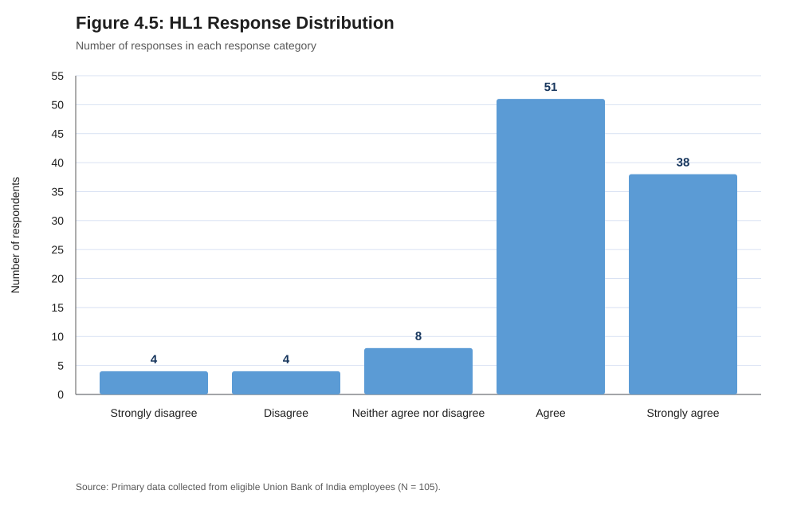

## Table B.2: HL2 — The digital activities prepared me for the face-to-face sessions.

| Response | Frequency | Percentage |
| --- | ---: | ---: |
| Strongly disagree | 3 | 2.9% |
| Disagree | 5 | 4.8% |
| Neither agree nor disagree | 13 | 12.4% |
| Agree | 53 | 50.5% |
| Strongly agree | 31 | 29.5% |
| **Total scored records** | **105** | **100.0%** |

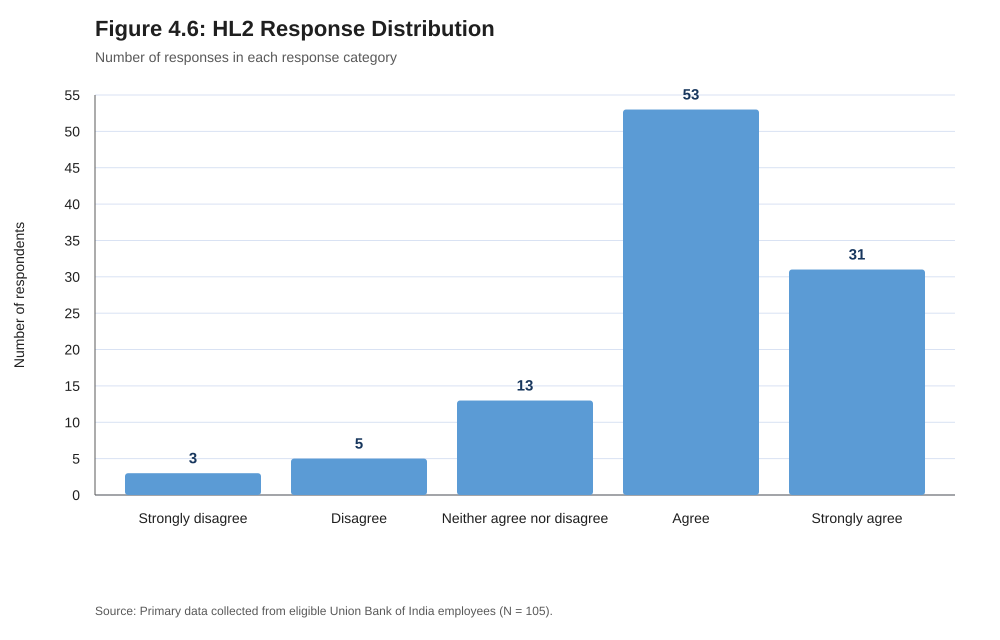

## Table B.3: HL3 — The face-to-face sessions helped me clarify or apply what I learned through the digital activities.

| Response | Frequency | Percentage |
| --- | ---: | ---: |
| Strongly disagree | 4 | 3.8% |
| Disagree | 2 | 1.9% |
| Neither agree nor disagree | 9 | 8.6% |
| Agree | 48 | 45.7% |
| Strongly agree | 42 | 40.0% |
| **Total scored records** | **105** | **100.0%** |

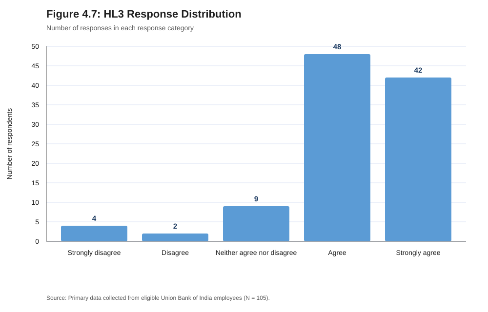

## Table B.4: HL4 — I could access the digital learning platform used for the programme without much difficulty.

| Response | Frequency | Percentage |
| --- | ---: | ---: |
| Strongly disagree | 3 | 2.9% |
| Disagree | 3 | 2.9% |
| Neither agree nor disagree | 8 | 7.6% |
| Agree | 49 | 46.7% |
| Strongly agree | 42 | 40.0% |
| **Total scored records** | **105** | **100.0%** |

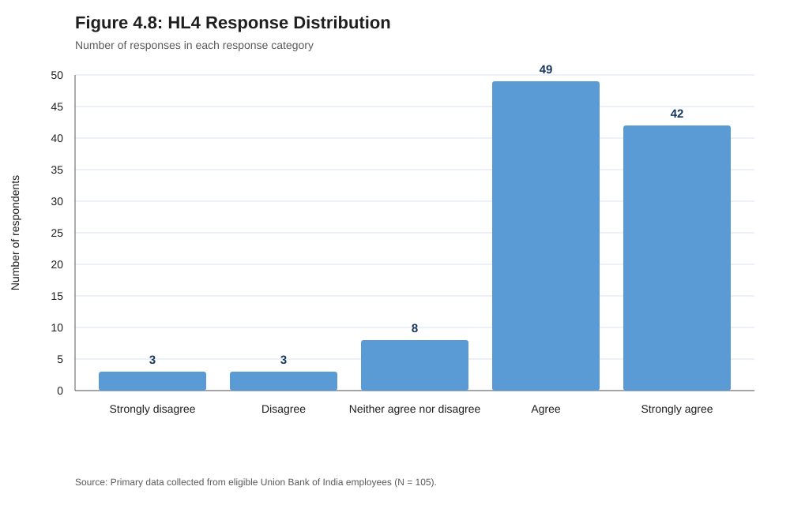

## Table B.5: HL5 — The digital platform was easy for me to navigate while completing the training.

| Response | Frequency | Percentage |
| --- | ---: | ---: |
| Strongly disagree | 5 | 4.8% |
| Disagree | 4 | 3.8% |
| Neither agree nor disagree | 8 | 7.6% |
| Agree | 48 | 45.7% |
| Strongly agree | 40 | 38.1% |
| **Total scored records** | **105** | **100.0%** |

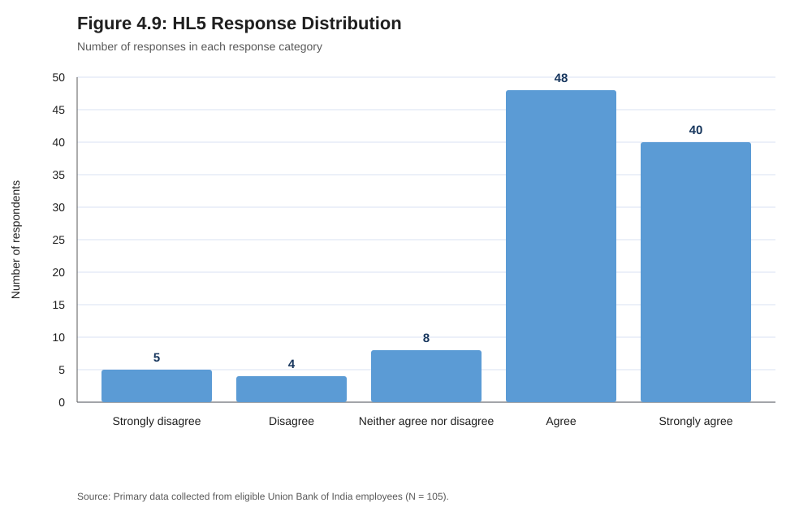

## Table B.6: HL6 — Learning materials on the digital platform were available when I needed them.

| Response | Frequency | Percentage |
| --- | ---: | ---: |
| Strongly disagree | 4 | 3.8% |
| Disagree | 2 | 1.9% |
| Neither agree nor disagree | 6 | 5.7% |
| Agree | 46 | 43.8% |
| Strongly agree | 46 | 43.8% |
| Documented imputed score (3.333) | 1 | 1.0% |
| **Total scored records** | **105** | **100.0%** |

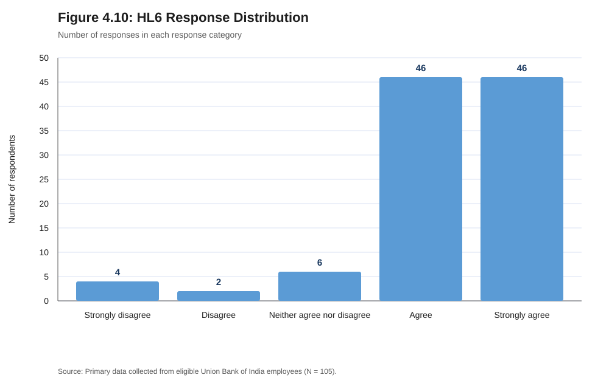

## Table B.7: HL7 — I could revisit digital modules or learning materials when I needed revision.

| Response | Frequency | Percentage |
| --- | ---: | ---: |
| Strongly disagree | 4 | 3.8% |
| Disagree | 1 | 1.0% |
| Neither agree nor disagree | 5 | 4.8% |
| Agree | 49 | 46.7% |
| Strongly agree | 46 | 43.8% |
| **Total scored records** | **105** | **100.0%** |

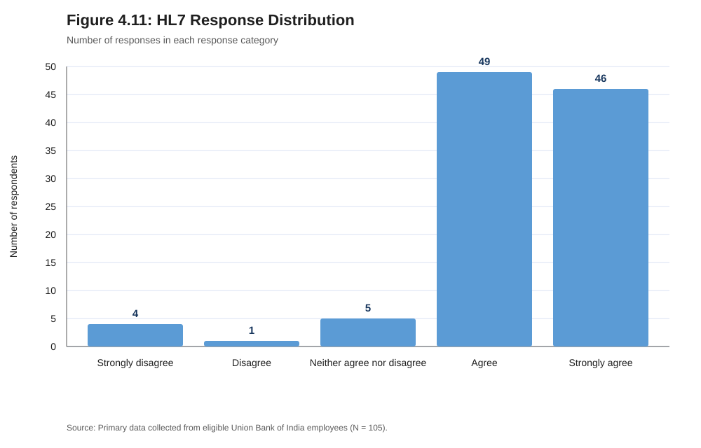

## Table B.8: TC1 — The trainer had good knowledge of the training subject.

| Response | Frequency | Percentage |
| --- | ---: | ---: |
| Strongly disagree | 4 | 3.8% |
| Disagree | 1 | 1.0% |
| Neither agree nor disagree | 6 | 5.7% |
| Agree | 52 | 49.5% |
| Strongly agree | 42 | 40.0% |
| **Total scored records** | **105** | **100.0%** |

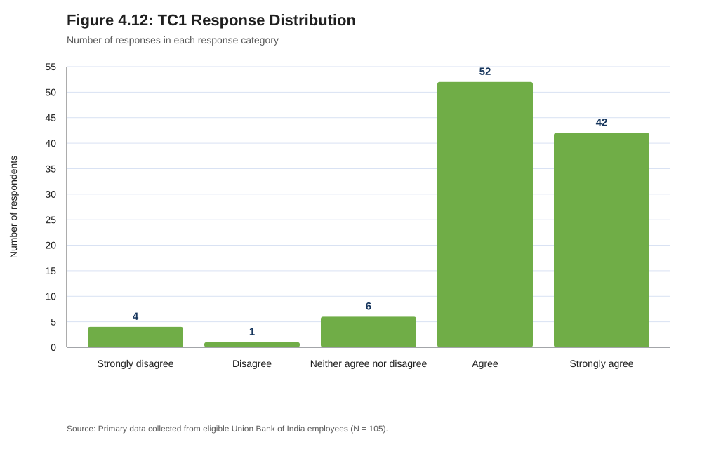

## Table B.9: TC2 — The trainer explained the training content clearly.

| Response | Frequency | Percentage |
| --- | ---: | ---: |
| Strongly disagree | 5 | 4.8% |
| Disagree | 0 | 0.0% |
| Neither agree nor disagree | 5 | 4.8% |
| Agree | 51 | 48.6% |
| Strongly agree | 44 | 41.9% |
| **Total scored records** | **105** | **100.0%** |

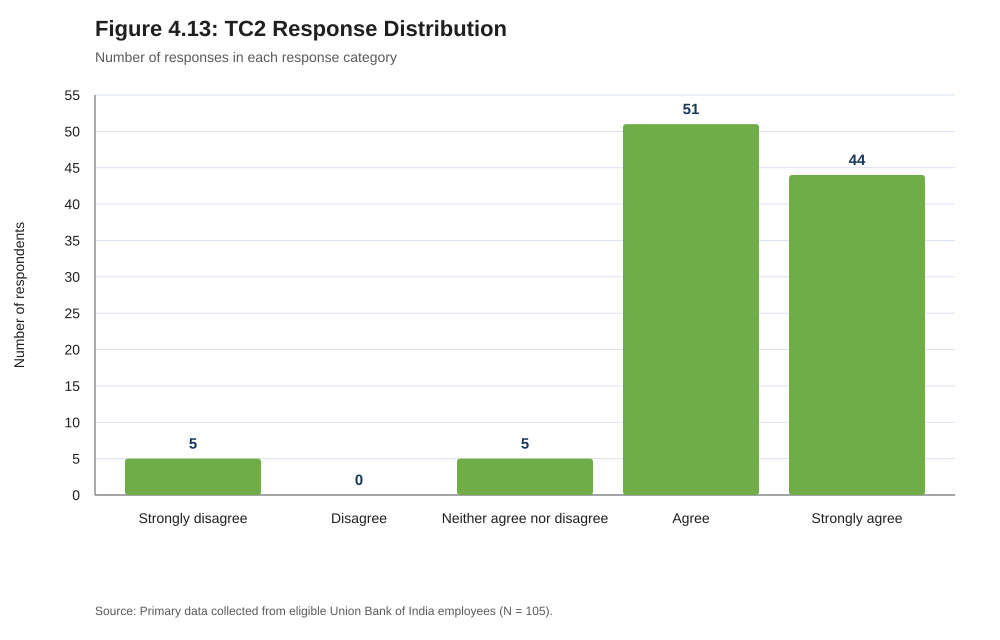

## Table B.10: TC3 — The trainer explained how the digital and face-to-face activities were connected.

| Response | Frequency | Percentage |
| --- | ---: | ---: |
| Strongly disagree | 4 | 3.8% |
| Disagree | 1 | 1.0% |
| Neither agree nor disagree | 10 | 9.5% |
| Agree | 56 | 53.3% |
| Strongly agree | 34 | 32.4% |
| **Total scored records** | **105** | **100.0%** |

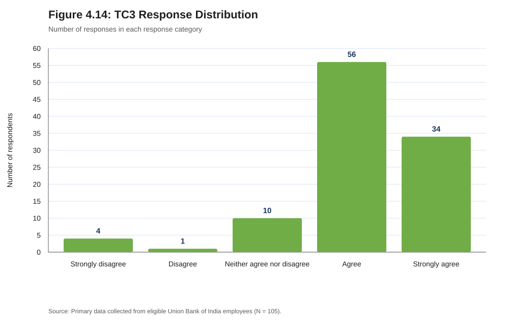

## Table B.11: TC4 — The trainer was able to use the digital tools involved in the programme effectively.

| Response | Frequency | Percentage |
| --- | ---: | ---: |
| Strongly disagree | 4 | 3.8% |
| Disagree | 2 | 1.9% |
| Neither agree nor disagree | 7 | 6.7% |
| Agree | 54 | 51.4% |
| Strongly agree | 38 | 36.2% |
| **Total scored records** | **105** | **100.0%** |

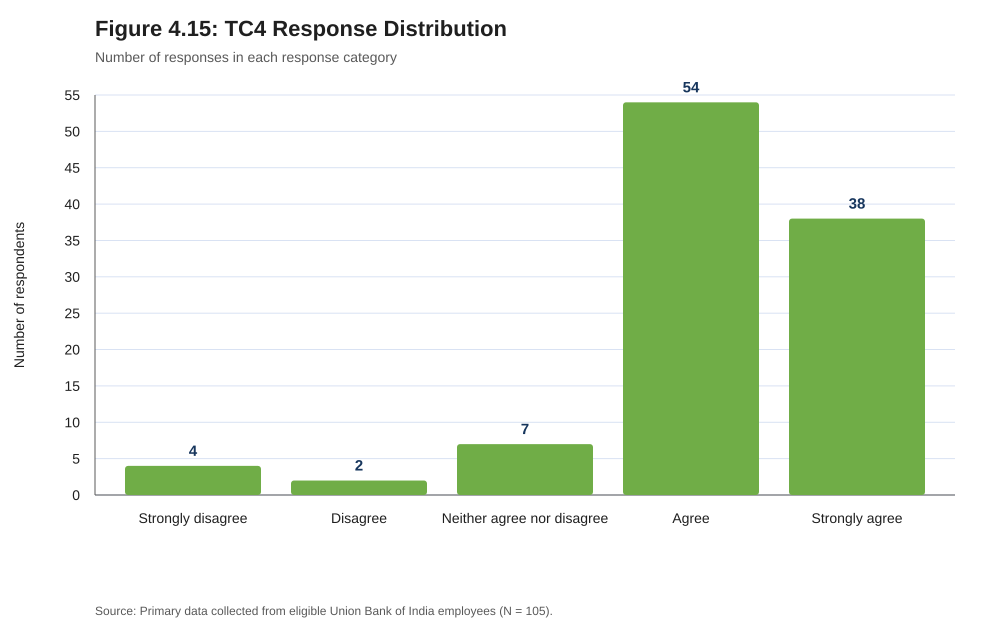

## Table B.12: TC5 — The trainer encouraged employees to ask questions and take part in activities.

| Response | Frequency | Percentage |
| --- | ---: | ---: |
| Strongly disagree | 4 | 3.8% |
| Disagree | 1 | 1.0% |
| Neither agree nor disagree | 6 | 5.7% |
| Agree | 51 | 48.6% |
| Strongly agree | 43 | 41.0% |
| **Total scored records** | **105** | **100.0%** |

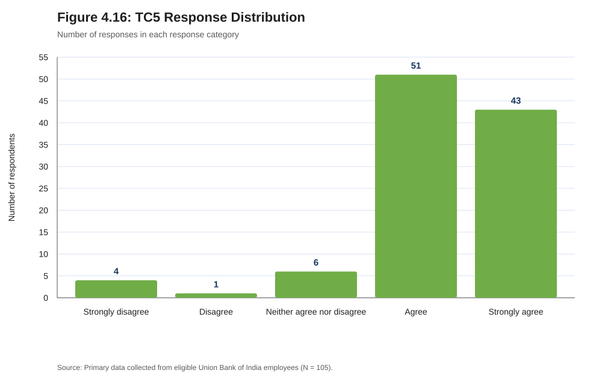

## Table B.13: TC6 — The trainer gave feedback that helped me understand or improve my learning.

| Response | Frequency | Percentage |
| --- | ---: | ---: |
| Strongly disagree | 5 | 4.8% |
| Disagree | 3 | 2.9% |
| Neither agree nor disagree | 6 | 5.7% |
| Agree | 54 | 51.4% |
| Strongly agree | 37 | 35.2% |
| **Total scored records** | **105** | **100.0%** |

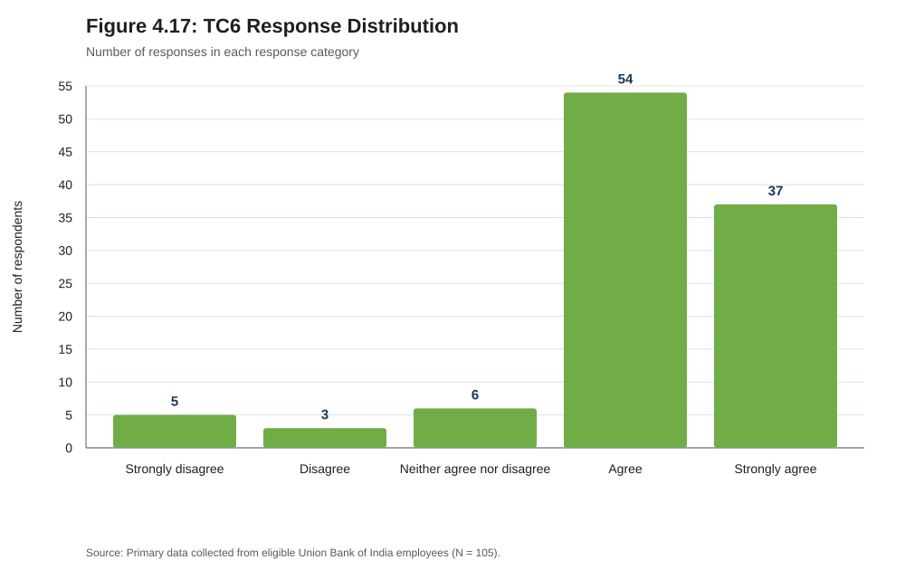

## Table B.14: LE1 — I stayed attentive during the training activities.

| Response | Frequency | Percentage |
| --- | ---: | ---: |
| Strongly disagree | 3 | 2.9% |
| Disagree | 4 | 3.8% |
| Neither agree nor disagree | 5 | 4.8% |
| Agree | 42 | 40.0% |
| Strongly agree | 51 | 48.6% |
| **Total scored records** | **105** | **100.0%** |

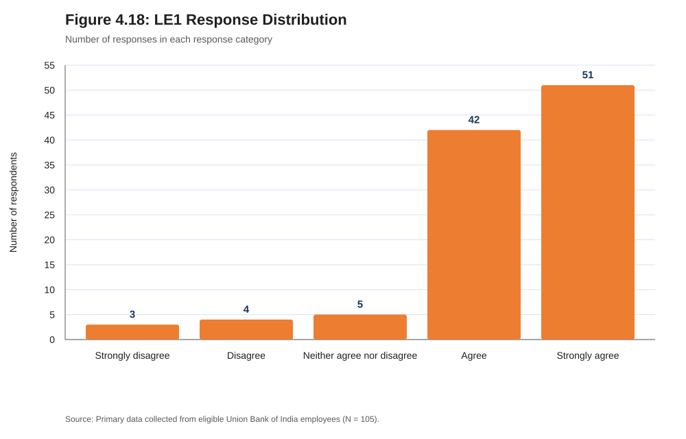

## Table B.15: LE2 — I made a serious effort to understand the training content.

| Response | Frequency | Percentage |
| --- | ---: | ---: |
| Strongly disagree | 3 | 2.9% |
| Disagree | 3 | 2.9% |
| Neither agree nor disagree | 5 | 4.8% |
| Agree | 43 | 41.0% |
| Strongly agree | 51 | 48.6% |
| **Total scored records** | **105** | **100.0%** |

## Table B.16: LE3 — I participated actively in discussions, exercises, or other training activities.

| Response | Frequency | Percentage |
| --- | ---: | ---: |
| Strongly disagree | 3 | 2.9% |
| Disagree | 1 | 1.0% |
| Neither agree nor disagree | 7 | 6.7% |
| Agree | 47 | 44.8% |
| Strongly agree | 47 | 44.8% |
| **Total scored records** | **105** | **100.0%** |

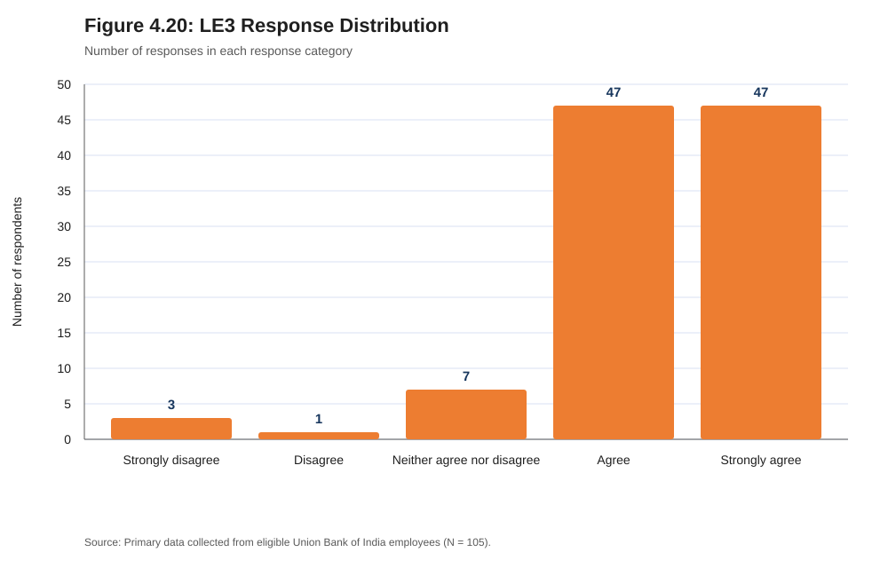

## Table B.17: LE4 — I felt involved in the learning process rather than simply completing required activities.

| Response | Frequency | Percentage |
| --- | ---: | ---: |
| Strongly disagree | 2 | 1.9% |
| Disagree | 0 | 0.0% |
| Neither agree nor disagree | 8 | 7.6% |
| Agree | 43 | 41.0% |
| Strongly agree | 52 | 49.5% |
| **Total scored records** | **105** | **100.0%** |

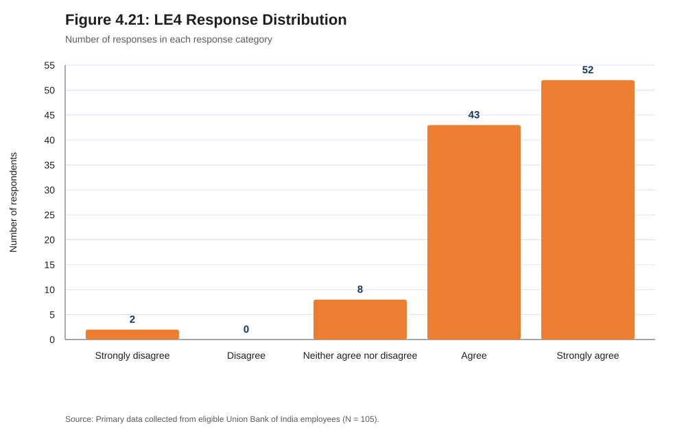

## Table B.18: LE5 — I asked questions or sought clarification when I did not understand something.

| Response | Frequency | Percentage |
| --- | ---: | ---: |
| Strongly disagree | 3 | 2.9% |
| Disagree | 0 | 0.0% |
| Neither agree nor disagree | 12 | 11.4% |
| Agree | 42 | 40.0% |
| Strongly agree | 48 | 45.7% |
| **Total scored records** | **105** | **100.0%** |

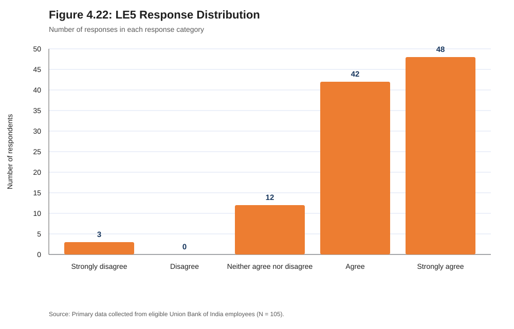

## Table B.19: LE6 — I remained interested in completing the programme.

| Response | Frequency | Percentage |
| --- | ---: | ---: |
| Strongly disagree | 4 | 3.8% |
| Disagree | 0 | 0.0% |
| Neither agree nor disagree | 6 | 5.7% |
| Agree | 39 | 37.1% |
| Strongly agree | 56 | 53.3% |
| **Total scored records** | **105** | **100.0%** |

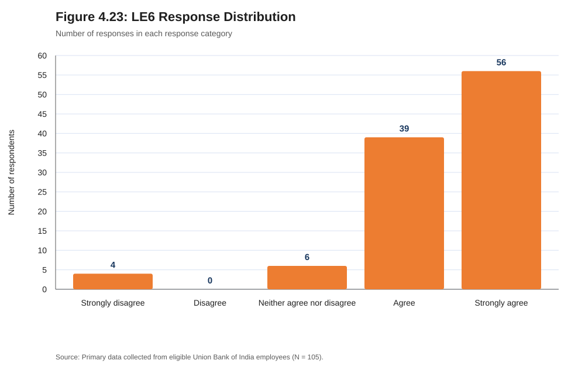

## Table B.20: TE1 — I understood the main knowledge or skills covered in the programme.

| Response | Frequency | Percentage |
| --- | ---: | ---: |
| Strongly disagree | 4 | 3.8% |
| Disagree | 1 | 1.0% |
| Neither agree nor disagree | 5 | 4.8% |
| Agree | 49 | 46.7% |
| Strongly agree | 46 | 43.8% |
| **Total scored records** | **105** | **100.0%** |

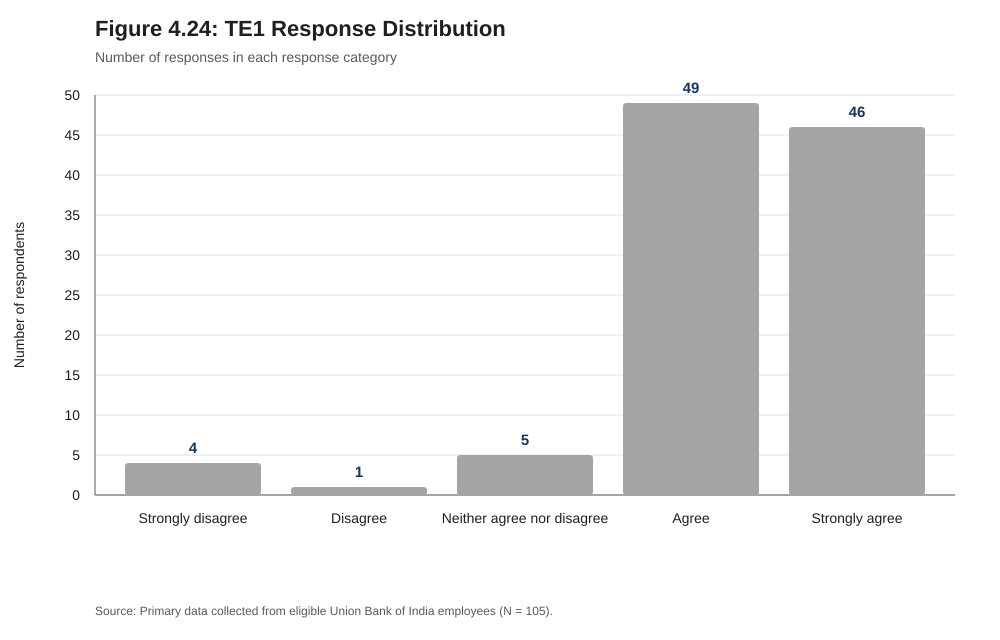

## Table B.21: TE2 — The training gave me knowledge or skills that are useful in my current role.

| Response | Frequency | Percentage |
| --- | ---: | ---: |
| Strongly disagree | 3 | 2.9% |
| Disagree | 2 | 1.9% |
| Neither agree nor disagree | 9 | 8.6% |
| Agree | 42 | 40.0% |
| Strongly agree | 49 | 46.7% |
| **Total scored records** | **105** | **100.0%** |

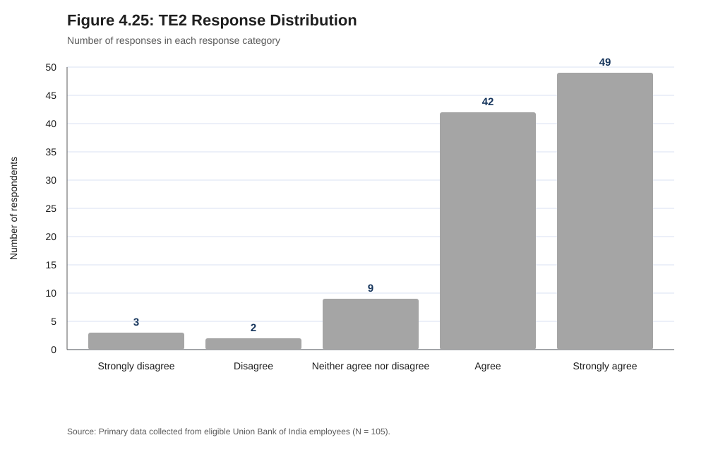

## Table B.22: TE3 — The content of the programme was relevant to the work I do at the Bank.

| Response | Frequency | Percentage |
| --- | ---: | ---: |
| Strongly disagree | 3 | 2.9% |
| Disagree | 0 | 0.0% |
| Neither agree nor disagree | 11 | 10.5% |
| Agree | 46 | 43.8% |
| Strongly agree | 45 | 42.9% |
| **Total scored records** | **105** | **100.0%** |

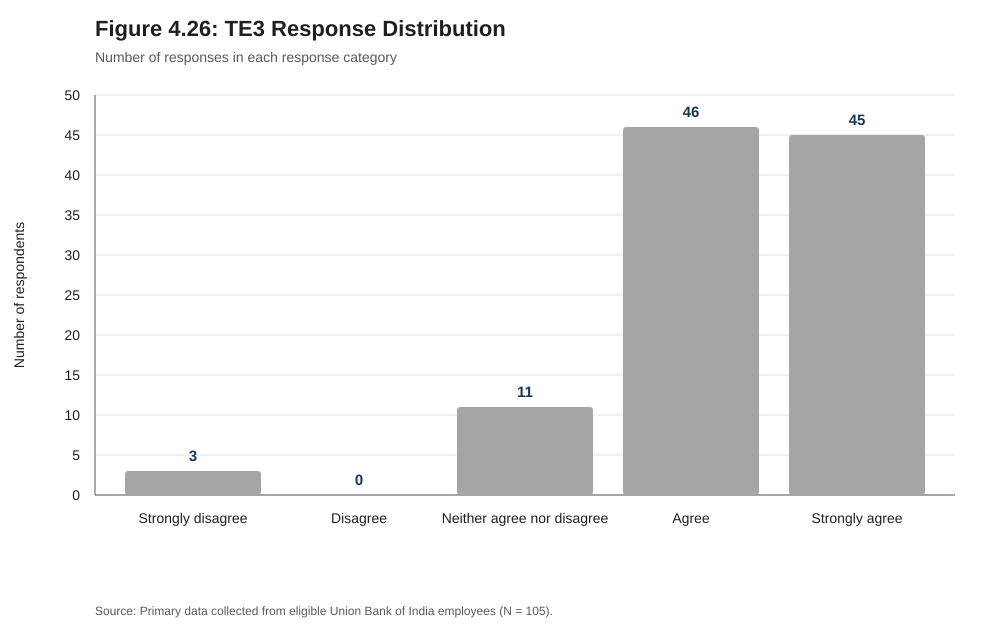

## Table B.23: TE4 — I feel capable of using the knowledge or skills taught in the programme.

| Response | Frequency | Percentage |
| --- | ---: | ---: |
| Strongly disagree | 4 | 3.8% |
| Disagree | 0 | 0.0% |
| Neither agree nor disagree | 10 | 9.5% |
| Agree | 44 | 41.9% |
| Strongly agree | 47 | 44.8% |
| **Total scored records** | **105** | **100.0%** |

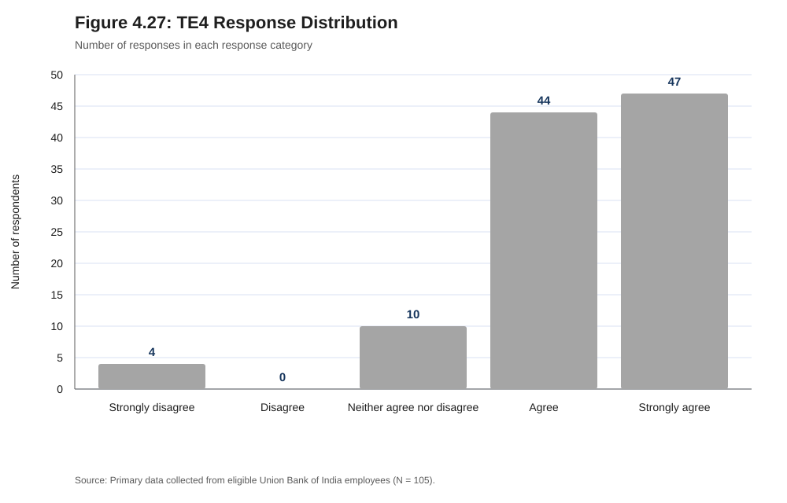

## Table B.24: TE5 — I have applied learning from the programme in my day-to-day work.

| Response | Frequency | Percentage |
| --- | ---: | ---: |
| Strongly disagree | 3 | 2.9% |
| Disagree | 2 | 1.9% |
| Neither agree nor disagree | 9 | 8.6% |
| Agree | 44 | 41.9% |
| Strongly agree | 47 | 44.8% |
| **Total scored records** | **105** | **100.0%** |

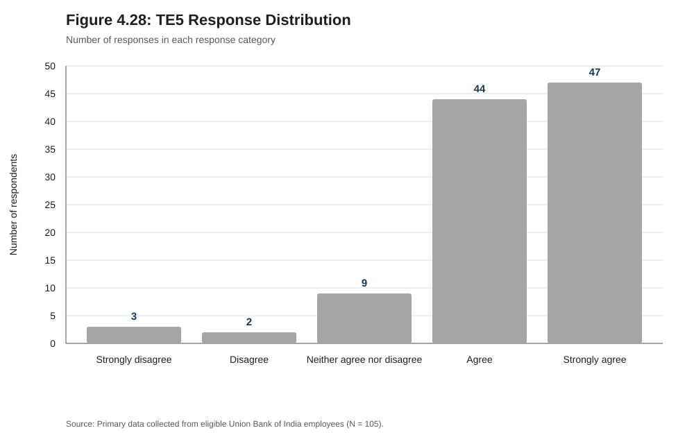

## Table B.25: TE6 — The programme helped me deal with relevant work tasks or problems more effectively.

| Response | Frequency | Percentage |
| --- | ---: | ---: |
| Strongly disagree | 4 | 3.8% |
| Disagree | 1 | 1.0% |
| Neither agree nor disagree | 10 | 9.5% |
| Agree | 50 | 47.6% |
| Strongly agree | 40 | 38.1% |
| **Total scored records** | **105** | **100.0%** |

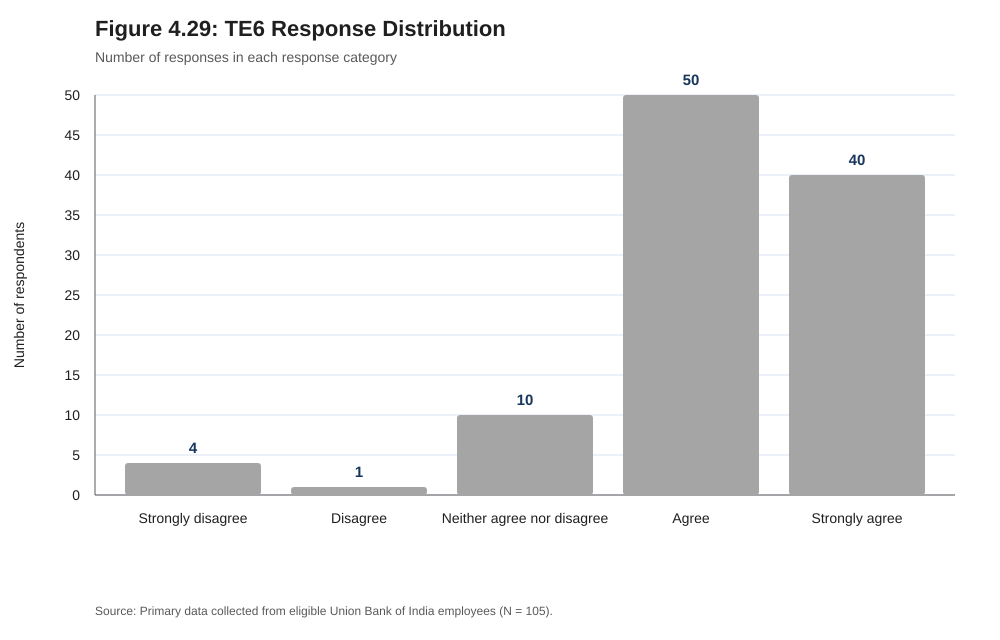

## Table B.26: TE7 — The programme has improved my confidence in carrying out relevant work responsibilities.

| Response | Frequency | Percentage |
| --- | ---: | ---: |
| Strongly disagree | 3 | 2.9% |
| Disagree | 3 | 2.9% |
| Neither agree nor disagree | 10 | 9.5% |
| Agree | 34 | 32.4% |
| Strongly agree | 55 | 52.4% |
| **Total scored records** | **105** | **100.0%** |

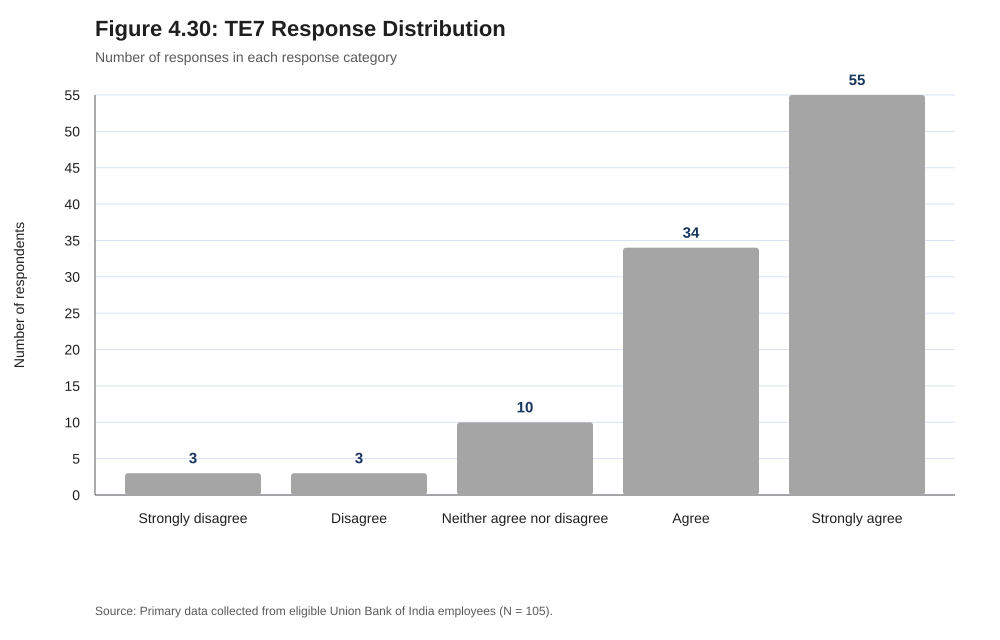
