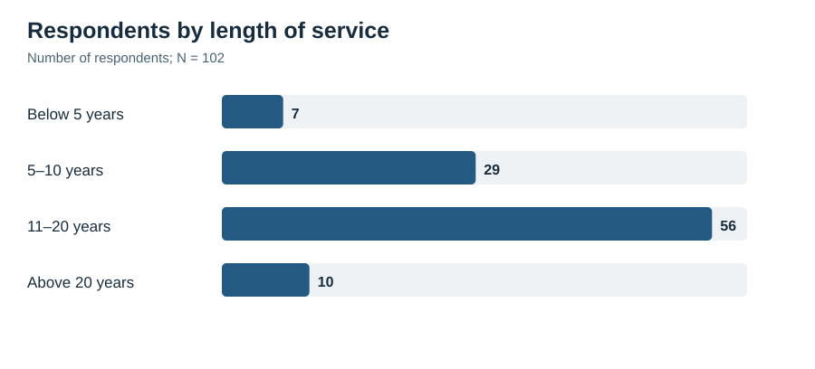
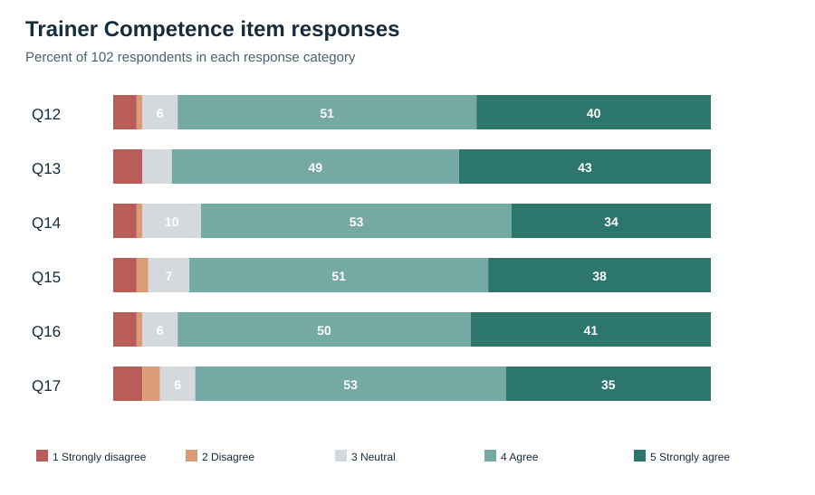
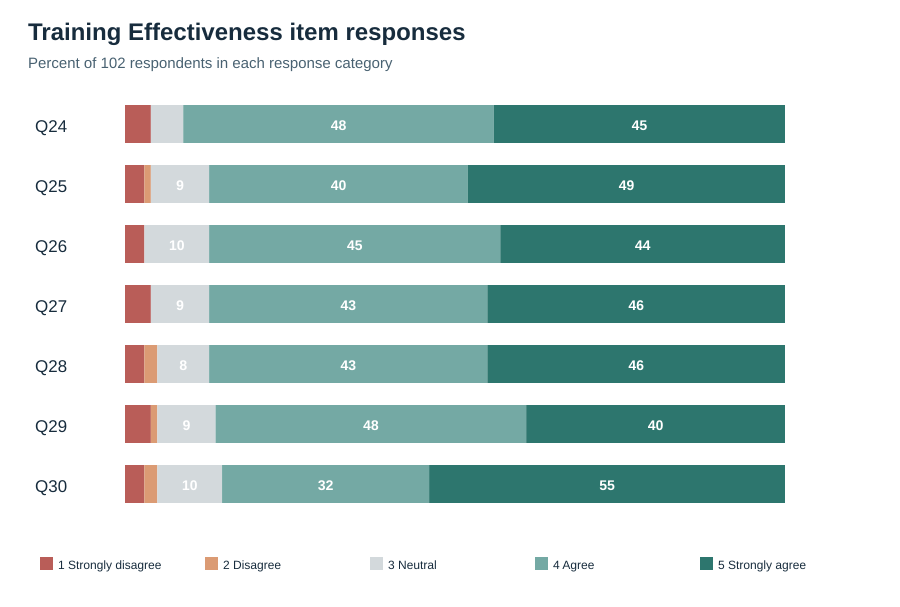

# Hybrid Learning and Training Effectiveness at Union Bank of India

# Chapter 1 — Introduction

## 1.1 Background and Context

Training is an everyday requirement in banking, not an occasional activity outside normal work. Employees may need to understand revised procedures, digital systems, products, compliance requirements, risk controls, and customer-service practices while continuing to manage their regular responsibilities. For this reason, a training programme is useful only when employees can access the material, understand why it matters, participate in the learning process, and apply relevant learning in their work.

Digital learning has made it easier for organisations to provide common learning material across locations. Through a digital platform, employees may receive modules, reading material, short videos, virtual sessions, assessments, and job aids without having to attend every activity in one physical location. This can be particularly useful when work schedules, travel, and the need to maintain customer service make conventional attendance difficult. At the same time, digital access alone does not ensure that learning has taken place. An employee may complete a module without understanding a new procedure, may be unable to locate material when it is needed, or may require a trainer to explain how a policy applies in an actual work situation.

Face-to-face learning continues to serve a different but equally important purpose. A trainer-led session can give employees an opportunity to ask questions, discuss a case, observe a demonstration, practise a task, receive feedback, and learn from colleagues facing similar work situations. This does not mean that every topic needs classroom delivery. Basic information, short assessments, refresher material, and reference resources may be well suited to a digital platform. The practical issue is whether the digital and face-to-face activities are connected in a way that helps employees move from information to understanding and then to use at work.

Hybrid learning, also called blended learning, is the planned combination of digital and face-to-face learning within one programme. It is not simply a programme that happens to contain both an online activity and a classroom session. A meaningful hybrid programme gives each activity a clear role. Digital material may prepare an employee before a session or remain available for revision later. A trainer-led session may then focus on clarification, practice, discussion, and work-related application. When the two parts are disconnected, training can feel like a set of separate requirements. When they are connected, employees can see why they are completing each activity and how it supports their work.

The present study is situated at Union Bank of India, among eligible employees connected with Regional Office Chennai South in Royapettah, Chennai. Union Bank’s annual reports describe a learning and development system that includes Union Vidya, the Bank’s Learning Management System (LMS), along with e-books, podcasts and audiobooks, microlearning resources, virtual workshops, role-based learning, mandatory e-learning modules for officers, and a Training Management System (Union Bank of India, 2024, 2025). Together, these arrangements make hybrid learning a practical question for the Bank. They provide the infrastructure for digital and trainer-led learning, while employee experience of a particular programme still needs to be examined. Respondents therefore considered one recent programme that used both modes.

The study examines four constructs. **Hybrid Learning** refers to the employee’s experience of how the digital and face-to-face parts of the programme were connected, including platform access, availability of material, and opportunities to revisit learning. **Trainer Competence** refers to the trainer’s knowledge, clarity, ability to connect activities across modes, use of relevant digital tools, encouragement of participation, and feedback. **Learner Engagement** refers to the employee’s attention, effort, interest, participation, and willingness to seek clarification. **Training Effectiveness** refers to the employee’s perception that the programme produced useful, understandable, relevant, and applicable learning for the current role.

The conceptual framework is:

    Hybrid Learning ────────┐
    Trainer Competence ─────┼──→ Training Effectiveness
    Learner Engagement ────┘

The framework treats Hybrid Learning, Trainer Competence, and Learner Engagement as separate employee-level predictors of Training Effectiveness. It does not assume that a well-planned programme or a competent trainer automatically makes every employee engage. Workload, time available for learning, prior experience, digital confidence, motivation, and immediate workplace conditions can also influence engagement. Employee perception matters because employees use the platform, attend sessions, interact with trainers, and decide whether learning helps in their work. The findings are therefore interpreted alongside the study’s stated self-report and cross-sectional limits.

Three complementary base papers provide the academic foundation for the study. Sosnova et al. (2025) provide the conceptual base paper by examining hybrid education methods and learning effectiveness in higher education. Kim (2022) provides corporate evidence from automotive sales training and shows why training delivery, instructor involvement, practice, and design should be evaluated rather than assumed to be effective. Bahl, Kiran and Sharma (2024) provide the Indian banking anchor through an open-access study of 402 managerial and non-managerial bank employees using Kirkpatrick’s Reaction, Learning, Behaviour, and Results framework. None of these papers reproduces the present Union Bank model. Together, they provide a justified conceptual, corporate, and banking basis for examining employee training effectiveness.

The topic is relevant to human-resource management because training design affects the employee’s experience of learning. If the digital and face-to-face parts are poorly connected, employees may see training as an additional task alongside their work. If a trainer cannot explain the purpose of an activity or respond to questions, employees may find it difficult to participate fully. In contrast, when learning activities are accessible, connected, and supported, employees may be better placed to understand and apply relevant knowledge. The study therefore focuses on practical conditions that can help the Bank design training that supports both employee capability and the continuity of work.

## 1.2 Key Concepts and Definitions

### Hybrid Learning

Hybrid Learning is the purposeful combination of digital and face-to-face learning within one training programme. The two modes are designed to support each other rather than operate as separate alternatives. In a banking programme, the digital component may include an LMS module, video, online assessment, virtual session, downloadable reference material, or short refresher. The face-to-face component may include a classroom session, demonstration, case discussion, role play, group exercise, or supervised practice.

In this study, Hybrid Learning is measured through the employee’s view of whether the two modes formed one connected programme, whether the digital platform and learning material were accessible, and whether digital material could be revisited when revision was needed. The study does not evaluate Union Vidya as a technology product, prescribe one fixed balance between digital and face-to-face learning, or compare online-only and classroom-only programmes.

### Trainer Competence

Trainer Competence refers to the ability of a trainer to support employee learning. It includes subject knowledge, clear explanation, effective use of relevant digital tools, the ability to connect digital and face-to-face activities, encouragement of participation, and useful feedback. These abilities matter in a hybrid programme because employees may need help in understanding why an online activity comes before a session, how a task will be discussed later, or how a new process applies in their own role.

Trainer Competence is treated separately from Hybrid Learning. A platform may be accessible, yet an employee may still need clear guidance and feedback. Similarly, a competent trainer may face limitations if learning material is difficult to access. Keeping the two constructs separate allows the study to examine their distinct associations with Training Effectiveness.

### Learner Engagement

Learner Engagement is the employee’s active involvement in the selected programme. It includes attention, effort to understand the content, participation in activities, interest in completing the programme, and willingness to seek clarification. Engagement is more than attendance or recorded completion. An employee may be physically present in a session or logged into a platform without concentrating on the content. An engaged employee makes an effort to understand, participates in discussion or practice, and asks questions when necessary.

The study measures engagement as the employee’s reported learning behaviour during one selected hybrid-training programme. It does not measure general work engagement, organisational commitment, motivation, or metacognitive skill as separate variables.

### Training Effectiveness

Training Effectiveness is the extent to which employees believe that a programme produced useful learning for their current work. It includes understanding the knowledge or skill taught, seeing its relevance to the role, feeling capable of using it, applying it in day-to-day tasks, handling related problems more effectively, and gaining confidence in relevant responsibilities.

This definition is informed by training-evaluation and training-transfer literature. It moves beyond immediate satisfaction, but it remains within the limits of employee self-report. The present study does not measure the Bank’s overall productivity, customer satisfaction, reputation, financial performance, or objective change in individual performance.

### Learning Management System

A Learning Management System, or LMS, is a digital system that helps an organisation organise, deliver, monitor, or support learning. It may host modules, reading material, videos, quizzes, virtual sessions, announcements, and learning records. Union Bank identifies Union Vidya as its LMS and places it within a wider learning and development system that includes e-learning, virtual training, staggered programmes, and role-based learning (Union Bank of India, 2024, 2025).

In the present study, Union Vidya is part of the Hybrid Learning context, not a separate construct. The questionnaire refers to the digital platform used for the selected programme and names Union Vidya as an example. This avoids assuming that every programme uses the same system or that all employees encounter the same platform features.

## 1.3 Need, Scope and Significance of the Study

### Need for the Study

The study addresses a practical question: when employees attend a programme that combines digital and face-to-face learning, how are Hybrid Learning, Trainer Competence, and Learner Engagement related to their perception of Training Effectiveness? This question matters because employees may be expected to learn while also managing regular work, responding to customers, following procedures, and keeping pace with digital change. Training that is difficult to access or poorly connected may increase the burden on employees rather than support them.

Research supports the importance of examining this issue, but a context gap remains. Much blended-learning research has been conducted with students. Those studies are helpful for understanding how learning environments can be designed, yet employees in banks learn under different conditions. They may need to balance learning with operational schedules, customer responsibilities, compliance work, and changing systems. Corporate evidence is available, but verified evidence on the combined relationships of Hybrid Learning, Trainer Competence, Learner Engagement, and Training Effectiveness among employees of an Indian public-sector bank remains limited.

Union Bank provides a suitable context because it has a documented digital-learning system and a broader training infrastructure. Public reporting confirms the availability of digital and trainer-led learning arrangements. It does not show how employees experience a particular programme. The present study focuses on this narrower employee-level question rather than making assumptions about the effectiveness of the complete training system.

### Scope of the Study

The study is limited to eligible employees connected with Union Bank of India Regional Office Chennai South who have attended at least one programme during the previous 12 months that included both digital and face-to-face learning. Respondents answer with reference to one recent programme. Employees who have attended only a digital programme or only a face-to-face programme are not eligible because they cannot comment meaningfully on the connection between the two learning modes.

The research examines Hybrid Learning, Trainer Competence, Learner Engagement, and Training Effectiveness. It does not treat knowledge retention, job performance, organisation-level results, supervisor support, employee agility, digital literacy, or the technical performance of Union Vidya as separate variables. These areas may matter for training generally, but including all of them would make the survey and analysis too broad for the proposed sample.

The study uses a structured five-point agreement questionnaire. It is quantitative, descriptive, correlational, and cross-sectional. The findings will describe the selected respondent group and relationships among reported perceptions. They will not establish that training caused later changes in work behaviour or bank performance.

### Significance of the Study

For Union Bank, the study may provide structured employee feedback on the connection between digital and face-to-face learning, the role of trainer support, and the conditions that encourage active engagement. The findings may identify practical areas for attention, such as the timing of digital modules, access to learning resources, clarity of trainer guidance, feedback, or opportunities for participation.

For trainers and learning-and-development staff, the study recognises that training is not limited to delivering content. Employees may need to understand how a digital module connects with a classroom activity, why a new procedure matters, and where they can obtain clarification after the session. Trainer preparation and programme design can therefore influence whether learning feels relevant and manageable alongside work responsibilities.

For academic research, the study contributes evidence from an underrepresented public-sector banking context. It brings together a conceptual study, corporate training evidence, and Indian banking evidence through a transparent, literature-informed questionnaire. The instrument was designed for this focused setting, reviewed by the academic guide, piloted, and assessed for internal consistency in the final sample.

## 1.4 Statement of the Problem

Union Bank of India has a documented learning and development system that includes digital resources and trainer-led training activity. These arrangements create the possibility of hybrid learning. However, the availability of a learning platform and training programmes does not show whether employees experience the digital and face-to-face activities as one connected learning process. It also does not show whether trainers provide the clarity and feedback employees need, whether employees participate actively, or whether the learning is seen as useful in their current work.

The problem addressed by this study is the limited verified evidence on the relationships among Hybrid Learning, Trainer Competence, Learner Engagement, and Training Effectiveness among Union Bank employees. Existing research offers useful findings from higher education, corporate training, and other workplace settings. It does not directly examine this four-construct framework in the selected public-sector banking setting or in relation to the Union Vidya/LMS context.

The study therefore examines whether Hybrid Learning, Trainer Competence, and Learner Engagement together are associated with employees’ perceptions of Training Effectiveness.

## 1.5 Research Questions

1. What are respondents’ perceptions of Hybrid Learning, Trainer Competence, Learner Engagement, and Training Effectiveness?
2. What associations are reported among the four study constructs?
3. To what extent do Hybrid Learning, Trainer Competence, and Learner Engagement jointly predict Training Effectiveness?

## 1.6 Industry and Company Context

### Banking Industry Context

Banking is a regulated, technology-enabled service industry. Employees need to keep up with revised procedures, compliance requirements, risk controls, products, customer-service practices, and digital systems while continuing their daily work. In a public-sector bank, learning must also reach employees across functions and locations without interrupting the continuity of customer service. Training therefore needs to provide accessible common material while still giving employees opportunities to ask questions, practise relevant tasks, receive guidance, and revisit learning when a work need arises.

This setting explains the value of a connected hybrid approach. A short policy update may be supported by a digital module and knowledge check. A procedural change may need digital preparation followed by a trainer-led demonstration and practice. Customer-facing topics may require discussion and role play, with digital material available later for revision. The purpose is not to use technology for every activity, but to connect each activity to the employee’s learning need and current work.

### Union Bank of India Context

Union Bank of India was registered in Mumbai on 11 November 1919 and became a nationalised bank in 1969. Andhra Bank and Corporation Bank were amalgamated into Union Bank on 1 April 2020 (Union Bank of India, n.d.-a). The Bank’s public profile reports more than 8,700 domestic branches and more than 73,900 employees as at June 2026. This large, geographically distributed setting makes consistent access to current learning material and trainer support important for employee development.

### Union Bank Training Architecture

The Bank’s current Learning and Development system combines physical learning infrastructure with digital delivery. The 2024–25 annual report describes a Master Policy on Learning and Development that includes e-learning, virtual training, staggered programmes, role-based training, mandatory e-learning modules for officers, and the Training Management System within Union Vidya (Union Bank of India, 2025). The 2023–24 report also describes Union Vidya as the Bank’s LMS, with digital learning resources and virtual workshops alongside classroom and locational programmes (Union Bank of India, 2024).

The Bank launched nine Union Learning Academies in 2022 as specialised Learning and Development Centres of Excellence. Its public training-centres list also identifies the Staff Training College at Bengaluru and seven Staff Training Centres in other cities (Union Bank of India, 2022; Union Bank of India, n.d.-b). These sources establish that the Bank has both trainer-led learning infrastructure and digital-learning arrangements. They do not show that every employee attended a particular centre or that every programme combined the two modes.

A staff circular dated 9 September 2026 provides a current example of how these arrangements may connect. It states that selected classroom sessions at Union Learning Academies and Zonal Learning Centres can be live-streamed through Microsoft Teams, with schedules and recordings made available through Union Vidya. Employees joining virtually may raise questions through the chat function, while the programme coordinator facilitates responses at suitable intervals (Union Bank of India, 2026). This shows an organisational arrangement for extending selected trainer-led sessions through digital access. It does not show that every programme is hybrid, that every employee uses the same facilities, or that this arrangement produces better employee outcomes.

The empirical focus is deliberately narrow: eligible employees connected with Regional Office Chennai South and their experience of one recent hybrid-training programme. This focus keeps the research close to employee experience and avoids unsupported conclusions about the entire Bank or the wider banking sector.

## 1.7 Chapterisation

Chapter 1 introduces the topic, defines the four study constructs, explains the need, scope, and significance of the study, states the research problem and research questions, and presents the industry and company context.

Chapter 2 reviews literature on Hybrid Learning, Trainer Competence, Learner Engagement, and Training Effectiveness. It explains the role of the three selected base papers, presents the theoretical and conceptual framework, describes the Union Bank case context, and identifies the workplace, banking, LMS, and measurement gaps addressed by the study.

Chapter 3 presents the research methodology. It explains the objective and hypothesis, variable definitions, research design, sample approach, data-collection procedure, questionnaire, SPSS-based analysis record, ethical considerations, limitations, and analysis plan.

Chapter 4 presents the data analysis and interpretation. Chapter 5 brings together the findings, contribution, limitations, future directions, and conclusion.

# Chapter 2 — Review of Literature

## 2.1 Review of Relevant Literature

### Hybrid Learning as an Integrated Training Design

Hybrid learning is generally understood as the intentional combination of digital and face-to-face learning within one programme. In an employee-training setting, this is not simply a question of dividing training hours between an online module and a classroom session. It is a question of design. Employees need to understand how one activity prepares them for the next and how the complete programme relates to a work task.

Digital learning can make basic information, reference resources, short assessments, and revision material available across locations. Face-to-face learning can create space for discussion, demonstration, feedback, practice, and clarification. These modes serve different purposes. A programme is more likely to feel coherent when employees can see why a digital activity comes before or after a trainer-led session, rather than experiencing both as separate requirements.

Garrison and Kanuka (2004) describe the potential of blended learning as arising from the thoughtful integration of online and face-to-face learning. Graham (2006) similarly explains blended learning through the combination of delivery modes, teaching methods, and learning approaches. Both sources are rooted mainly in education, yet their design principle is useful in a workplace: the two modes should complement one another rather than duplicate or contradict one another.

Educational evidence supports the broad value of purposeful integration, although it cannot be treated as direct evidence for bank employees. Vo, Zhu and Diep (2017) synthesised 51 effect sizes from higher-education courses and reported a small positive average effect for blended learning compared with conventional classroom teaching (*g* = 0.385). Yu, Yu, Li and Wang (2025) reviewed 133 empirical studies involving 18,464 student participants and reported an upper-medium effect on learning performance (*g* = 0.651). These findings suggest that a well-designed blended environment can support learning. However, students and employees work under different conditions. Employees may need to learn alongside customer service, routine operational work, deadlines, and changing procedures. These meta-analyses provide useful background, but their student results cannot be assumed to hold for Union Bank employees.

Kumar and Pande (2017) examine technology-mediated learning for working professionals. Their study is relevant because it does not treat technology as the sole reason for successful learning. It identifies institutional, facilitator, learner, and pedagogical conditions within a blended-learning ecosystem. In practice, an accessible platform may still be of limited use when employees do not see the relevance of the content, cannot obtain guidance, or do not understand how the learning connects with later work.

Mulaudzi (2021) studied blended teaching for workplace training in the South African transport sector. The study is a Master’s dissertation rather than a journal article, but it gives useful workplace-level insight into flexibility, digital access, time management, learning materials, and practical barriers. These conditions are relevant to employees who must complete training alongside their regular responsibilities. Mulaudzi’s work also helped shape the questionnaire’s practical wording on access, materials, and connected learning. Its instrument was not adopted as a corporate scale.

Han and Ellis (2020) developed the Perceptions of the Blended Learning Environment Questionnaire. Their work is important because it treats a blended environment as more than a general positive or negative opinion. It considers how learners experience the relationship between modes and the contribution of online learning. The scale was developed in higher education, so its student wording cannot be transferred unchanged to bank employees. Its value here lies in the way it brings integration, access, material availability, and revision into the assessment of a blended environment.

Sosnova, Hlianenko, Sosnova, Tsyna and Tsyna (2025) serve as the conceptual base paper for this study. The authors examined hybrid education methods and learning effectiveness through an experiment involving 64 higher-education students. The hybrid condition combined online platforms, practice-oriented activity, problem-based learning, interactive methods, and project work. The hybrid group reported stronger learning outcomes than the comparison group. The study does not use a corporate population, measure employee training effectiveness, or provide a questionnaire suitable for Union Bank employees. Its value lies in its direct conceptual proposition: a carefully designed hybrid approach can be examined in relation to learning effectiveness.

### Hybrid Training and Effectiveness in Corporate Settings

Kim (2022) provides the main corporate base paper for this study. The paper reports a South Korean automotive sales-training programme that shifted across three delivery methods: traditional training, fully digital training, and hybrid training. The analysis included 583 training instances from 2019 and 2020: 325 traditional, 140 fully digital, and 118 hybrid. The hybrid format included online and offline learning, whereas the fully digital format relied more heavily on self-directed learning.

Kim uses the Content, Instructional Design, Programmed Learning, and Recommendation framework, referred to as CIP-R, to evaluate training effectiveness. The framework includes content, instructional design, personalised learning, perceived competence, and recommendation. The study reported that effectiveness declined after the move from traditional to fully digital delivery and improved after the introduction of the hybrid format. It also identified instructor engagement, training duration, personalised learning, confidence and competence, and job-related skill level as factors associated with the reported training outcome.

Kim’s result needs a careful reading. The paper does not state that a hybrid programme is always better than a classroom programme. Traditional training had the highest estimated effectiveness mean, hybrid delivery was in the middle, and fully digital delivery had the lowest mean. The reported difference between hybrid and fully digital delivery was not statistically significant. The practical contribution is therefore not a claim that all corporate training should become hybrid. It is the finding that delivery mode, instructor involvement, practice, and programme design all matter when employees judge the value of training.

This evidence guides three decisions in the present study. First, Training Effectiveness is treated as more than immediate satisfaction. Second, Hybrid Learning is measured through the quality and integration of the employee’s experience, rather than only by asking whether an employee attended an online session. Third, Trainer Competence is retained as a separate construct because employees may need human guidance and feedback even when the digital component is accessible.

Uddin, Ahamed, Jakowan, Islam and Nahar (2026) provide additional corporate evidence from 150 employees with prior blended-learning experience. Their study examines whether blended learning influences employee performance through soft-skill development and knowledge acquisition. The authors found positive relationships between blended learning and the two learning-related variables, while the direct relationship with employee performance was not significant after those pathways were considered. The paper reinforces the view that work outcomes should not be assumed simply because a programme uses more than one delivery mode.

Uddin et al. are used as supporting workplace literature. Their soft-skill, knowledge-acquisition, and performance pathways would require additional measures beyond the four constructs examined here.

### Trainer Competence in Hybrid Training

Trainer competence is particularly important when a programme is spread across digital and face-to-face activity. Employees may need a trainer who can explain the subject clearly, connect an online module with a later session, use relevant digital tools, invite questions, and provide useful feedback. Without this support, an employee may complete the required activity without understanding how it relates to a current work responsibility.

Trainer competence should not be confused with the technical quality of an LMS. A platform may work well, yet a trainer may not explain the connection between its content and the learning objective. Similarly, a knowledgeable trainer may find it difficult to support learners if the material is inaccessible. These are related conditions, but they are not the same condition. For this reason, the questionnaire measures Hybrid Learning and Trainer Competence separately.

The selected base papers do not provide one open workplace study that measures Trainer Competence and Learner Engagement together in this exact model. Kim (2022) identifies instructor engagement, training design, participation, and practice as relevant to corporate training effectiveness. Mulaudzi (2021) discusses access, facilitation, material use, and practical barriers in workplace blended learning. Ansari et al. (2023) show, in a university setting, that blended-learning training was associated with improved lecturer and student competence and satisfaction. The population differs from the present study, but the paper supports the practical view that facilitation across digital and face-to-face modes requires competence rather than mere availability of technology.

Together, these studies provide a reasoned basis for distinguishing what the trainer does from how the employee participates. In the questionnaire, Trainer Competence covers subject knowledge, clarity, digital facilitation, connection of activities, participation support, and feedback. Learner Engagement covers attention, effort, participation, involvement, clarification-seeking, and interest. This distinction prevents a favourable view of the trainer from being treated as the same thing as the employee’s own active involvement in learning.

### Learner Engagement

Learner engagement refers to active involvement in the learning process. It may include attention, effort, persistence, participation, interest, and a willingness to seek clarification. Engagement is different from attendance. An employee may sit through a session, log into a platform, or appear as having completed a module without making a serious effort to understand the material. For a programme that deals with changing procedures or work practices, completion alone is therefore an incomplete indication of learning.

Schaufeli, Bakker and Salanova (2006) describe engagement in the work context through vigour, dedication, and absorption. Their scale measures work engagement rather than participation in a specific training programme. The useful principle here is that engagement involves active effort and involvement. Employees are asked whether they stayed attentive, made an effort to understand, participated in activities, felt involved, sought clarification, and remained interested in completing the selected programme.

Learner Engagement is retained as a separate independent variable for a practical reason. A connected programme and a competent trainer can support learning, but they cannot fully determine whether an employee remains attentive, participates, asks for clarification, or makes an effort to understand. Workload, time pressure, prior experience, digital confidence, motivation, and local work conditions may also influence engagement. The conceptual model therefore examines engagement’s own association with Training Effectiveness rather than assuming it lies on a fixed pathway between the other constructs and the outcome.

### Training Effectiveness

Training Effectiveness can be understood at different levels. Kirkpatrick’s framework distinguishes reaction, learning, behaviour, and results. This is useful because it shows why a positive immediate reaction is not enough to establish that training was effective. Employees may enjoy a session but fail to understand the material. They may understand the material but lack an opportunity to use it. They may apply a skill but be unable to identify an organisation-level result.

Bahl, Kiran and Sharma (2024) provide the most relevant banking base paper. Their open-access study used 402 managerial and non-managerial employees from public, private, and foreign-sector banks in India. Using Kirkpatrick’s Reaction, Learning, Behaviour, and Results framework, the study evaluates employee training effectiveness in a banking setting. It does not study Hybrid Learning, Trainer Competence, Learner Engagement, or Union Vidya. Its role in the present study is therefore specific: it confirms that training effectiveness is a substantive and measurable issue among bank employees, while leaving the present four-construct combination unexamined.

Holton (1996) argues that evaluation levels alone do not explain why learning is or is not transferred to practice. Individual factors, training design, and the work environment can affect later application. Baldwin and Ford (1988) describe transfer as the generalisation and maintenance of learned capability in work situations. Blume et al. (2010) provide meta-analytic evidence that individual characteristics, training design, and work-environment conditions are related to transfer. Together, these sources support a careful employee-level view of training effectiveness.

In the present study, Training Effectiveness includes understanding the content, seeing its relevance to the current role, feeling capable of using it, applying learning in relevant tasks, dealing with related work problems more effectively, and gaining confidence in responsibilities. The study does not ask employees to judge the Bank’s productivity, customer satisfaction, reputation, or financial results. Those outcomes require organisation-level data and a different design.

Aziz (2015) developed a General Training Effectiveness Scale for Malaysian workplace learning. The study is useful because it separates learning and individual performance from organisation-level outcomes. The questionnaire follows this employee-level logic and leaves out organisation-level items. Its wording is adapted to Union Bank training, with content review, a pilot, and reliability analysis used to assess the instrument.

### Workplace Implementation Conditions

The literature indicates that hybrid learning should be treated as a learning design, not as a technology purchase. An LMS can make content available, but it cannot decide which material employees need before a session, which issue requires discussion, or when someone needs feedback. Similarly, a classroom session can allow discussion, but it may not give employees an easy way to revisit a policy, procedure, or demonstration later. The quality of the connection between these activities is central to the present Hybrid Learning construct.

Mubayrik (2018) reviewed workplace blended-learning studies in adult education and identified recurring themes such as flexible access, authentic learning activities, collaboration, learner satisfaction, and support for technology use. The review is useful because it shows that workplace blended learning has been studied through varied populations, measures, and designs. It also explains why a broad claim that hybrid learning is automatically effective would be misleading. The type of work, learning objective, technology, trainer, and opportunity to participate can all shape an employee’s experience.

Learning sequence is especially relevant in a workplace. In some programmes, a digital activity may introduce terminology, policy content, background information, or a short demonstration before a trainer-led session. The later session can then focus on questions, case analysis, problem solving, and practice. In other programmes, a trainer-led session may introduce a complex issue and digital material may be used later for revision or a knowledge check. The survey asks whether employees experienced the two modes as connected and whether they could access the platform and materials when needed; it does not compare different training sequences.

A practical learning sequence can be understood as digital preparation, trainer-led engagement and practice, workplace application, and digital reinforcement. This is an illustrative design principle, not a second research model or an additional questionnaire section. It is useful because it gives every activity a clear role and helps employees see how learning can be used beyond the session.

### Use of the Literature in Practical Recommendations

The reviewed literature can guide recommendations after the survey findings are available, but it cannot predetermine those recommendations. If employees report lower Hybrid Learning scores for access or material availability, the Bank may need to review the timing and availability of digital resources. If Trainer Competence is lower for explaining the connection between modes or giving feedback, trainer preparation may need attention. If engagement is lower for participation or clarification-seeking, programme design may need to provide more opportunities for questions, practice, and follow-up.

The completed survey can indicate where employees saw strengths or difficulties in one recent programme. The literature then helps interpret those responses and identify practical areas for review.

### Summary of the Empirical Review

The literature supports the study while also showing its limits. Sosnova et al. (2025) provide a conceptual hybrid-learning and effectiveness link in higher education. Kim (2022) shows why corporate hybrid training should be evaluated through programme design, instructor involvement, practice, and employee outcomes. Bahl, Kiran and Sharma (2024) establish the relevance of training-effectiveness evaluation among Indian bank employees. Han and Ellis (2020), Mulaudzi (2021), and Aziz (2015) support the structure and workplace wording of the present questionnaire.

No single source supplies the complete model or a ready-made Union Bank questionnaire. The survey brings together relevant ideas from these papers, while the evidence map records how each item was developed.

### Literature Summary

**Table 2.1: Literature supporting the present study**

| Study | Context and contribution | Use in the present study |
| --- | --- | --- |
| Sosnova et al. (2025) | Hybrid education experiment with higher-education students; examines learning effectiveness. | Conceptual anchor for examining Hybrid Learning and learning effectiveness. |
| Kim (2022) | Corporate automotive sales-training study comparing delivery methods. | Corporate evidence on training design, instructor involvement, participation, and Training Effectiveness. |
| Bahl, Kiran and Sharma (2024) | Open Indian banking study of 402 employees using Kirkpatrick’s framework. | Banking-sector anchor for employee-level Training Effectiveness. |
| Han and Ellis (2020) | Validated blended-learning-environment instrument in higher education. | Supports the structure of Hybrid Learning items, adapted for the workplace. |
| Mulaudzi (2021) | Workplace blended-learning study in the transport sector. | Supports workplace wording on access, materials, flexibility, and facilitation. |
| Aziz (2015) | Workplace training-effectiveness scale development. | Supports employee-level learning, relevance, and application items. |

## 2.2 Theoretical Framework

### Blended-Learning Integration

The first theoretical perspective is that Hybrid Learning works through the meaningful integration of learning modes. Garrison and Kanuka (2004) and Graham (2006) provide the conceptual basis for this view. A programme should not ask employees to complete digital work and attend a session without explaining the relationship between them. When learning activities have a clear sequence, employees may be more likely to understand the purpose of the programme and participate actively.

### Separate Employee-Level Predictors

The second perspective is that Hybrid Learning, Trainer Competence, and Learner Engagement are related but distinct employee-level conditions. Kim (2022) highlights instructional design, instructor involvement, participation, and practice in corporate training. Ansari et al. (2023) and Mulaudzi (2021) also show that facilitation and access conditions matter when learning is distributed across digital and face-to-face modes. At the same time, an employee’s engagement can be shaped by circumstances beyond the trainer and programme design. The present study therefore measures all three constructs separately and examines their joint association with Training Effectiveness.

### Training Evaluation and Transfer

The third perspective is drawn from training evaluation and transfer literature. Kirkpatrick (1994) explains why evaluation should move beyond immediate reaction. Holton (1996), Baldwin and Ford (1988), and Blume et al. (2010) show that learning and later application are affected by individual, design, and environmental conditions. The present study does not measure organisation-level results. It examines employees’ own perception that learning was understandable, relevant, useful, and applicable in their current role.

### Conceptual Framework

The theoretical perspectives support the following framework:

    Hybrid Learning ────────┐
    Trainer Competence ─────┼──→ Training Effectiveness
    Learner Engagement ────┘

The three independent variables are examined together in relation to Training Effectiveness. The model does not assume a fixed sequence between programme design, trainer support, and employee engagement. The arrows show the predictor–outcome structure used in the SPSS multiple regression; they do not prove causation.

## 2.3 Case Study: Union Bank of India

The study is situated at Union Bank of India, with data collected among employees connected with Regional Office Chennai South. Bank employees may need current knowledge of products, procedures, compliance requirements, risk controls, digital systems, and customer-service practices. Training is therefore relevant to employee development as well as the consistent delivery of work.

Union Bank’s annual reports describe a broad Learning and Development system. The 2023–24 report records the launch of Union Vidya as the Bank’s LMS and identifies digital resources and virtual workshops available through the platform. It also records classroom and locational training delivered through the wider training system. The 2024–25 report describes a Master Policy on Learning and Development that includes e-learning, virtual training, and staggered programmes. It reports ten mandatory e-learning modules for officers, role-based training, and the Training Management System in Union Vidya as a one-stop digital platform (Union Bank of India, 2024, 2025).

The Bank launched nine Union Learning Academies in 2022 as specialised Learning and Development Centres of Excellence. Its public training-centres list also identifies the Staff Training College at Bengaluru and seven Staff Training Centres in other cities (Union Bank of India, 2022; Union Bank of India, n.d.-b). These sources describe physical trainer-led learning infrastructure; they do not establish the experience of every employee or the design of every programme.

A 9 September 2026 internal staff circular further states that selected classroom sessions conducted through Union Learning Academies and Zonal Learning Centres may be live-streamed through Microsoft Teams. The circular states that schedules and recordings are available through Union Vidya and that virtual participants can raise questions through Teams chat (Union Bank of India, 2026). This is direct organisational evidence of a delivery arrangement that can connect trainer-led and digital access.

This documented infrastructure explains why Union Bank is a suitable setting for the present study. It shows that the organisation has digital-learning resources and trainer-led learning arrangements from which a connected hybrid programme may be designed. It does not establish that every employee has the same experience, every programme uses the same design, or digital resources are equally accessible in every setting. The survey addresses this employee-level question by asking eligible respondents about one specific recent programme that included both modes.

The case study is deliberately limited to actual employee experience. Respondents are not asked to judge the complete training system or compare several programmes from memory. The questionnaire avoids collecting customer information, internal system records, confidential details, or Bank-wide performance data.

## 2.4 Gaps in the Study

The first gap is a **workplace-context gap**. Important blended-learning literature and measurement scales come from higher education. Employee training occurs alongside job roles, schedules, customer expectations, and work pressures. Corporate studies exist, but direct evidence on how employees experience hybrid training remains less extensive than the education literature.

The second gap is a **banking-sector gap**. Bahl, Kiran and Sharma (2024) show that Training Effectiveness can be evaluated among Indian bank employees, but their study does not examine Hybrid Learning, Trainer Competence, Learner Engagement, or Union Vidya. Union Bank has documented digital-learning infrastructure, yet published organisational material does not show how employees experience the integration of digital and face-to-face learning, trainer support, engagement, and training effectiveness.

The third gap is a **predictor-combination gap**. Sosnova examines hybrid methods and learning effectiveness in education. Kim examines training effectiveness across delivery methods in a corporate setting. Bahl, Kiran and Sharma evaluate training effectiveness in Indian banking through Kirkpatrick’s model. These papers are complementary, but none examines Hybrid Learning, Trainer Competence, and Learner Engagement together as separate predictors of employee-level Training Effectiveness in a public-sector bank.

The fourth gap is a **measurement gap**. A validated blended-learning environment scale is available in a student setting, while a workplace training-effectiveness scale includes organisation-level outcomes. Neither can be used unchanged for a short survey of Union Bank employees. The present study uses a literature-informed questionnaire that separates programme design, trainer competence, learner engagement, and employee-level training effectiveness. The instrument was reviewed by the academic guide and piloted online with 20 eligible employees on 15–16 September 2026. The SPSS analysis reports overall internal consistency for the 26-item questionnaire; it does not provide separate reliability estimates for the four constructs.

Related research exists across higher education, corporate learning, and banking training evaluation. Evidence remains limited, however, at the specific intersection of hybrid learning, trainer competence, learner engagement, training effectiveness, public-sector banking, and Union Vidya/LMS experience. This study addresses that focused intersection.

# Chapter 3 — Research Methodology

## 3.1 Objectives of the Study

The study examines how eligible respondents of Union Bank of India experienced one hybrid-training programme and how that experience was associated with perceived Training Effectiveness. In a public-sector bank, employees may use digital material, attend trainer-led sessions, and continue regular operational work at the same time. The study therefore considers the employee’s reported programme experience rather than assuming that the availability of an LMS alone makes training effective.

The primary objective is:

**To examine whether Hybrid Learning, Trainer Competence, and Learner Engagement jointly predict Training Effectiveness among eligible respondents of Union Bank of India.**

The specific objectives are:

1. To describe respondents’ perceptions of Hybrid Learning, Trainer Competence, Learner Engagement, and Training Effectiveness.
2. To examine the associations among the four study constructs.
3. To determine the joint contribution of Hybrid Learning, Trainer Competence, and Learner Engagement in predicting Training Effectiveness.

The objectives are stated as associations and prediction within the selected sample. They do not claim that any construct causes another.

## 3.2 Hypothesis of the Study

The study uses one omnibus regression hypothesis at the 5 per cent level of significance.

**Table 3.1: Regression hypothesis**

| Null hypothesis (H₀) | Alternative hypothesis (H₁) |
| --- | --- |
| Hybrid Learning, Trainer Competence, and Learner Engagement do not jointly predict Training Effectiveness among eligible respondents of Union Bank of India. | Hybrid Learning, Trainer Competence, and Learner Engagement jointly predict Training Effectiveness among eligible respondents of Union Bank of India. |

The hypothesis concerns the overall regression model. Individual coefficients are also reported because they show each predictor’s association with Training Effectiveness after the overlap between the three predictors has been considered.

## 3.3 Definition of Variables

The study uses four scored constructs.

**Hybrid Learning** is the planned combination of digital and face-to-face learning within one programme. It is measured through connected design, access to the digital platform, availability of learning material, and the ability to revisit digital learning. Questions 5–11 measure this construct.

**Trainer Competence** is the trainer’s ability to support learning through subject knowledge, clear explanation, connected facilitation across learning modes, effective use of relevant digital tools, encouragement of participation, and feedback. Questions 12–17 measure this construct.

**Learner Engagement** is the respondent’s active involvement in the selected training programme. It includes attention, effort, participation, involvement, clarification-seeking, and interest in completing the programme. Questions 18–23 measure this construct. Engagement is treated as a separate independent variable because employee involvement can also be influenced by workload, time availability, prior experience, motivation, digital confidence, and workplace conditions.

**Training Effectiveness** is the respondent’s perception that the programme produced useful learning for the current role. It includes understanding, work relevance, capability, application, support for related work tasks, and confidence. Questions 24–30 measure this construct.

**Table 3.2: Construct operationalisation and item allocation**

| Construct | Questions | Number of items | Role in the regression model |
| --- | ---: | ---: | --- |
| Hybrid Learning | 5–11 | 7 | Independent variable |
| Trainer Competence | 12–17 | 6 | Independent variable |
| Learner Engagement | 18–23 | 6 | Independent variable |
| Training Effectiveness | 24–30 | 7 | Dependent variable |
| **Total Likert-scale items** | **5–30** | **26** | — |

The questionnaire has 30 numbered questions. Questions 1–4 confirm eligibility and describe the respondent group. Questions 5–30 are five-point agreement items. Knowledge retention, job performance, organisation-level results, employee agility, supervisor support, and technical performance of Union Vidya are outside the measured model.

## 3.4 Research Design

The study follows a quantitative, descriptive, correlational, and predictive research design. It is quantitative because it uses structured response options and statistical analysis. It is descriptive because it reports the pattern of employee responses. It is correlational because it examines the direction and strength of reported associations among the four construct means. It is predictive because the SPSS regression model examines how the three independent variables jointly relate to the dependent variable, Training Effectiveness.

The study is cross-sectional. Each respondent completed the questionnaire once and answered with reference to one hybrid-training programme attended during the previous 12 months. This approach asks employees to consider a specific programme rather than compare several programmes from memory. The unit of analysis is the individual response record.

The model is:

    Hybrid Learning ────────┐
    Trainer Competence ─────┼──→ Training Effectiveness
    Learner Engagement ────┘

The model does not assume that Hybrid Learning or Trainer Competence determines Learner Engagement. The three variables may be related, but engagement can also reflect employee and work-context conditions that were outside the measured model.

## 3.5 Population, Sample and Sampling Method

The study population comprises Union Bank of India employees connected with Regional Office Chennai South who had attended a training programme that included both digital or online learning and face-to-face learning during the previous 12 months.

Non-probability purposive sampling was used. An employee was eligible only when the employee had attended hybrid training in the stated period. This condition was necessary because employees who had experienced only one delivery mode could not comment meaningfully on the connection between digital and face-to-face activity.

The initial target was approximately 80 eligible respondents. A total of 132 records were received: 70 printed questionnaires and 62 Google Forms submissions. Initial screening retained 103 profile-complete records. The multiple regression uses 102 valid cases because one record had no Trainer Competence mean in the SPSS analysis file.

The questionnaire was anonymous and did not collect employee names or numbers. Therefore, the analysis treats each eligible submitted form as one response record. Similar answer patterns were not treated as proof of duplicate respondents without identifying evidence.

## 3.6 Data Collection Procedure and Screening

Primary data were collected through printed questionnaires and a Google Forms link. The fieldwork record confirms that employees were approached through Regional Office Chennai South and 27 Chennai branches: Triplicane 1, Triplicane 2, Triplicane 3, Alandur, Teynampet, Mowbrays Road, Chamiers Road, Mylapore 1, Mylapore 2, Mylapore 3, Adyar, Madhya Kailash, Besant Nagar 1, Besant Nagar 2, Indiranagar, Shastri Nagar, T. Nagar 1, T. Nagar 2, T. Nagar 3, West Mambalam, Nungambakkam, Koyambedu, Virugambakkam, Saligramam, Ashok Nagar 1, Ashok Nagar 2, and Ashok Nagar 3. Responses were also collected from the Retail Loans and Currency Chest departments at the Regional Office. The Google Forms link allowed employees to respond when a paper form could not be completed immediately because of work responsibilities.

*Source: Researcher’s internship fieldwork record.*

**Table 3.3: Response disposition and SPSS analysis cases**

| Disposition | Digital | Manual | Total |
| --- | ---: | ---: | ---: |
| Responses received | 62 | 70 | 132 |
| Q1 = No | 13 | 3 | 16 |
| Q1 blank or unreadable | 0 | 11 | 11 |
| Required profile field blank | 0 | 2 | 2 |
| Profile-complete records before SPSS | 49 | 54 | 103 |
| SPSS listwise exclusion for missing construct mean | — | — | 1 |
| **Valid SPSS analysis cases** | — | — | **102** |

## 3.7 Research Instrument and Scoring

The research instrument is a structured, self-administered questionnaire placed in the Appendix. It has 30 numbered questions. Questions 1–4 screen for eligibility and describe the respondent group. Questions 5–30 use a five-point agreement scale from Strongly Disagree to Strongly Agree. Each respondent answered about one hybrid-training programme attended during the preceding 12 months.

The instrument is literature-informed and adapted to the Union Bank context. Its content basis is documented through the selected base papers and supporting measurement literature. Union Vidya is named as the Bank’s LMS and as an example platform that may have been used in the selected programme.

For Questions 5–30, response categories are coded from 1 for Strongly Disagree to 5 for Strongly Agree. SPSS output refers to the corresponding construct means as `HLTMEAN`, `TCTMEAN`, `LETMEAN`, and `TETMEAN`.

## 3.8 Research Questions

1. What are respondents’ perceptions of Hybrid Learning, Trainer Competence, Learner Engagement, and Training Effectiveness?
2. What associations are reported among the four study constructs?
3. To what extent do Hybrid Learning, Trainer Competence, and Learner Engagement jointly predict Training Effectiveness?

## 3.9 Data Analysis Techniques

SPSS Statistics 23 was used to describe responses and test the relationships among the four constructs. The regression model used 102 valid cases.

**Table 3.4: SPSS-based analysis plan**

| Analysis | SPSS procedure used | Role in the study |
| --- | --- | --- |
| Item description | Descriptives with mean, standard deviation, skewness, and kurtosis for 26 items | Chapter 4 presents the seven Hybrid Learning item means used to discuss the lowest-rated aspect of that construct. |
| Construct exploration | Explore procedure with histograms, Q–Q plots, boxplots, and normality tests | Examines the construct-mean distributions. |
| Overall questionnaire consistency | One 26-item Cronbach’s alpha analysis | Reports overall internal consistency of the item set. |
| Exploratory structure check | Principal Component Analysis with varimax rotation | Retained as an exploratory diagnostic; it does not redefine the four theory-based constructs. |
| Association | Pearson correlation | Describes pairwise associations among the four construct means. |
| Main hypothesis test | Multiple regression | Tests the combined relationship of Hybrid Learning, Trainer Competence, and Learner Engagement with Training Effectiveness. |
| Respondent profile | Excel frequency and percentage summary | Describes age group, length of service, and job level for the selected 102 profile-complete records. |
| Supplementary comparisons | One-sample and paired *t*-tests, Welch’s independent-samples *t*-test, and one-way ANOVA | Provides descriptive comparisons for the 102-case scored dataset; these are exploratory and are not the main hypothesis test. |
| Crosstab suitability check | Pearson chi-square on construct-mean categories | Checks whether those tables have adequate expected cell counts before any inferential interpretation. |

The multiple-regression model is:

    Training Effectiveness = b₀ + b₁(Hybrid Learning) + b₂(Trainer Competence) + b₃(Learner Engagement) + e

In this model, Training Effectiveness is the dependent variable. Hybrid Learning, Trainer Competence, and Learner Engagement are entered together as independent variables. The overall F-test determines whether the three predictors jointly explain a statistically significant amount of variation in Training Effectiveness. The coefficient table then shows each predictor’s adjusted association after the other predictors are considered.

Pearson correlations provide context for interpreting the regression results. These analyses establish association within the selected sample rather than cause and effect.

The respondent-profile summary was produced in an Excel workbook. The supplementary comparisons in Chapter 4 were calculated from the corresponding 102-record subset of the frozen 103-record scored CSV. They are distinguished from the supplied SPSS viewer results because several of that viewer’s additional tests used 103 cases. The saved SPSS data file is needed to confirm exact case-by-case agreement between the two sources before final submission. The supplementary results are not used to decide the main hypothesis.

## 3.10 Questionnaire Review, Reliability and Validity

Before main data collection, the academic guide-approved questionnaire was piloted online with 20 eligible employees on 15–16 September 2026. The pilot checked clarity, completion burden, Union Vidya wording, relevance, and repetition. Feedback did not identify a systematic issue requiring deletion of a scored item, so the approved 30-question instrument was retained. Pilot records were stored separately and excluded from the main analysis.

The SPSS analysis reports one reliability analysis across all 26 Likert-scale items. The overall Cronbach’s alpha is .980239. This indicates very high internal consistency for the complete item set in the SPSS analysis file. Because the output does not provide four separate reliability runs, it is not used to claim separate alpha values for Hybrid Learning, Trainer Competence, Learner Engagement, or Training Effectiveness.

Content relevance is supported by the questionnaire evidence map. Hybrid Learning items are based on blended-learning integration and workplace-access literature. Trainer Competence and Learner Engagement items are based on workplace blended-learning and engagement literature. Training Effectiveness items are based on corporate training evaluation and transfer literature, including Bahl, Kiran and Sharma’s (2024) banking evaluation context. The academic guide’s review supports the practical suitability of the wording for this academic study.

## 3.11 Ethical Considerations and Limitations

Participation was voluntary, and the survey avoided personal identifiers and confidential Bank data. Respondents were informed that the study was for academic use and that only combined results would be reported.

The study uses a non-probability sample, so its findings cannot be generalised statistically to all Bank employees. It is cross-sectional and based on employee perceptions; therefore, it cannot establish causation. The same respondent assessed programme experience, trainer competence, engagement, and training effectiveness, which may strengthen observed associations through a common self-report condition. SPSS provides one overall 26-item alpha rather than separate construct-level reliability estimates. One record was excluded listwise from the regression because a Trainer Competence mean was missing in the analysis file.

These limitations define the study’s contribution. It offers a focused account of how eligible respondents experienced Hybrid Learning, Trainer Competence, Learner Engagement, and Training Effectiveness in the Union Bank context, while keeping conclusions within the evidence available.

# Chapter 4 — Data Analysis and Interpretation

This chapter presents the SPSS Statistics 23 results alongside clearly identified supplementary summaries from the selected 102-record scored dataset. The main analysis concerns the extent to which Hybrid Learning, Trainer Competence, and Learner Engagement jointly predict Training Effectiveness among the selected Union Bank respondents.

The SPSS output uses 102 valid cases for the construct-level exploration and multiple-regression model. Some item-level and pairwise outputs use 103 or 102 cases because SPSS applies the available-case rule for those procedures. Each table states the number of cases used for that analysis.

The results describe the selected respondent group. They show reported associations and prediction within this sample; they do not establish that one part of training causes another.

## 4.1 Descriptive Analysis

### Respondent Profile

The profile summary covers 102 complete respondent records: 48 online and 54 paper responses. The largest age group was 35–44 years, and just over half reported 11–20 years of service. Officers formed the largest job-level group. Each percentage uses 102 as its denominator.

**Table 4.1: Respondent profile frequencies (N = 102)**

| Profile | Category | Frequency | Percentage |
| --- | --- | ---: | ---: |
| Age group | Below 25 | 0 | 0.0 |
| Age group | 25–34 | 29 | 28.4 |
| Age group | 35–44 | 56 | 54.9 |
| Age group | 45–54 | 13 | 12.7 |
| Age group | 55 and above | 4 | 3.9 |
| Length of service | Below 5 years | 7 | 6.9 |
| Length of service | 5–10 years | 29 | 28.4 |
| Length of service | 11–20 years | 56 | 54.9 |
| Length of service | Above 20 years | 10 | 9.8 |
| Job level | Clerical | 20 | 19.6 |
| Job level | Officer | 56 | 54.9 |
| Job level | Managerial | 26 | 25.5 |

*Source: Formula-based Excel profile-frequency workbook for the 102-record V5 subset. Percentages may differ from 100.0 by 0.1 because of rounding.*

**Figure 4.1: Age-group distribution**

**Figure 4.2: Length-of-service distribution**

**Figure 4.3: Job-level distribution**

### 4.1.1 Construct-Level Results

SPSS *Explore* output was used to examine the four construct means together. All construct means are above the midpoint of the five-point response scale. Learner Engagement has the highest mean, followed by Training Effectiveness, Trainer Competence, and Hybrid Learning.

**Table 4.2: Construct-level descriptive statistics from SPSS Explore output**

| Construct | Valid N | Mean | Standard deviation | Minimum | Maximum | Skewness | Kurtosis |
| --- | ---: | ---: | ---: | ---: | ---: | ---: | ---: |
| Hybrid Learning | 102 | 4.148 | 0.859 | 1.000 | 5.000 | -1.818 | 4.058 |
| Trainer Competence | 102 | 4.158 | 0.863 | 1.000 | 5.000 | -2.109 | 5.583 |
| Learner Engagement | 102 | 4.317 | 0.793 | 1.000 | 5.000 | -2.131 | 6.236 |
| Training Effectiveness | 102 | 4.254 | 0.835 | 1.000 | 5.000 | -2.035 | 5.275 |

*Source: Supplied SPSS Statistics 23 output, Explore procedure.*

**Figure 4.4: Mean ratings for the four study constructs**

*Source: Code-drawn figure from the four SPSS Explore means in Table 4.2; the dashed line marks the neutral response value of 3.*

Responses were concentrated toward agreement and strong agreement, producing the negative skewness shown in Table 4.2. Fewer employees gave low ratings. The survey does not establish why they responded this way.

Hybrid Learning has the lowest construct mean, though it remains above the neutral point. This indicates that respondents generally viewed the mixed digital and face-to-face arrangement positively, while leaving more room for improvement than the other three areas. Learner Engagement has the highest mean. In practical terms, respondents generally reported attention, participation, and interest in the programme selected for the questionnaire.

### 4.1.2 Hybrid Learning Item Results

The seven Hybrid Learning items describe the connection between digital and face-to-face activities and access to the digital material. Table 4.3 reports their means from the SPSS item-descriptives output. These item results use 103 valid responses, while Table 4.2 uses the 102 cases available together across all four construct means.

**Table 4.3: Hybrid Learning item means**

| Question | Item focus | Valid N | Mean |
| --- | --- | ---: | ---: |
| Q5 | Digital and face-to-face parts planned as one experience | 103 | 4.107 |
| Q6 | Digital activities prepared the respondent for face-to-face sessions | 103 | 3.990 |
| Q7 | Face-to-face sessions clarified or applied digital learning | 103 | 4.165 |
| Q8 | Access to the digital platform | 103 | 4.184 |
| Q9 | Ease of platform navigation | 103 | 4.107 |
| Q10 | Availability of digital learning materials | 103 | 4.223 |
| Q11 | Access to digital material for revision | 103 | 4.262 |

*Source: SPSS Statistics 23 item descriptives; item wording is given in Appendix A.*

Q6 has the lowest mean among the seven Hybrid Learning items. It asks whether digital activities prepared the respondent for the face-to-face sessions. The mean of 3.990 remains positive, but it points to a part of the learning sequence that could be reviewed in future programmes.

The following table gives the full response distribution for each of the 26 scored questions in the reconstructed 102-case dataset. Each row totals 102. These counts come from the scored CSV and are separate from the 103-case SPSS item means in Table 4.3. The accompanying charts were generated from the same counts.

**Table 4.4: Item response frequencies for the 102-case scored dataset**

| Construct | Question | 1 Strongly disagree | 2 Disagree | 3 Neutral | 4 Agree | 5 Strongly agree |
| --- | --- | ---: | ---: | ---: | ---: | ---: |
| Hybrid Learning | Q5 | 4 | 4 | 6 | 51 | 37 |
| Hybrid Learning | Q6 | 3 | 5 | 13 | 51 | 30 |
| Hybrid Learning | Q7 | 4 | 2 | 9 | 45 | 42 |
| Hybrid Learning | Q8 | 3 | 3 | 7 | 49 | 40 |
| Hybrid Learning | Q9 | 5 | 3 | 8 | 46 | 40 |
| Hybrid Learning | Q10 | 4 | 2 | 6 | 45 | 45 |
| Hybrid Learning | Q11 | 4 | 1 | 5 | 48 | 44 |
| Trainer Competence | Q12 | 4 | 1 | 6 | 51 | 40 |
| Trainer Competence | Q13 | 5 | 0 | 5 | 49 | 43 |
| Trainer Competence | Q14 | 4 | 1 | 10 | 53 | 34 |
| Trainer Competence | Q15 | 4 | 2 | 7 | 51 | 38 |
| Trainer Competence | Q16 | 4 | 1 | 6 | 50 | 41 |
| Trainer Competence | Q17 | 5 | 3 | 6 | 53 | 35 |
| Learner Engagement | Q18 | 3 | 4 | 4 | 41 | 50 |
| Learner Engagement | Q19 | 3 | 2 | 5 | 42 | 50 |
| Learner Engagement | Q20 | 3 | 1 | 5 | 47 | 46 |
| Learner Engagement | Q21 | 2 | 0 | 7 | 42 | 51 |
| Learner Engagement | Q22 | 3 | 0 | 11 | 41 | 47 |
| Learner Engagement | Q23 | 4 | 0 | 5 | 38 | 55 |
| Training Effectiveness | Q24 | 4 | 0 | 5 | 48 | 45 |
| Training Effectiveness | Q25 | 3 | 1 | 9 | 40 | 49 |
| Training Effectiveness | Q26 | 3 | 0 | 10 | 45 | 44 |
| Training Effectiveness | Q27 | 4 | 0 | 9 | 43 | 46 |
| Training Effectiveness | Q28 | 3 | 2 | 8 | 43 | 46 |
| Training Effectiveness | Q29 | 4 | 1 | 9 | 48 | 40 |
| Training Effectiveness | Q30 | 3 | 2 | 10 | 32 | 55 |

*Source: Reconstructed 102-case scored CSV; normal 1–5 response categories only.*

**Figure 4.5: Hybrid Learning item-response distribution**

**Figure 4.6: Trainer Competence item-response distribution**

**Figure 4.7: Learner Engagement item-response distribution**

**Figure 4.8: Training Effectiveness item-response distribution**

### 4.1.3 Distribution Diagnostics

SPSS generated histograms, normal Q–Q plots and boxplots for the four construct means. The regression output also includes residual plots. Together with the negative skewness shown in Table 4.2, these graphics show that ratings were concentrated toward the higher end of the scale.

Normality tests in the Explore output are statistically significant for all four construct means, consistent with the negatively skewed ratings. The plots serve as distribution diagnostics. The regression results are interpreted in light of the bounded five-point scale and the concentration of positive responses.

### 4.1.4 Overall Questionnaire Consistency and Exploratory Structure Check

The reliability analysis reports one Cronbach’s alpha for the full set of 26 Likert-scale questions. The output includes 102 valid cases and excludes one case from this reliability run.

**Table 4.5: Overall questionnaire consistency**

| Item set | Number of items | Valid cases | Excluded cases | Cronbach’s alpha |
| --- | ---: | ---: | ---: | ---: |
| All scored questionnaire items | 26 | 102 | 1 | .980 |

*Source: Supplied SPSS Statistics 23 reliability output.*

The alpha value indicates very high internal consistency for the complete questionnaire item set. It should not be read as four separate reliability values because the supplied output contains only one combined reliability analysis. The high value also suggests that several items are closely related, which is useful for consistency but should be considered when interpreting relationships between constructs measured in the same response form.

Principal Component Analysis with varimax rotation provided an exploratory check of the item structure. The Kaiser–Meyer–Olkin value is .929, and Bartlett’s test of sphericity is statistically significant, χ²(325) = 3664.340, *p* < .001. SPSS extracted four components. This output is treated as a supporting structural check because the questionnaire was designed from the four theory-based constructs. It is not used to rename constructs, claim full scale validation, or change the stated study model.

## 4.2 Inferential Analysis

### 4.2.1 Correlation Analysis

Pearson correlations describe the direction and strength of association between the construct means. All reported correlations are positive and statistically significant.

**Table 4.6: Pearson correlations among study constructs**

| Pair of constructs | Pearson’s *r* | Valid N | Significance |
| --- | ---: | ---: | ---: |
| Hybrid Learning and Trainer Competence | .818 | 102 | < .001 |
| Hybrid Learning and Learner Engagement | .713 | 103 | < .001 |
| Hybrid Learning and Training Effectiveness | .659 | 103 | < .001 |
| Trainer Competence and Learner Engagement | .746 | 102 | < .001 |
| Trainer Competence and Training Effectiveness | .668 | 102 | < .001 |
| Learner Engagement and Training Effectiveness | .765 | 103 | < .001 |

*Source: Supplied SPSS Statistics 23 correlation output.*

The strongest association with Training Effectiveness is Learner Engagement (*r* = .765). Employees who reported greater attention, participation, and involvement also tended to report stronger perceived training effectiveness. Hybrid Learning and Trainer Competence are themselves strongly associated (*r* = .818). This suggests that respondents often experienced well-connected hybrid learning and effective trainer facilitation together. It also means that their separate contributions must be assessed with care when all three predictors are entered into one regression model.

### 4.2.2 Multiple Regression Analysis

The main hypothesis was tested through a multiple regression model with Training Effectiveness as the dependent variable and Hybrid Learning, Trainer Competence, and Learner Engagement as the three predictors.

**Table 4.7: Overall multiple-regression model**

| R | R² | Adjusted R² | Standard error of estimate | F | df | Significance |
| ---: | ---: | ---: | ---: | ---: | --- | ---: |
| .780 | .608 | .596 | .531 | 50.652 | 3, 98 | < .001 |

*Source: Supplied SPSS Statistics 23 regression output; dependent variable: Training Effectiveness; valid N = 102.*

The overall regression model is statistically significant, *F*(3, 98) = 50.652, *p* < .001. Together, Hybrid Learning, Trainer Competence, and Learner Engagement account for 60.8 per cent of the variation in reported Training Effectiveness within the 102 cases. The alternative hypothesis is therefore supported at the model level.

**Table 4.8: Predictor coefficients for Training Effectiveness**

| Predictor | Unstandardised B | Standard error | Standardised beta | *t* | Significance |
| --- | ---: | ---: | ---: | ---: | ---: |
| Constant | .599 | .301 | — | 1.991 | .049 |
| Hybrid Learning | .188 | .112 | .194 | 1.681 | .096 |
| Trainer Competence | .109 | .115 | .113 | .947 | .346 |
| Learner Engagement | .560 | .105 | .532 | 5.346 | < .001 |

*Source: Supplied SPSS Statistics 23 regression coefficients table; dependent variable: Training Effectiveness; valid N = 102.*

When the three predictors are considered together, Learner Engagement is the only individually statistically significant predictor of Training Effectiveness (*β* = .532, *p* < .001). Its positive coefficient means that higher reported engagement is associated with higher reported training effectiveness after the overlap with Hybrid Learning and Trainer Competence is considered.

Hybrid Learning and Trainer Competence have positive coefficients, but their individual coefficients are not statistically significant in this combined model. This does not show that either area is unimportant. Both are strongly related to the other constructs in the correlation results, particularly to each other. The regression result simply shows that, in this respondent group and with all three predictors entered at the same time, Learner Engagement has the clearest unique association with perceived Training Effectiveness.

The regression output did not include VIF or tolerance statistics. The strong Hybrid Learning–Trainer Competence correlation is shown in Table 4.6 and considered when interpreting the coefficient pattern.

### 4.2.3 Supplementary Comparisons and Test Suitability

The following tests use the 102-case scored CSV and address questions separate from the main regression. They are exploratory checks, not additional evidence that one training factor causes another. Their source differs from the saved SPSS viewer: that viewer’s one-sample, crosstab, and ANOVA outputs often used 103 cases. The saved SPSS data file was not available for a cell-by-cell comparison, so these supplementary numbers require verification in SPSS before final submission.

First, one-sample *t*-tests compare each mean score with 3, the neutral point on the five-point scale. Each 102-case mean is above 3. These tests restate the generally positive response pattern; they do not test the relationship hypothesis.

**Table 4.9: One-sample comparisons with the neutral midpoint, 102-case scored CSV**

| Construct | N | Mean | *t*(101) | Significance |
| --- | ---: | ---: | ---: | ---: |
| Hybrid Learning | 102 | 4.144 | 13.484 | < .001 |
| Trainer Competence | 102 | 4.158 | 13.551 | < .001 |
| Learner Engagement | 102 | 4.317 | 16.778 | < .001 |
| Training Effectiveness | 102 | 4.254 | 15.159 | < .001 |

The Hybrid Learning mean here is 4.144, compared with 4.148 in the supplied SPSS *Explore* table. This small difference confirms that the saved SPSS viewer and the reconstructed 102-case CSV are not yet proven to contain identical item values. The SPSS figures remain the source for Tables 4.2–4.7 and the main hypothesis decision.

A Welch independent-samples *t*-test compared perceived Training Effectiveness for officers and managers. The officer group had 56 respondents (*M* = 4.163), and the managerial group had 26 (*M* = 4.220). The difference was not statistically significant, *t*(52.261) = −0.270, *p* = .788. Clerical respondents were not part of this two-group comparison.

Paired *t*-tests compared each respondent’s Training Effectiveness score with that respondent’s other construct scores. None of the three mean differences reached the .05 significance level. These tests compare ratings of different concepts, so they should not be interpreted as changes over time or as evidence that one construct produced another.

**Table 4.10: Paired comparisons with Training Effectiveness, 102-case scored CSV**

| Paired scores | Mean difference | *t*(101) | Significance |
| --- | ---: | ---: | ---: |
| Hybrid Learning − Training Effectiveness | −0.109 | −1.611 | .110 |
| Trainer Competence − Training Effectiveness | −0.095 | −1.385 | .169 |
| Learner Engagement − Training Effectiveness | 0.063 | 1.126 | .263 |

A one-way ANOVA compared Training Effectiveness across clerical, officer, and managerial respondents. Their respective means were 4.550 (n = 20), 4.163 (n = 56), and 4.220 (n = 26). The group difference was not statistically significant, *F*(2, 99) = 1.629, *p* = .201. A Duncan post-hoc comparison is therefore not used to identify group differences in this final 102-case analysis.

Finally, raw-mean crosstabs were checked for Pearson chi-square suitability. Between 98.8 and 99.3 per cent of expected cells were below five across the three predictor-by-effectiveness tables; the minimum expected count was approximately .010. These tables are too sparse for a dependable chi-square interpretation. The positive construct relationships are therefore assessed through the Pearson correlations in Table 4.6 rather than chi-square significance claims.

**Table 4.11: Chi-square crosstab suitability check, 102-case scored CSV**

| Construct crossed with Training Effectiveness | Pearson χ² | df | Expected cells below 5 | Interpretation |
| --- | ---: | ---: | ---: | --- |
| Hybrid Learning | 433.554 | 266 | 99.3% | Too sparse for inference |
| Trainer Competence | 369.492 | 196 | 99.1% | Too sparse for inference |
| Learner Engagement | 481.111 | 210 | 98.8% | Too sparse for inference |

*The construct means have many distinct values, producing very small expected counts. No hypothesis decision is based on these chi-square statistics.*

## 4.3 Interpretation of Results

Respondents who were more actively involved in their selected programme also reported stronger learning relevance, confidence, and work application. In a bank setting, active involvement can include asking questions, practising a process, following a live or classroom session, revisiting material, and connecting the programme with regular work responsibilities.

Hybrid Learning received positive ratings and was positively associated with Training Effectiveness. Table 4.3 shows where respondents were least positive: preparation through digital activities before a face-to-face session. For a bank employee, this could mean starting the live session without enough time or guidance to use the earlier material. The survey does not identify the exact reason; it identifies a useful question for programme review.

The correlation and regression findings should be read together. Correlation shows that each construct moves positively with Training Effectiveness. Regression asks a narrower question: which predictor still makes a distinct statistical contribution after the other two are already in the model? Here, Learner Engagement provides that distinct contribution.

## 4.4 Comparison with Previous Studies

Sosnova et al. (2025) examined hybrid methods and learning effectiveness among higher-education students. The positive ratings in the present study are broadly compatible with their interest in connected learning activities, but the two studies used different populations and outcome measures. The Union Bank survey did not compare a hybrid group with a classroom-only group.

Kim (2022) found that training delivery, instructor involvement and programme design mattered in automotive sales training. Kim also reported that the hybrid group did not outperform the traditional group in every comparison. The present findings similarly suggest that the quality of the learning experience deserves attention: Hybrid Learning and Trainer Competence were positively correlated with Training Effectiveness, while Learner Engagement had the clearest separate coefficient in the combined model. These are employee perceptions from one banking sample, so they cannot reproduce Kim's comparison of delivery methods.

Bahl, Kiran and Sharma (2024) showed the value of evaluating training among Indian bank employees through Kirkpatrick's framework. The present study adds a narrower view of one hybrid programme, with employees reporting understanding, relevance and use of learning in their own roles. It did not measure Kirkpatrick's full results level or objective work performance. Mulaudzi's (2021) workplace study also highlights access and practical barriers; the lower digital-preparation item in Table 4.3 makes that issue worth examining in the Bank's training process.

## 4.5 Theoretical and Practical Implications

The three predictors had a significant joint relationship with perceived Training Effectiveness. This supports examining programme design, trainer support and employee involvement together in workplace hybrid learning. Their high correlations also show why a positive pairwise relationship should not be confused with a separate contribution after the other predictors are entered into the regression. The findings do not establish a causal order among the three predictors.

For the Bank, the most immediate review point is the handover from digital preparation to the face-to-face session. Programme coordinators could check when preparatory material reaches employees, how the trainer refers to it, and whether employees can make time to use it. Trainers could also give employees practical chances to ask questions and practise. These suggestions follow the response pattern, especially Q6 and the strong association of Learner Engagement with Training Effectiveness; they have not been tested as interventions in this study.

# Chapter 5 — Summary, Conclusion and Suggestions

## 5.1 Introduction

This chapter brings together the results of the study on Hybrid Learning and Training Effectiveness among selected Union Bank respondents. Hybrid Learning, Trainer Competence, and Learner Engagement are the three independent variables; Training Effectiveness is the dependent variable. The regression uses 102 valid cases.

## 5.2 Summary of the Study

The study was undertaken in the context of employee learning in a public-sector bank. Union Bank uses both physical learning infrastructure and digital learning support, including Union Vidya and virtual delivery arrangements. Employees may therefore experience training through a mix of online material, trainer-led discussion, practice, clarification, and later access to resources.

The study focused on four constructs:

- Hybrid Learning;
- Trainer Competence;
- Learner Engagement; and
- Training Effectiveness.

The questionnaire asked respondents to consider one hybrid-training programme attended during the preceding 12 months. It contained 26 five-point agreement items across the four constructs, along with four eligibility and profile questions. A small online pilot was conducted before the main collection to check clarity, relevance, repetition, completion burden, and Union Vidya wording.

Main responses were gathered through printed questionnaires and Google Forms from employees connected with Regional Office Chennai South and selected Chennai branches. Of 132 received records, 103 were profile-complete before SPSS analysis. The SPSS analysis reports 102 valid cases for the construct-level and regression analysis because one case had a missing Trainer Competence mean in that file.

The main hypothesis tested whether Hybrid Learning, Trainer Competence, and Learner Engagement jointly predict Training Effectiveness. Descriptive statistics, an overall reliability analysis, exploratory factor analysis, Pearson correlations, and multiple regression were available in the SPSS output. The regression was the main hypothesis test.

## 5.3 Major Findings

### 5.3.1 Respondents rated all four areas positively

All construct means were above the midpoint of the five-point scale. Learner Engagement had the highest mean (4.317), followed by Training Effectiveness (4.254), Trainer Competence (4.158), and Hybrid Learning (4.148). These results show that the selected respondents generally gave positive ratings to their programme experience.

Hybrid Learning had the lowest mean among the four constructs, although it was still positive. This is an important practical finding. A programme can contain both digital and face-to-face elements, yet employees may still need clearer digital preparation, better sequencing of material, or easier connection between platform content and trainer-led work.

### 5.3.2 The four constructs were positively associated

All pairwise Pearson correlations were positive and statistically significant. Learner Engagement had the strongest association with Training Effectiveness (*r* = .765). Hybrid Learning and Trainer Competence were also strongly associated with each other (*r* = .818). The pattern suggests that respondents often experienced these parts of training together, rather than as completely separate experiences.

### 5.3.3 Decision on the study hypothesis

The study tested one overall hypothesis: whether Hybrid Learning, Trainer Competence, and Learner Engagement jointly predict perceived Training Effectiveness. The regression model was statistically significant at the 5 per cent level. **The null hypothesis (H₀) is rejected, and the alternative hypothesis (H₁) is supported for the three predictors together.**

**Table 5.1: Decision on the overall regression hypothesis**

| Test | Result | Decision |
| --- | --- | --- |
| Hybrid Learning, Trainer Competence, and Learner Engagement jointly predicting Training Effectiveness | *F*(3, 98) = 50.652; *p* < .001; *R*² = .608; valid N = 102 | Reject H₀; support H₁ for the combined model. |

The *R*² value means that the three predictors together accounted for 60.8 per cent of the variation in reported Training Effectiveness among these respondents. It does not mean that they caused 60.8 per cent of an employee’s learning or work performance.

### 5.3.4 Individual predictor results

The overall decision does not mean that all three predictors were individually significant. The coefficient results answer a separate question: which variable still has a distinct statistical association with Training Effectiveness when the other two are included in the model?

**Table 5.2: Individual predictors in the combined regression model**

| Predictor | Standardised beta | Significance | Result at the 5 per cent level |
| --- | ---: | ---: | --- |
| Hybrid Learning | .194 | .096 | Not individually significant |
| Trainer Competence | .113 | .346 | Not individually significant |
| Learner Engagement | .532 | < .001 | Individually significant |

Learner Engagement had the clearest unique association with perceived Training Effectiveness. Hybrid Learning and Trainer Competence had positive coefficients, but their separate contributions were not statistically established after all three variables were entered together. These results do not make either area unnecessary: both were positively correlated with Training Effectiveness, and Hybrid Learning and Trainer Competence were strongly related to each other.

There are no separate H₀/H₁ decisions for the three predictors. The study stated one hypothesis for the combined model; the individual coefficients help explain that model’s result.

## 5.4 Contribution of the Study

The study adds a focused employee-level view of hybrid training in the Union Bank context. It does not treat Union Vidya as a separate technology-quality variable or assume that the availability of a digital platform automatically improves outcomes. Instead, it links the learning arrangement, trainer competence, employee engagement, and reported training effectiveness in one direct-predictor model.

The study also adds a banking context to literature that often examines hybrid learning in educational settings or training effectiveness in general workplace settings. The result shows why learning design should be considered together with the employee’s participation in the programme. In a branch or office environment, employees may attend training while managing operational deadlines, customer needs, compliance responsibilities, and changes in digital procedures. Engagement can therefore be strengthened or weakened by factors beyond the trainer and the learning platform.

## 5.5 Suggestions for Training Review

Two findings guide the practical suggestions: Learner Engagement was the only individually significant predictor in the combined regression, and digital preparation before face-to-face sessions was the lowest-rated Hybrid Learning item (Question 6, mean = 3.990; Table 4.3). The following actions are proposals for review, not interventions tested by this study.

1. **Give employees a clear chance to participate.** Trainers can include a work-related case, a demonstration, time for questions, and a short practice activity. The Bank can review whether employees are able to take part in these activities rather than only attend a session.

2. **Send digital preparation early enough to use it.** Programme coordinators can check whether employees receive the relevant material, login information, and a clear pre-session task before the trainer-led session. This directly addresses the lower rating for Question 6.

3. **Connect the two learning modes.** During the live or classroom session, the trainer can refer to the earlier digital material and show how it applies to a banking task. Employees should know what to revisit afterward.

4. **Allow workable learning time where possible.** Branch workload and customer service may limit the time available for preparation and participation. Local scheduling can take those demands into account.

5. **Use short feedback to identify the problem.** After training, employees can be asked whether access, preparation, trainer guidance, participation, or work relevance needs attention. The Bank can then review the part of the learning experience that employees actually found difficult.

## 5.6 Limitations of the Study

The findings apply to the selected respondent group and cannot be generalised statistically to all Union Bank employees. The sample was purposive and focused on employees connected with the Chennai South fieldwork context. Responses were collected at one point in time and were self-reported, so the results cannot establish causation or show which experience came first.

The same person rated programme design, trainer competence, engagement, and training effectiveness. This may increase observed associations because of shared response conditions. SPSS provides one very high overall alpha for all 26 scored items, rather than separate reliability coefficients for each construct. It also reports one listwise exclusion from the main model because a Trainer Competence mean was missing in the SPSS file. Finally, the three independent variables overlap substantially, particularly Hybrid Learning and Trainer Competence. This overlap should be kept in mind when reading the individual regression coefficients.

## 5.7 Directions for Future Research

A future study could collect responses from more Union Bank regions and compare programme types, job levels, or delivery arrangements. It could follow employees over time to examine whether learning is applied after a training programme rather than relying only on one-time perceptions. It could also collect supervisor observations or work-based indicators alongside employee responses, reducing reliance on one source of data.

Further research may examine the work conditions that shape engagement, such as workload, manager support, time available for learning, digital confidence, or prior experience. These factors were not measured in the present study, but they may help explain why employees do not always engage equally even when training is well designed and trainers are competent.

## 5.8 Conclusion

The study’s overall null hypothesis is rejected: Hybrid Learning, Trainer Competence, and Learner Engagement jointly predicted perceived Training Effectiveness among the 102 valid cases, with *R*² = .608. The alternative hypothesis is supported for the combined model. Of the three predictors, only Learner Engagement had a statistically significant individual coefficient after the other two were considered.

For Union Bank, this points to a practical review of how employees prepare for a session and how actively they can participate in it. Digital resources and trainer-led activities should connect to the work employees need to do. These are recommendations based on reported patterns, while the statistical findings remain associations within this selected respondent group rather than proof that a particular training change will cause better outcomes.

# References

Ansari, B. I., Junaidi, J., Maulina, S., Herman, H., Kamaruddin, I., Rahman, A., & Saputra, N. (2023). The effect of blended-learning training on lecturers’ and students’ competence and satisfaction. *Journal of Intercultural Communication, 23*(4), 155–164. https://doi.org/10.36923/jicc.v23i4.201

Aziz, S. F. A. (2015). Developing general training effectiveness scale for the Malaysian workplace learning. *Mediterranean Journal of Social Sciences, 6*(4S1), 47–56. https://doi.org/10.5901/mjss.2015.v6n4s1p47

Bahl, K., Kiran, R., & Sharma, A. (2024). Evaluating the effectiveness of training of managerial and non-managerial bank employees using Kirkpatrick’s model for evaluation of training. *Humanities and Social Sciences Communications, 11*, 508. https://doi.org/10.1057/s41599-024-02973-y

Baldwin, T. T., & Ford, J. K. (1988). Transfer of training: A review and directions for future research. *Personnel Psychology, 41*(1), 63–105. https://doi.org/10.1111/j.1744-6570.1988.tb00632.x

Blume, B. D., Ford, J. K., Baldwin, T. T., & Huang, J. L. (2010). Transfer of training: A meta-analytic review. *Journal of Management, 36*(4), 1065–1105. https://doi.org/10.1177/0149206309352880

Garrison, D. R., & Kanuka, H. (2004). Blended learning: Uncovering its transformative potential in higher education. *The Internet and Higher Education, 7*(2), 95–105. https://doi.org/10.1016/j.iheduc.2004.02.001

Graham, C. R. (2006). Blended learning systems: Definition, current trends, and future directions. In C. J. Bonk & C. R. Graham (Eds.), *The handbook of blended learning* (pp. 3–21). Pfeiffer.

Han, F., & Ellis, R. A. (2020). Initial development and validation of the Perceptions of the Blended Learning Environment Questionnaire. *Journal of Psychoeducational Assessment, 38*(1), 23–38. https://doi.org/10.1177/0734282919834091

Holton, E. F. (1996). The flawed four-level evaluation model. *Human Resource Development Quarterly, 7*(1), 5–21. https://doi.org/10.1002/hrdq.3920070103

Kim, S. (2022). Innovating workplace learning: Training methodology analysis based on content, instructional design, programmed learning, and recommendation framework. *Frontiers in Psychology, 13*, 870574. https://doi.org/10.3389/fpsyg.2022.870574

Kirkpatrick, D. L. (1994). *Evaluating training programs: The four levels*. Berrett-Koehler.

Kumar, R., & Pande, N. (2017). Technology-mediated learning paradigm and the blended learning ecosystem: What works for working professionals? *Procedia Computer Science, 122*, 1114–1123. https://doi.org/10.1016/j.procs.2017.11.446

Mubayrik, H. B. (2018). The present and future state of blended learning at workplace-learning settings in adult education: A systematic review. *Journal of Social Studies Education Research, 9*(4), 247–273.

Mulaudzi, M. S. (2021). *The use of blended teaching to improve workplace training in the transport sector* [Master’s dissertation, University of Johannesburg]. https://hdl.handle.net/10210/501896

Schaufeli, W. B., Bakker, A. B., & Salanova, M. (2006). The measurement of work engagement with a short questionnaire. *Educational and Psychological Measurement, 66*(4), 701–716. https://doi.org/10.1177/0013164405282471

Sosnova, M., Hlianenko, K., Sosnova, V., Tsyna, V., & Tsyna, A. (2025). Enhancing the effectiveness of learning through hybrid education methods. *Revista Eduweb, 19*(2), 95–106. https://doi.org/10.46502/issn.1856-7576/2025.19.02.7

Uddin, M., Ahamed, M. R., Jakowan, Islam, M. R., & Nahar, M. (2026). How blended learning influences employee performance: The mediating role of soft skill development and knowledge acquisition. *International Journal of Accounting and Economics Studies, 13*(2), 243–250. https://doi.org/10.14419/9cjynm83

Union Bank of India. (n.d.-a). *About Union Bank of India*. Retrieved September 22, 2026, from https://www.unionbankofindia.bank.in/en/common/profile

Union Bank of India. (n.d.-b). *Address and contact details of training centres*. Retrieved September 22, 2026, from https://www.unionbankofindia.bank.in/pdf/address%20and%20contact%20details%20of%20training%20centres.pdf

Union Bank of India. (2022, October 1). *Union Bank of India launches 9 Union Learning Academies* [Press release]. https://www.unionbankofindia.bank.in/pdf/union%20bank%20of%20india%20launches%209%20union%20learning%20academies.pdf

Union Bank of India. (2024). *Integrated annual report 2023–24*. https://www.unionbankofindia.bank.in/pdf/ubi-iar2024-final-stitched-book-english-compressed-26-06-2024.pdf

Union Bank of India. (2025). *Integrated annual report 2024–25*. https://www.unionbankofindia.bank.in/pdf/union-bank-ar-2024-25-eng-final.pdf

Union Bank of India. (2026, September 9). *Live streaming of training sessions from training centres – Enhancing learning accessibility across the Bank* [Staff circular, internal].

Vo, M. H., Zhu, C., & Diep, N. A. (2017). The effect of blended learning on student performance at course-level in higher education: A meta-analysis. *Studies in Educational Evaluation, 53*, 17–28. https://doi.org/10.1016/j.stueduc.2017.01.002

Yu, Q., Yu, K., Li, B., & Wang, Q. (2025). Effectiveness of blended learning on students’ learning performance: A meta-analysis. *Journal of Research on Technology in Education, 57*(3), 499–520. https://doi.org/10.1080/15391523.2023.2264984

# Appendix A — Questionnaire

## Hybrid Learning and Training Effectiveness at Union Bank of India

This questionnaire forms part of an academic study on hybrid learning and training effectiveness among employees of Union Bank of India.

In this study, **hybrid learning** means a training programme in which digital learning and face-to-face learning were planned as connected parts of the same programme. The digital component may have used **Union Vidya, Union Bank of India’s Learning Management System (LMS),** or another authorised learning platform.

Please answer the statements with reference to **one hybrid-training programme attended during the last 12 months**. There are no right or wrong answers. Participation is voluntary and confidential. Do not write your name, employee number, customer details, or any confidential Bank information.

## Section A — Eligibility and Basic Information

1. During the last 12 months, have you attended a training programme that included both digital or online learning and face-to-face learning?  
   Yes / No  
   *If your answer is No, please do not continue with the questionnaire.*

2. Age group: Below 25 / 25–34 / 35–44 / 45–54 / 55 and above

3. Length of service in Union Bank of India: Below 5 years / 5–10 years / 11–20 years / Above 20 years

4. Job level: Clerical / Officer / Managerial / Other

## Response Scale for Questions 5–30

1 – Strongly Disagree  
2 – Disagree  
3 – Neither Agree nor Disagree  
4 – Agree  
5 – Strongly Agree

## Section B — Hybrid Learning

In Questions 5–11, “digital learning platform” means **Union Vidya** where it was used for your selected programme, or another authorised digital platform used for that programme.

5. The digital and face-to-face parts of the programme were planned as one connected learning experience.

6. The digital activities prepared me for the face-to-face sessions.

7. The face-to-face sessions helped me clarify or apply what I learned through the digital activities.

8. I could access the digital learning platform used for the programme without much difficulty.

9. The digital platform was easy for me to navigate while completing the training.

10. Learning materials on the digital platform were available when I needed them.

11. I could revisit digital modules or learning materials when I needed revision.

## Section C — Trainer Competence

12. The trainer had good knowledge of the training subject.

13. The trainer explained the training content clearly.

14. The trainer explained how the digital and face-to-face activities were connected.

15. The trainer was able to use the digital tools involved in the programme effectively.

16. The trainer encouraged employees to ask questions and take part in activities.

17. The trainer gave feedback that helped me understand or improve my learning.

## Section D — Learner Engagement

18. I stayed attentive during the training activities.

19. I made a serious effort to understand the training content.

20. I participated actively in discussions, exercises, or other training activities.

21. I felt involved in the learning process rather than simply completing required activities.

22. I asked questions or sought clarification when I did not understand something.

23. I remained interested in completing the programme.

## Section E — Training Effectiveness

24. I understood the main knowledge or skills covered in the programme.

25. The training gave me knowledge or skills that are useful in my current role.

26. The content of the programme was relevant to the work I do at the Bank.

27. I feel capable of using the knowledge or skills taught in the programme.

28. I have applied learning from the programme in my day-to-day work.

29. The programme helped me deal with relevant work tasks or problems more effectively.

30. The programme has improved my confidence in carrying out relevant work responsibilities.
