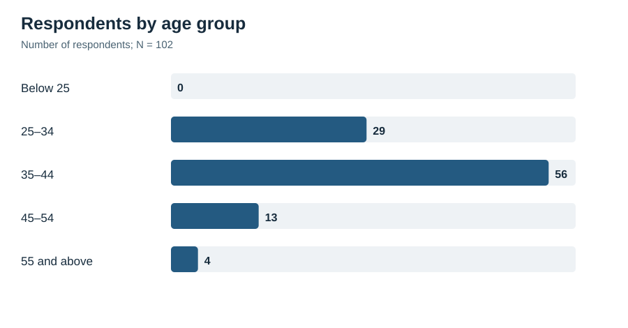
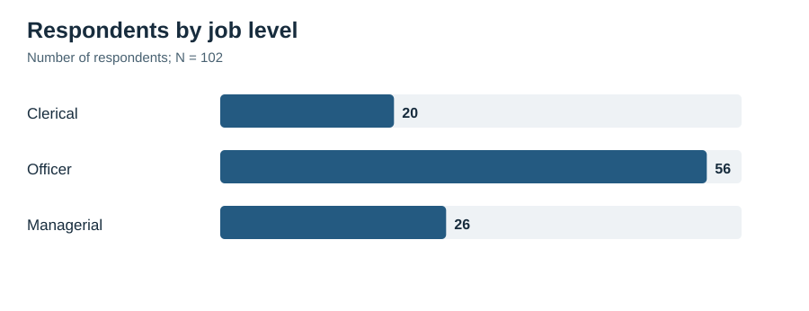
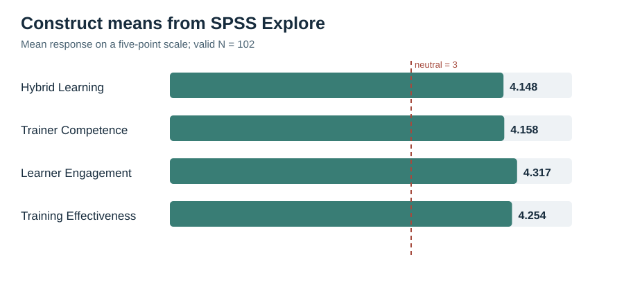
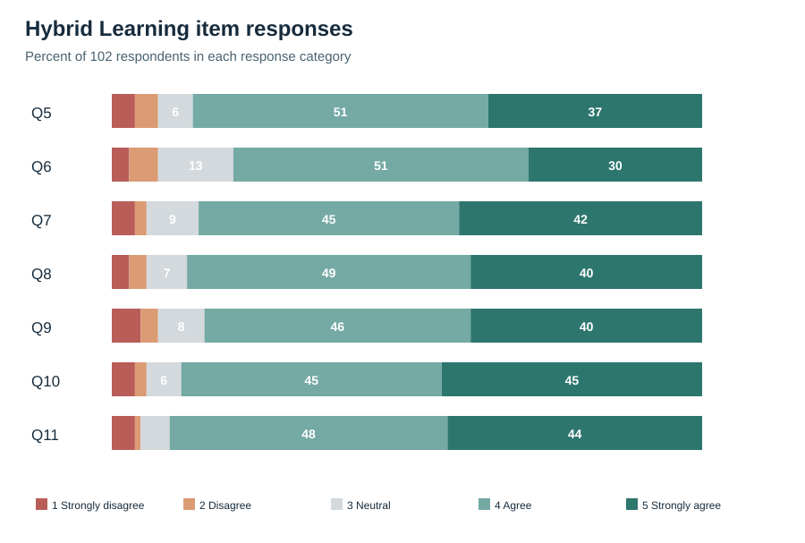
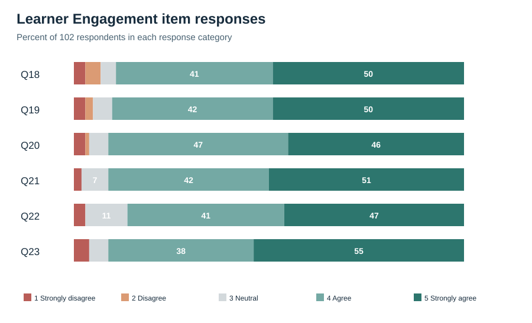

# Hybrid Learning and Training Effectiveness at Union Bank of India

# Chapter 1 — Introduction

## 1.1 Background and Context

Bank employees must keep learning while continuing their regular duties. A change in procedure, a new digital system, or an updated product can affect how they serve customers and meet compliance requirements. Training therefore has to be accessible during a working schedule and useful when an employee returns to the job.

Digital platforms help a bank share learning material with staff working in different locations. Modules, videos, virtual sessions, assessments, and job aids can be accessed without requiring travel for every activity. That flexibility matters when a branch must continue serving customers. Access, however, is only the starting point: completing a module does not show that an employee understood a procedure or knows how to use it at work. Some questions still need an explanation from a trainer.

In-person sessions offer room for questions, demonstrations, practice, and feedback. Employees can also discuss situations that arise in their own branches. Yet a classroom is unnecessary for every update: a short refresher or reference document may be easier to use online. What matters is the connection between the two modes, so that information introduced digitally can be understood and put to use in a trainer-led activity or at work.

Hybrid learning, or blended learning, deliberately connects digital and face-to-face activities within one programme. The digital part might introduce a topic before a session and remain available for later revision. A trainer can then use the session to clarify difficult points and practise work-related tasks. Without that connection, employees may experience the activities as separate requirements rather than parts of one learning process.

This research concerns eligible Union Bank employees connected with Regional Office Chennai South in Royapettah, Chennai. The Bank reports using Union Vidya, its Learning Management System (LMS), alongside e-books, podcasts, audiobooks, microlearning, virtual workshops, role-based learning, mandatory e-learning for officers, and a Training Management System (Union Bank of India, 2024, 2025). These arrangements show that different ways of learning are available. They do not tell us how employees experienced their connection in a particular programme. Each respondent therefore answered about one recent programme that included both digital and face-to-face learning.

Four constructs describe that experience. **Hybrid Learning** covers the link between the digital and face-to-face activities, access to the platform and materials, and opportunities to revise what was taught. **Trainer Competence** concerns the trainer’s subject knowledge, clarity, use of relevant tools, encouragement, and feedback. **Learner Engagement** captures the employee’s attention, effort, interest, participation, and willingness to ask for clarification. **Training Effectiveness** refers to whether the employee found the learning understandable, relevant, useful, and applicable to the current role.

The conceptual framework is:

    Hybrid Learning ────────┐
    Trainer Competence ─────┼──→ Training Effectiveness
    Learner Engagement ────┘

In the framework, Hybrid Learning, Trainer Competence, and Learner Engagement are three distinct predictors of perceived Training Effectiveness. A well-organised programme and a capable trainer need not produce the same level of engagement in every employee. Workload, available time, previous experience, digital confidence, motivation, and branch conditions may also matter. The questionnaire records how employees experienced these parts of one programme; the resulting associations are interpreted within the limits of a one-time self-report survey.

The three base papers each address a different part of the question. Sosnova et al. (2025) examine hybrid education and learning effectiveness among students, providing a conceptual starting point. Kim (2022) studies automotive sales training and draws attention to delivery design, instructor involvement, and practice in a corporate setting. Bahl, Kiran and Sharma (2024) assess training among 402 Indian bank employees using Kirkpatrick’s Reaction, Learning, Behaviour, and Results framework. The present four-construct Union Bank model is not taken from any one paper; its basis combines these conceptual, workplace, and banking perspectives.

For HR and learning-and-development staff, the design of a programme matters because employees must fit training around their work. Disconnected activities can feel like an extra obligation. A trainer who explains why an activity matters and responds to questions can make participation easier. By examining access, integration, trainer support, and engagement, the research identifies aspects of training that the Bank can review while maintaining regular service.

## 1.2 Key Concepts and Definitions

### Hybrid Learning

Hybrid Learning combines digital and face-to-face activities as parts of one planned programme. A bank might use an LMS module, video, virtual session, online assessment, or downloadable reference material for the digital part. Classroom discussion, demonstration, role play, group exercise, or supervised practice may provide the in-person part. Each mode has a purpose in the same learning sequence.

Employees rate whether the two modes felt connected, whether they could access the platform and materials, and whether digital material remained available for revision. The measure concerns their experience of one programme. It is not a technical review of Union Vidya or a comparison of programmes delivered through only one mode.

### Trainer Competence

Trainer Competence concerns how well a trainer supports learning. Subject knowledge and clear explanations matter, as do the ability to connect digital work with the live session, use relevant tools, invite participation, and give useful feedback. In a hybrid programme, employees may need the trainer to show how an online task relates to later discussion or to a procedure in their own role.

An accessible platform cannot replace an explanation from a trainer. Equally, a capable trainer may be constrained when employees cannot obtain the learning material. Measuring these experiences separately permits a comparison of their associations with Training Effectiveness.

### Learner Engagement

Learner Engagement describes what an employee brings to the selected programme: attention, effort, participation, interest, and a willingness to ask questions. Attendance or an online completion record alone cannot show this involvement. A participant may be present without following the content closely; engagement is reflected in trying to understand it and taking part in the learning activities.

The engagement questions concern behaviour in one selected training programme. They do not assess general work engagement, organisational commitment, motivation, or metacognitive skill as additional constructs.

### Training Effectiveness

Training Effectiveness means the employee’s assessment of what the programme contributed to current work. The questions cover understanding, relevance, confidence, and the perceived ability to apply learning to day-to-day tasks and related problems.

Training-evaluation and transfer literature supports this definition, which goes beyond asking whether employees liked a session. The evidence remains self-reported: no objective change in individual performance, customer service, productivity, reputation, or financial results is measured here.

### Learning Management System

A Learning Management System (LMS) helps an organisation deliver and manage learning through digital resources such as modules, readings, videos, quizzes, virtual sessions, and learning records. Union Bank identifies Union Vidya as its LMS within a broader system of e-learning, virtual training, staggered programmes, and role-based learning (Union Bank of India, 2024, 2025).

Union Vidya provides context for the Hybrid Learning questions; it is not scored as a separate variable. The questionnaire names it as an example while asking about the platform used in the respondent’s selected programme, since programmes and platform features may differ.

## 1.3 Need, Scope and Significance of the Study

### Need for the Study

The central question is how employees’ experience of Hybrid Learning, Trainer Competence, and Learner Engagement relates to perceived Training Effectiveness. Bank staff learn while managing customers, procedures, and daily operations. If activities are difficult to access or poorly connected, training can add pressure instead of helping them work with new knowledge.

Blended-learning research offers useful ideas about programme design, although much of it concerns students. A bank employee faces a different setting: customer service and compliance work continue during training. Corporate studies add workplace evidence, but research on the four constructs together among employees of an Indian public-sector bank remains limited.

Union Bank has documented digital resources and trainer-led training facilities. Those records establish the setting, not the quality of an employee’s experience in a specific programme. The survey addresses that narrower question.

### Scope of the Study

Eligible respondents were employees connected with Union Bank’s Regional Office Chennai South who had attended a programme combining digital and face-to-face learning in the previous 12 months. Each person answered about one recent programme. Someone who had experienced only one mode could not assess how the two were connected and was therefore ineligible.

The four measured areas are Hybrid Learning, Trainer Competence, Learner Engagement, and Training Effectiveness. Other potentially relevant matters, including knowledge retention, job performance, supervisor support, digital literacy, and Union Vidya’s technical performance, are outside this model. A narrower instrument keeps the analysis manageable for the selected sample.

Responses were collected once through a structured five-point agreement questionnaire. Descriptive and correlational analyses describe this respondent group and the relationships among their ratings. The design cannot establish later changes in work behaviour or Bank performance caused by training.

### Significance of the Study

For Union Bank, the results organise employees’ feedback about the connection between learning modes, trainer support, and participation. Lower-rated aspects can point staff toward issues worth reviewing, such as module timing, access to materials, guidance, feedback, or opportunities to take part.

Trainers and learning-and-development staff can use these responses to look beyond content delivery. Employees also need to know why a digital module precedes a session, how a new procedure applies to their role, and where to ask questions afterwards. Those practical connections affect whether training feels manageable alongside regular duties.

The academic contribution is a focused account from a public-sector banking setting. The questionnaire draws on conceptual, corporate, and Indian banking literature; it was reviewed by the guide, piloted, and assessed for internal consistency in the final sample.

## 1.4 Statement of the Problem

Union Bank’s learning system includes digital resources and trainer-led activities, creating opportunities for hybrid training. Yet the existence of these resources says little about a particular employee’s experience. The open questions are whether the activities feel connected, whether trainers give enough guidance, whether employees participate, and whether they can use what they learned in their current roles.

Evidence from higher education and corporate training helps frame these questions, but it does not directly examine the four constructs together in the selected Union Bank setting. In particular, published material about Union Vidya does not explain how employees connect its digital resources with trainer-led learning.

The research tests whether ratings of Hybrid Learning, Trainer Competence, and Learner Engagement jointly relate to perceived Training Effectiveness.

## 1.5 Research Questions

1. What are respondents’ perceptions of Hybrid Learning, Trainer Competence, Learner Engagement, and Training Effectiveness?
2. What associations are reported among the four study constructs?
3. To what extent do Hybrid Learning, Trainer Competence, and Learner Engagement jointly predict Training Effectiveness?

## 1.6 Industry and Company Context

### Banking Industry Context

Banking work combines regulation, digital systems, products, and customer service. Employees must update their knowledge of procedures and risk controls while serving customers each day. In a public-sector bank with staff across functions and locations, common material needs to be accessible without losing opportunities for questions, practice, guidance, and later revision.

Different training needs call for different activities. A short policy update might suit a digital module and knowledge check; a new procedure may require a demonstration and practice; a customer-facing situation may be easier to discuss through role play. Digital material can remain available afterwards. The choice of mode should follow the task employees need to learn.

### Union Bank of India Context

Union Bank was registered in Mumbai on 11 November 1919 and nationalised in 1969. Andhra Bank and Corporation Bank joined it through amalgamation on 1 April 2020 (Union Bank of India, n.d.-a). Its public profile reported more than 8,700 domestic branches and 73,900 employees in June 2026. In a workforce spread across so many locations, access to current material and trainer support becomes a practical learning concern.

### Union Bank Training Architecture

Union Bank supports learning through both physical training facilities and digital delivery. Its 2024–25 annual report describes a Master Policy on Learning and Development covering e-learning, virtual and staggered programmes, role-based training, mandatory e-learning for officers, and a Training Management System within Union Vidya (Union Bank of India, 2025). The preceding annual report identifies Union Vidya as the Bank’s LMS and records digital resources and virtual workshops alongside classroom and locational programmes (Union Bank of India, 2024).

Nine specialised Union Learning Academies were launched in 2022. The Bank’s public list also names a Staff Training College in Bengaluru and seven Staff Training Centres elsewhere (Union Bank of India, 2022; Union Bank of India, n.d.-b). Together with the digital facilities, these are part of its learning infrastructure. Their existence does not establish who attended a centre or whether every programme combined the two modes.

A circular dated 9 September 2026 gives one example of a connection between the modes. Selected classroom sessions at Union Learning Academies and Zonal Learning Centres can be streamed through Microsoft Teams. Schedules and recordings are made available through Union Vidya, and virtual participants can ask questions in the chat for the programme coordinator to raise at suitable intervals (Union Bank of India, 2026). This arrangement extends access to selected trainer-led sessions; the circular provides no evidence about employee outcomes across the Bank.

The survey therefore stays with the experience employees can report: one recent hybrid programme attended by eligible respondents connected with Regional Office Chennai South. Its findings speak to that group, rather than the Bank as a whole.

## 1.7 Chapterisation

Chapter 1 sets out the banking context, the four constructs, the research problem, and the questions guiding the study.

Chapter 2 reviews the relevant literature and explains the roles of the three base papers. It then develops the framework and the gap addressed in the Union Bank setting.

Chapter 3 describes the objective, hypothesis, sampling and collection procedures, questionnaire, analysis, and ethical safeguards.

Chapter 4 reports and interprets the results. Chapter 5 draws out the findings, limitations, suggestions, and conclusion.

# Chapter 2 — Review of Literature

## 2.1 Review of Relevant Literature

### Hybrid Learning as an Integrated Training Design

In workplace training, hybrid learning means more than assigning hours to an online module and a classroom session. The activities need to be designed as a sequence that employees can follow and connect to their work. A digital task should have a clear reason for appearing before or after a trainer-led activity.

Digital delivery can distribute basic information, short assessments, and material for later reference across locations. In-person time can be used for questions, demonstration, practice, and feedback. Employees are more likely to see a programme as one course of learning when they understand why those activities are connected.

Garrison and Kanuka (2004) place integration at the centre of blended learning. Graham (2006) discusses the combination of delivery modes, teaching methods, and learning approaches. Although both accounts come mainly from education, they offer a relevant design test for employee training: the activities should support one another, not repeat or conflict with each other.

Two education reviews help establish the broader learning question. Vo, Zhu and Diep (2017) combined 51 effect sizes from higher-education courses and reported a small average advantage for blended learning over conventional classroom teaching (*g* = 0.385). Yu, Yu, Li and Wang (2025) reviewed 133 studies with 18,464 students and found an upper-medium effect on learning performance (*g* = 0.651). These are student results. Bank employees must often learn alongside customer service, deadlines, and changing procedures, so the estimates provide background rather than a prediction for Union Bank.

Kumar and Pande (2017) examine technology-mediated learning among working professionals. They identify institutional, facilitator, learner, and pedagogical conditions within a blended-learning ecosystem. Their account is useful here because access to a platform alone cannot explain whether employees find the content relevant, receive guidance, or carry learning into work.

Mulaudzi’s (2021) Master’s dissertation examines blended teaching in South African transport-sector training. Its discussion of time, access, flexibility, materials, and practical barriers is relevant to employees who train around ordinary work. Those themes informed the present questionnaire’s wording on access and connected learning, although the dissertation instrument was not adopted as a ready-made corporate scale.

The Perceptions of the Blended Learning Environment Questionnaire by Han and Ellis (2020) asks how learners experience the relationship between modes and the contribution of online learning. Its higher-education wording is not suitable for direct use with bank staff. The underlying themes—connection, access, availability of materials, and revision—help explain the content of the Hybrid Learning items.

Sosnova, Hlianenko, Sosnova, Tsyna and Tsyna (2025) provide the conceptual base paper. Their experiment with 64 higher-education students combined online platforms with practice-oriented, problem-based, interactive, and project activities. Learning outcomes were stronger for the hybrid group than for the comparison group. The population and outcome measures differ from those in this thesis, and the paper offers no Union Bank questionnaire. It is used for the narrower proposition that hybrid design and learning effectiveness can be studied together.

### Hybrid Training and Effectiveness in Corporate Settings

Kim (2022) supplies the corporate training evidence. In South Korean automotive sales training, the delivery format changed across traditional, fully digital, and hybrid arrangements. The analysis covers 583 training instances in 2019–2020: 325 traditional, 140 fully digital, and 118 hybrid. Unlike the more self-directed fully digital format, the hybrid format included online and offline activity.

Training was evaluated with Kim’s Content, Instructional Design, Programmed Learning, and Recommendation (CIP-R) framework, which covers content, design, personalised learning, perceived competence, and recommendation. Reported effectiveness fell when delivery moved from traditional to fully digital training and rose after hybrid delivery was introduced. Instructor engagement, duration, personalised learning, confidence and competence, and job-related skill level were among the factors associated with the reported outcome.

The ordering of Kim’s group means matters: traditional training ranked highest, hybrid training next, and fully digital training lowest. The difference between hybrid and fully digital delivery was not statistically significant. Kim therefore cannot support a general claim that hybrid training is superior. The paper is more useful for showing why delivery design, instructor involvement, and practice should be considered when evaluating a corporate programme.

Kim’s findings inform the present measurement choices. Training Effectiveness extends beyond a pleasant immediate reaction; Hybrid Learning concerns the quality of the connection between modes; and Trainer Competence remains separate because access to digital content does not replace guidance and feedback.

The word “hybrid” does not tell us whether an employee could open the materials, prepare in time, participate, or practise. These details are especially relevant when staff attend from different branches while regular work continues. For that reason, the Union Bank questionnaire asks about one programme’s connected activities and available support. It does not require employees to compare formats they may never have experienced.

Kim compares corporate delivery arrangements. This thesis instead asks individual bank employees whether one programme helped them understand and apply work-related learning. The designs cannot be expected to produce identical results, but the corporate comparison makes the employee-level question worth examining.

Uddin, Ahamed, Jakowan, Islam and Nahar (2026) studied 150 employees with blended-learning experience. They examined soft-skill development and knowledge acquisition in relation to employee performance. Both learning-related variables had positive relationships with blended learning, while the direct relationship with performance was not significant after those pathways were considered. Their result cautions against inferring a work outcome from delivery format alone.

Uddin et al. provide supporting workplace literature. Testing their specific soft-skill, knowledge-acquisition, and performance pathways would require measures that are outside this four-construct survey.

### Trainer Competence in Hybrid Training

When training moves between a platform and an in-person session, the trainer helps employees make sense of the sequence. Clear subject explanations, links between activities, suitable digital-tool use, questions, and feedback can all matter. Without such support, completion of an online task may remain disconnected from the employee’s responsibilities.

Technical platform quality and trainer competence are different questions. Material may be available online without an explanation of its purpose; a knowledgeable trainer may also struggle when employees cannot access that material. The questionnaire therefore asks about programme design and trainer support in separate blocks.

No selected base paper tests Trainer Competence and Learner Engagement together in this exact workplace model. Kim (2022) discusses instructors, participation, practice, and design in corporate training. Mulaudzi (2021) addresses facilitation and practical access barriers at work. In a university setting, Ansari et al. (2023) associate blended-learning training with lecturer and student competence and satisfaction. That population differs from bank employees, but the study adds support for examining facilitation rather than treating technology availability as enough.

These sources help distinguish the trainer’s contribution from the employee’s response. The Trainer Competence items cover explanation, digital facilitation, connections across modes, participation support, and feedback. The Learner Engagement items concern attention, effort, involvement, questions, and interest. A favourable trainer rating is not automatically an account of active learner participation.

### Learner Engagement

Engagement concerns active involvement, including attention, effort, participation, interest, and asking for clarification. A login or attendance record cannot show whether someone tried to understand a changing procedure. Completion is therefore an incomplete account of the learning process.

Schaufeli, Bakker and Salanova (2006) describe work engagement through vigour, dedication, and absorption. Their scale is not a measure of participation in one training programme. The present items draw only on the broader idea of active effort: respondents report their attention, participation, involvement, questions, and interest during the selected programme.

Learner Engagement remains an independent variable because programme design and trainer skill do not fully determine an employee’s attention or participation. Time pressure, earlier experience, digital confidence, motivation, and branch conditions can also shape the response. The model therefore examines engagement’s own association with Training Effectiveness rather than presuming that it sits in a fixed sequence between the other variables and the outcome.

### Training Effectiveness

Kirkpatrick’s framework separates reaction, learning, behaviour, and results. That distinction prevents a positive reaction to a session from standing in for all training outcomes. An employee may enjoy a session without understanding it, or understand it without later having a chance to apply the learning.

Bahl, Kiran and Sharma (2024) provide the Indian banking base paper. Their open-access evaluation covers 402 managerial and non-managerial employees from public, private, and foreign-sector banks and uses Kirkpatrick’s four levels. It establishes the relevance of training evaluation in banking. The paper does not examine hybrid delivery, trainer competence, learner engagement, or Union Vidya, which is why it cannot supply the present model by itself.

Holton (1996) argues that evaluation levels do not by themselves explain transfer into practice. Baldwin and Ford (1988) describe transfer through the generalisation and maintenance of learning at work. Blume et al. (2010) find links between transfer and characteristics of the learner, training design, and work environment. These sources caution that later application depends on more than the training event.

The outcome measured here is narrower: employees rate understanding, relevance, capability, application to tasks, help with related problems, and confidence in current responsibilities. They are not asked to estimate productivity, customer satisfaction, reputation, or financial results for the Bank, which would require other data.

Aziz’s (2015) General Training Effectiveness Scale was developed for Malaysian workplace learning. Its distinction between individual learning and organisation-level outcomes informs the present questionnaire’s employee-level focus. Union Bank wording was then reviewed for content, piloted, and assessed through reliability analysis.

Bahl, Kiran and Sharma (2024) evaluate a broader chain that includes results. This survey has no independent record of branch productivity, customer outcomes, or behaviour observed over time. It can instead ask whether employees understood the content, recognised its relevance, and felt able to use it. That is a perceived employee-level outcome, not a full Kirkpatrick evaluation.

Aziz (2015) also helps keep individual learning distinct from what an organisation achieves. A respondent cannot reasonably judge a Bank-wide result from one recent programme. Job Performance was left outside the model for a related reason: actual performance would need a suitable measure and evidence beyond the same employee’s account of training.

### Workplace Implementation Conditions

An LMS can hold content, but people still need to decide what should be read before a session, what requires discussion, and when feedback is needed. A classroom discussion, in turn, may not give employees material they can revisit later. This connection between activities is central to the Hybrid Learning measure.

Mubayrik’s (2018) review of workplace blended learning identifies flexible access, authentic activities, collaboration, satisfaction, and support with technology as recurring themes. The studies vary in population, design, and measurement. Their variety is a reason to examine the task, trainer, technology, and opportunity to participate in a particular setting instead of assuming one delivery format works equally well everywhere.

Sequence matters when employees must make time for training alongside work. A digital activity might introduce a policy or demonstration before a live session devoted to cases and practice. Alternatively, a trainer might introduce a difficult topic first and leave digital material for revision. The questionnaire asks whether the selected programme’s activities felt connected and accessible; it does not rank these possible sequences.

One possible design is digital preparation, trainer-led practice, workplace application, and digital revision. This example clarifies what a connected programme might look like. It is not another model tested in the survey.

### Use of the Literature in Practical Recommendations

Recommendations must begin with what respondents actually rated, then use the literature to interpret those ratings. Low access or material scores would point to resource timing and availability. Lower ratings of explanation or feedback would suggest reviewing trainer preparation. Limited participation or clarification-seeking would direct attention to questions, practice, and follow-up.

Employee ratings identify areas of strength or difficulty in the selected programme; the reviewed studies help explain why those areas may matter.

### Summary of the Empirical Review

The sources perform complementary roles. Sosnova et al. (2025) connect hybrid methods and learning effectiveness in education; Kim (2022) studies corporate training design, instructors, practice, and outcomes; and Bahl, Kiran and Sharma (2024) evaluate training among Indian bank employees. Han and Ellis (2020), Mulaudzi (2021), and Aziz (2015) inform the themes and workplace wording of the questionnaire.

No one source contains the entire model or an instrument ready for Union Bank. Appendix B traces how the scored items draw on these separate strands of literature.

### Comparison of the Three Base Papers

The base papers cover three settings rather than one identical model. Sosnova et al. (2025) work with students; Kim (2022) examines automotive sales trainees; and Bahl, Kiran and Sharma (2024) study Indian bank employees without a hybrid-delivery measure. Their differences make the Union Bank question meaningful, but none supplies a result to replicate directly in Chennai.

Their methods also set limits on comparison. Sosnova and Kim compare arrangements or outcomes across delivery conditions, while Bahl and colleagues use a multi-level evaluation framework. The current one-time questionnaire describes four ratings and tests a single regression. It cannot show that changing Union Bank’s delivery mode would reproduce an earlier result or yield organisation-level outcomes.

Kim’s discussion of instructors and participation, Mulaudzi’s (2021) workplace account of facilitation and time, and Schaufeli, Bakker and Salanova’s (2006) concept of active effort all help separate trainer support from learner behaviour. The last source concerns general work engagement, so it is used as background rather than a training scale. A bank employee may value a trainer’s explanation but still have little time to prepare or ask questions. The two experiences are therefore measured separately.

The supporting measurement sources have a different purpose. Han and Ellis (2020) inform questions about the connection between modes, Mulaudzi (2021) contributes workplace access conditions, and Aziz (2015) supports an employee-level outcome. Appendix B records the adaptation of those themes to one Union Bank programme. Neither a student scale nor a transport-sector instrument becomes a validated Bank measure simply by changing its wording.

The literature leads to one focused test: among employees exposed to both modes, do more positive ratings of integration, trainer competence, and engagement accompany higher perceived Training Effectiveness? The answer can direct attention to areas for review, while the one-time design leaves time order and causation unresolved.

### Literature Summary

**Table 2.1: Literature supporting the present study**

| Study | Context and contribution | Use in the present study |
| --- | --- | --- |
| Sosnova et al. (2025) | Hybrid education experiment with higher-education students; examines learning effectiveness. | Conceptual anchor for examining Hybrid Learning and learning effectiveness. |
| Kim (2022) | Corporate automotive sales-training study comparing delivery methods. | Corporate evidence on training design, instructor involvement, participation, and Training Effectiveness. |
| Bahl, Kiran and Sharma (2024) | Open Indian banking study of 402 employees using Kirkpatrick’s framework. | Banking-sector anchor for employee-level Training Effectiveness. |
| Han and Ellis (2020) | Validated blended-learning-environment instrument in higher education. | Supports the structure of Hybrid Learning items, adapted for the workplace. |
| Mulaudzi (2021) | Workplace blended-learning study in the transport sector. | Supports workplace wording on access, materials, flexibility, and facilitation. |
| Aziz (2015) | Workplace training-effectiveness scale development. | Supports employee-level learning, relevance, and application items. |

## 2.2 Theoretical Framework

### Blended-Learning Integration

The framework begins with the integration of learning modes described by Garrison and Kanuka (2004) and Graham (2006). Digital work and a live session should form an intelligible sequence. When employees can see the connection, the purpose of each activity is easier to understand.

For an employee, that sequence might start with digital material that introduces a topic before a session devoted to cases and practice. The material may remain available when a procedure needs to be checked later. A programme could also begin with a live explanation and use digital resources for follow-up. What matters is whether employees recognise the link between activities and the work need.

Programme design cannot be reduced to the platform used. Posting a module does not ensure it prepares staff for discussion; a good classroom activity may also be hard to apply later without a reference resource. The Hybrid Learning items consequently ask about both connection and access, not merely a login or completion record.

### Separate Employee-Level Predictors

The second perspective keeps three related experiences distinct. Kim (2022) discusses design, instructors, participation, and practice in corporate training. Ansari et al. (2023) and Mulaudzi (2021) add evidence about facilitation and access across learning modes. Employee engagement may also reflect circumstances beyond either the trainer or programme. This is why all three are measured separately and entered together in the regression.

Consider an employee who receives the material and understands the trainer but cannot participate because branch work demands attention. Another may be eager to learn but unable to find the digital resource. Combining these situations in one favourable or unfavourable rating would hide which part of the experience needs attention.

The predictors can still move together. Clear instructions may help employees follow a digital task, while connected activities may invite participation. The model allows those associations without imposing a sequence in which one predictor must cause engagement. Its regression asks how the three ratings relate to Training Effectiveness when considered together.

### Training Evaluation and Transfer

Training evaluation and transfer provide the third perspective. Kirkpatrick (1994) distinguishes immediate reaction from later outcomes. Holton (1996), Baldwin and Ford (1988), and Blume et al. (2010) discuss how the learner, design, and work environment relate to application. The outcome here is the employee’s report of understandable, relevant, useful, and applicable learning, not an organisation-level result.

“Effectiveness” can otherwise mean several different things. Enjoying a trainer’s session is a reaction; understanding a concept is learning; using it in a task is application. A Bank-wide change in service or productivity is broader still. The questionnaire concentrates on understanding, role relevance, and reported use or ability to use the learning.

Transfer literature also draws attention to what happens after a session. An employee might understand a procedure but have no immediate opportunity, time, or support to use it. A one-time survey cannot follow a skill over several months; it can record whether respondents see a connection between training and their current tasks (Baldwin and Ford, 1988; Holton, 1996).

### Conceptual Framework

The theoretical perspectives support the following framework:

    Hybrid Learning ────────┐
    Trainer Competence ─────┼──→ Training Effectiveness
    Learner Engagement ────┘

Hybrid Learning, Trainer Competence, and Learner Engagement enter the model together as independent variables. The arrows represent the SPSS predictor–outcome analysis, without specifying an order among predictors or demonstrating causation.

Each questionnaire block has a distinct purpose: arrangement and access, trainer facilitation, employee participation, or perceived learning and relevance. Separate blocks make it possible to notice a weaker part of the experience even when overall ratings are high. The regression supplies the joint test; item responses point to practical matters for review.

## 2.3 Case Study: Union Bank of India

The respondents were employees connected with Union Bank’s Regional Office Chennai South. Their work may require updated knowledge of products, procedures, risk controls, digital systems, and customer service. Training supports that continuing work as well as individual development.

The annual reports describe both digital and trainer-led learning. The 2023–24 report records Union Vidya’s launch as the Bank’s LMS, together with digital resources, virtual workshops, and classroom and locational training. The 2024–25 report describes the Master Policy on Learning and Development, e-learning, virtual and staggered programmes, ten mandatory e-learning modules for officers, role-based training, and a Training Management System in Union Vidya (Union Bank of India, 2024, 2025).

Union Bank launched nine specialised Union Learning Academies in 2022. Its public training-centres list names the Bengaluru Staff Training College and seven Staff Training Centres elsewhere (Union Bank of India, 2022; Union Bank of India, n.d.-b). These records establish physical training facilities, although they do not describe every employee’s programme.

An internal circular dated 9 September 2026 describes selected classroom sessions at Union Learning Academies and Zonal Learning Centres being live-streamed through Microsoft Teams. It places schedules and recordings in Union Vidya and allows virtual participants to raise questions through chat (Union Bank of India, 2026). This is an example of trainer-led sessions being extended through digital access.

These resources make Union Bank a relevant setting for studying hybrid learning, but infrastructure alone cannot tell us how a programme felt to participants. The survey therefore asks eligible employees about one recent programme that used both modes, including the access and support they experienced.

Respondents assess their own programme rather than the entire training system. They are not asked to compare several programmes or disclose customer information, confidential records, or Bank-wide performance data.

## 2.4 Gaps in the Study

The **workplace-context gap** arises because much blended-learning evidence and measurement work comes from higher education. Employees train alongside schedules, customer needs, and work pressure. Corporate studies exist, but provide less direct evidence about these experiences than the student literature.

The **banking-sector gap** remains despite Bahl, Kiran and Sharma’s (2024) study of training effectiveness among Indian bank employees. Their model does not address Hybrid Learning, Trainer Competence, Learner Engagement, or Union Vidya. Union Bank’s public material describes its learning facilities but not how employees experienced the combination of modes in one programme.

The **predictor-combination gap** concerns what the three base papers do not examine together. Sosnova studies hybrid methods in education, Kim compares corporate delivery arrangements, and Bahl, Kiran and Sharma evaluate training in banking. None tests the three independent constructs together against employee-level Training Effectiveness in a public-sector bank.

The **measurement gap** follows from the settings of available scales: one blended-learning instrument was designed for students, while a workplace effectiveness scale extends to organisation-level outcomes. Neither fits this short bank survey unchanged. The four questionnaire blocks were informed by the literature, reviewed by the guide, and piloted online with 20 eligible employees on 15–16 September 2026. SPSS reports overall consistency for the 26 items, but no separate reliability estimate for each construct.

The contribution lies at the intersection of those separate literatures: employee experience of hybrid delivery, trainer support, participation, and perceived effectiveness within a public-sector bank using Union Vidya as part of its learning system.

# Chapter 3 — Research Methodology

## 3.1 Objectives of the Study

This research asks how eligible Union Bank employees experienced one hybrid-training programme and how their ratings relate to perceived Training Effectiveness. They may use digital material and attend trainer-led sessions while continuing ordinary bank work. The measure is their account of that programme, not the mere presence of an LMS.

The primary objective is:

**To examine whether Hybrid Learning, Trainer Competence, and Learner Engagement jointly predict Training Effectiveness among eligible respondents of Union Bank of India.**

The specific objectives are:

1. To describe respondents’ perceptions of Hybrid Learning, Trainer Competence, Learner Engagement, and Training Effectiveness.
2. To examine the associations among the four study constructs.
3. To determine the joint contribution of Hybrid Learning, Trainer Competence, and Learner Engagement in predicting Training Effectiveness.

These objectives concern associations and statistical prediction in the selected sample, without a claim of causation.

## 3.2 Hypothesis of the Study

One overall regression hypothesis is tested at the 5 per cent significance level.

**Table 3.1: Regression hypothesis**

| Null hypothesis (H₀) | Alternative hypothesis (H₁) |
| --- | --- |
| Hybrid Learning, Trainer Competence, and Learner Engagement do not jointly predict Training Effectiveness among eligible respondents of Union Bank of India. | Hybrid Learning, Trainer Competence, and Learner Engagement jointly predict Training Effectiveness among eligible respondents of Union Bank of India. |

The hypothesis refers to the model as a whole. Coefficients are reported separately to show each predictor’s adjusted association after accounting for overlap with the others.

## 3.3 Definition of Variables

Four constructs are scored from the questionnaire.

**Hybrid Learning** concerns the connection between digital and face-to-face activities in one programme. Questions 5–11 cover that design, platform access, available material, and later revision.

**Trainer Competence** covers subject knowledge, clear explanation, links across modes, suitable digital-tool use, encouragement, and feedback. It is measured by Questions 12–17.

**Learner Engagement** refers to the respondent’s attention, effort, participation, questions, and interest during the selected programme. Questions 18–23 measure it. Engagement remains an independent variable because workload, available time, experience, motivation, digital confidence, and local conditions can affect participation beyond programme design or trainer support.

**Training Effectiveness** records perceived understanding, role relevance, capability, application to related tasks, and confidence. Questions 24–30 ask about these employee-level outcomes.

**Table 3.2: Construct operationalisation and item allocation**

| Construct | Questions | Number of items | Role in the regression model |
| --- | ---: | ---: | --- |
| Hybrid Learning | 5–11 | 7 | Independent variable |
| Trainer Competence | 12–17 | 6 | Independent variable |
| Learner Engagement | 18–23 | 6 | Independent variable |
| Training Effectiveness | 24–30 | 7 | Dependent variable |
| **Total Likert-scale items** | **5–30** | **26** | — |

There are 30 numbered questions: four for eligibility and profile, followed by 26 five-point agreement items. Knowledge retention, job performance, organisation-level results, employee agility, supervisor support, and Union Vidya’s technical performance are not additional measured variables.

## 3.4 Research Design

The design is quantitative, descriptive, correlational, and predictive in the statistical sense. Structured ratings describe the response pattern; correlations show the direction and strength of pairwise associations; and SPSS regression assesses the three independent variables together in relation to Training Effectiveness.

Each respondent completed the survey once about a hybrid programme attended in the previous 12 months. Referring to one programme reduces the need to combine memories of several different courses. The individual response record is the unit of analysis.

The model is:

    Hybrid Learning ────────┐
    Trainer Competence ─────┼──→ Training Effectiveness
    Learner Engagement ────┘

The predictors may be related, but the model does not assume that programme design or trainer skill determines engagement. Employee and workplace conditions outside the questionnaire may also matter.

## 3.5 Population, Sample and Sampling Method

The population of interest was employees connected with Union Bank’s Regional Office Chennai South who had attended a programme using both digital and face-to-face learning in the previous 12 months.

Purposive, non-probability sampling identified employees with the experience needed to answer the questions. Only those who had attended both modes in the stated period were eligible, because the survey asks about the connection between them.

Collection was limited to offices and branches accessible during the internship. The eligibility question then screened for relevant training experience. Respondents were not drawn at random from a Bank-wide list, so the resulting percentages and associations cannot be extended statistically to all Union Bank employees.

The initial target was about 80 eligible respondents. Collection produced 132 submissions—70 on paper and 62 through Google Forms. Screening left 103 profile-complete records. SPSS used 102 valid cases for the multiple regression because one record lacked a Trainer Competence mean in its analysis file.

No employee name or number was requested. Each eligible form was treated as one response record; similar answer patterns alone could not establish that one person responded twice.

The number of employees approached or sent the link was not recorded completely, so a formal response rate is unavailable. Table 3.3 instead accounts for forms received and retained.

## 3.6 Data Collection Procedure and Screening

The researcher used printed forms and a Google Forms link. Fieldwork records list Regional Office Chennai South and 27 Chennai branches: Triplicane 1, Triplicane 2, Triplicane 3, Alandur, Teynampet, Mowbrays Road, Chamiers Road, Mylapore 1, Mylapore 2, Mylapore 3, Adyar, Madhya Kailash, Besant Nagar 1, Besant Nagar 2, Indiranagar, Shastri Nagar, T. Nagar 1, T. Nagar 2, T. Nagar 3, West Mambalam, Nungambakkam, Koyambedu, Virugambakkam, Saligramam, Ashok Nagar 1, Ashok Nagar 2, and Ashok Nagar 3. Retail Loans and Currency Chest at the Regional Office were also collection points. The online option let staff respond later when branch duties prevented them from completing a paper form at once.

Main-study collection began at the Regional Office on 15 September 2026, alongside a separate online pilot. The dated fieldwork record places branch visits from 16 to 28 September 2026. All pilot submissions were in by 16 September and remained outside the main-study count.

The researcher reported verbal permission through the Regional Office HR Manager. Branch staff were approached around their work so that customer service could continue. Paper and online forms used the same 30 questions and response scale. Offering both modes made participation easier, although possible differences between paper and online responses were not tested separately.

*Source: Researcher’s internship fieldwork record.*

**Table 3.3: Response disposition and SPSS analysis cases**

| Disposition | Digital | Manual | Total |
| --- | ---: | ---: | ---: |
| Responses received | 62 | 70 | 132 |
| Q1 = No | 13 | 3 | 16 |
| Q1 blank or unreadable | 0 | 11 | 11 |
| Required profile field blank | 0 | 2 | 2 |
| Profile-complete records before SPSS | 49 | 54 | 103 |
| SPSS listwise exclusion for missing construct mean | — | — | 1 |
| **Valid SPSS analysis cases** | — | — | **102** |

Question 1 screened for attendance at a programme combining the two modes within the stated period. Sixteen respondents answered “No”; eligibility was unconfirmed in another eleven records. Two otherwise eligible paper forms lacked a required profile answer. After excluding those 29 forms, 103 profile-complete records remained. SPSS then excluded one case from analyses requiring all four construct means because its Trainer Competence mean was missing in that file. The main regression therefore has 102 cases. The saved viewer output does not identify the case by response ID, which prevents an exact person-by-person reconciliation with the reconstructed supplementary subset.

## 3.7 Research Instrument and Scoring

Appendix A contains the self-administered 30-question instrument. Questions 1–4 establish eligibility and profile; Questions 5–30 use a five-point scale from Strongly Disagree to Strongly Agree. Respondents referred to one hybrid programme from the previous 12 months.

The item themes come from the base papers and supporting measurement literature, with the adaptation recorded in Appendix B. Union Vidya is identified as the Bank’s LMS and given as an example of a platform a respondent may have used.

The four question blocks follow different parts of the same programme. Questions 5–11 address connected delivery and access to material; 12–17 concern trainer support; 18–23 concern the employee’s own involvement; and 24–30 concern learning and usefulness at work. This separation provides more information than a single overall judgement of the programme.

Questions 5–30 are coded from 1 (Strongly Disagree) to 5 (Strongly Agree). In SPSS, the four construct means are named `HLTMEAN`, `TCTMEAN`, `LETMEAN`, and `TETMEAN`.

Each construct score is the arithmetic mean of its assigned items and remains on the 1–5 scale; higher values indicate more favourable ratings. All items run in the same direction, so none requires reverse coding. Means allow comparison of blocks with six or seven items. They summarise respondents’ answers, not observed job performance or Bank-wide results.

## 3.8 Research Questions

1. What are respondents’ perceptions of Hybrid Learning, Trainer Competence, Learner Engagement, and Training Effectiveness?
2. What associations are reported among the four study constructs?
3. To what extent do Hybrid Learning, Trainer Competence, and Learner Engagement jointly predict Training Effectiveness?

## 3.9 Data Analysis Techniques

SPSS Statistics 23 supplied the construct summaries and relationship tests. Its main regression used 102 valid cases.

**Table 3.4: SPSS-based analysis plan**

| Analysis | SPSS procedure used | Role in the study |
| --- | --- | --- |
| Item description | Descriptives with mean, standard deviation, skewness, and kurtosis for 26 items | Chapter 4 presents the seven Hybrid Learning item means used to discuss the lowest-rated aspect of that construct. |
| Construct exploration | Explore procedure with histograms, Q–Q plots, boxplots, and normality tests | Examines the construct-mean distributions. |
| Overall questionnaire consistency | One 26-item Cronbach’s alpha analysis | Reports overall internal consistency of the item set. |
| Exploratory structure check | Principal Component Analysis with varimax rotation | Retained as an exploratory diagnostic; it does not redefine the four theory-based constructs. |
| Association | Pearson correlation | Describes pairwise associations among the four construct means. |
| Main hypothesis test | Multiple regression | Tests the combined relationship of Hybrid Learning, Trainer Competence, and Learner Engagement with Training Effectiveness. |
| Respondent profile | Excel frequency and percentage summary | Describes age group, length of service, and job level for the selected 102 profile-complete records. |
| Supplementary comparisons | One-sample and paired *t*-tests, Welch’s independent-samples *t*-test, and one-way ANOVA | Provides descriptive comparisons for the 102-case scored dataset; these are exploratory and are not the main hypothesis test. |
| Crosstab suitability check | Pearson chi-square on construct-mean categories | Checks whether those tables have adequate expected cell counts before any inferential interpretation. |

The multiple-regression model is:

    Training Effectiveness = b₀ + b₁(Hybrid Learning) + b₂(Trainer Competence) + b₃(Learner Engagement) + e

Training Effectiveness is the dependent variable. The other three constructs enter together as predictors. The overall F-test assesses their joint association; the coefficient table shows what remains for each predictor after the others are included.

Pearson correlations show the pairwise relationships that provide context for the joint model. Neither analysis establishes cause and effect.

An Excel workbook produced the respondent-profile summary. Supplementary Chapter 4 comparisons came from a 102-record subset of the frozen 103-record scored CSV. They are labelled separately because some additional tests in the saved SPSS viewer used 103 cases. Without the SPSS data file, exact case-by-case agreement between the sources remains unverified. The supplementary comparisons play no part in the main hypothesis decision.

The same distinction applies to descriptive results. Construct and regression figures come from SPSS; profile frequencies and supplementary item distributions come from selected scored records. Source and case count are shown with the tables. A 103-case SPSS item mean and a 102-case frequency distribution are therefore not treated as calculations on identical respondents.

## 3.10 Questionnaire Review, Reliability and Validity

The guide-approved questionnaire was piloted online with 20 eligible employees as main collection began. The pilot opened on 15 September 2026 and was complete by 16 September; the main survey also began on 15 September with the same approved questions. Pilot feedback covered clarity, time burden, Union Vidya wording, relevance, and repetition. No systematic problem required removing an item, and scored wording stayed unchanged during collection. Pilot records were kept separate from the main analysis.

The pilot also provided a check on completion time: the mean was 14.3 minutes and the median 14. Sixteen participants thought the length was about right; four found it too long. Comments noted possible overlap between Questions 5 and 6 and Questions 14 and 15, while one person found Question 24 difficult when considering more than one programme. The instruction to answer about one selected programme addressed the latter concern. The comments did not amount to a repeated difficulty across the group, and all scored questions were retained.

Across the four pilot item blocks, preliminary Cronbach’s alpha values ranged from .879 to .929. With 20 responses, these figures offer an early consistency check rather than full scale validation. The later SPSS output was examined separately.

SPSS reports one reliability analysis for all 26 agreement items: Cronbach’s alpha is .980239. The figure indicates very high consistency for the combined item set in that file. It is not a substitute for four separate construct alphas, which the saved output does not contain.

Appendix B sets out the content basis of the questions. Blended-learning and access research informs Hybrid Learning; workplace facilitation and engagement literature informs the next two blocks; and training evaluation and transfer, including Bahl, Kiran and Sharma’s (2024) banking setting, informs the outcome block. The guide reviewed the wording for use in this academic survey.

## 3.11 Ethical Considerations and Limitations

Participation was voluntary. The questionnaire requested no personal identifiers or confidential Bank data, and respondents were told that only combined results would be used for academic purposes.

Several design limits affect interpretation. The non-probability sample cannot represent all Bank employees statistically, and the one-time self-report survey cannot show causation. Having the same person rate programme experience and the outcome may strengthen observed associations. The saved SPSS output has an overall 26-item alpha but no separate construct alphas; it also excludes one record listwise from the regression because a Trainer Competence mean was missing.

Within those limits, the results provide a focused account of eligible respondents’ experience of four aspects of training in the Union Bank setting.

# Chapter 4 — Data Analysis and Interpretation

Chapter 4 brings together the saved SPSS Statistics 23 results and separately labelled summaries from the selected scored records. Its main test asks whether the three predictors jointly relate to Training Effectiveness among the Union Bank respondents.

The SPSS construct summaries and multiple regression use 102 valid cases. Some item and pairwise procedures use 103 or 102, depending on available data. The case count is given beside each result.

All findings concern this respondent group and the associations among its ratings; the survey cannot establish a causal sequence.

## 4.1 Descriptive Analysis

### Respondent Profile

The profile table covers 102 complete records, including 48 online and 54 paper forms. Most respondents were aged 35–44, just over half reported 11–20 years of service, and officers were the largest job-level group. All percentages in Table 4.1 use 102 as the denominator.

**Table 4.1: Respondent profile frequencies (N = 102)**

| Profile | Category | Frequency | Percentage |
| --- | --- | ---: | ---: |
| Age group | Below 25 | 0 | 0.0 |
| Age group | 25–34 | 29 | 28.4 |
| Age group | 35–44 | 56 | 54.9 |
| Age group | 45–54 | 13 | 12.7 |
| Age group | 55 and above | 4 | 3.9 |
| Length of service | Below 5 years | 7 | 6.9 |
| Length of service | 5–10 years | 29 | 28.4 |
| Length of service | 11–20 years | 56 | 54.9 |
| Length of service | Above 20 years | 10 | 9.8 |
| Job level | Clerical | 20 | 19.6 |
| Job level | Officer | 56 | 54.9 |
| Job level | Managerial | 26 | 25.5 |

*Source: Formula-based Excel profile-frequency workbook for the 102-record V5 subset. Percentages may differ from 100.0 by 0.1 because of rounding.*

**Figure 4.1: Age-group distribution**

**Figure 4.2: Length-of-service distribution**

**Figure 4.3: Job-level distribution**

### 4.1.1 Construct-Level Results

The SPSS *Explore* results place all four construct means above the five-point scale’s midpoint. Learner Engagement ranks highest, then Training Effectiveness, Trainer Competence, and Hybrid Learning.

**Table 4.2: Construct-level descriptive statistics from SPSS Explore output**

| Construct | Valid N | Mean | Standard deviation | Minimum | Maximum | Skewness | Kurtosis |
| --- | ---: | ---: | ---: | ---: | ---: | ---: | ---: |
| Hybrid Learning | 102 | 4.148 | 0.859 | 1.000 | 5.000 | -1.818 | 4.058 |
| Trainer Competence | 102 | 4.158 | 0.863 | 1.000 | 5.000 | -2.109 | 5.583 |
| Learner Engagement | 102 | 4.317 | 0.793 | 1.000 | 5.000 | -2.131 | 6.236 |
| Training Effectiveness | 102 | 4.254 | 0.835 | 1.000 | 5.000 | -2.035 | 5.275 |

*Source: Supplied SPSS Statistics 23 output, Explore procedure.*

**Figure 4.4: Mean ratings for the four study constructs**

*Source: Code-drawn figure from the four SPSS Explore means in Table 4.2; the dashed line marks the neutral response value of 3.*

Agreement and strong agreement predominate, producing the negative skewness in Table 4.2. Low ratings were less common, although the survey gives no reason for the pattern.

Hybrid Learning is lowest but remains above neutral. Employees generally rated the combined arrangement favourably, yet its practical details may offer more room for review than the other areas. Learner Engagement is highest, reflecting respondents’ reports of attention, participation, and interest.

### 4.1.2 Item-Level Results Across the Four Constructs

The seven Hybrid Learning items address connection across modes and access to digital material. Table 4.3 gives their SPSS item means for 103 available responses; Table 4.2 uses 102 cases with all four construct means.

**Table 4.3: Hybrid Learning item means**

| Question | Item focus | Valid N | Mean |
| --- | --- | ---: | ---: |
| Q5 | Digital and face-to-face parts planned as one experience | 103 | 4.107 |
| Q6 | Digital activities prepared the respondent for face-to-face sessions | 103 | 3.990 |
| Q7 | Face-to-face sessions clarified or applied digital learning | 103 | 4.165 |
| Q8 | Access to the digital platform | 103 | 4.184 |
| Q9 | Ease of platform navigation | 103 | 4.107 |
| Q10 | Availability of digital learning materials | 103 | 4.223 |
| Q11 | Access to digital material for revision | 103 | 4.262 |

*Source: SPSS Statistics 23 item descriptives; item wording is given in Appendix A.*

Q6, about digital preparation for face-to-face sessions, has the lowest Hybrid Learning item mean at 3.990. This is still above neutral, but preparation is a reasonable part of the sequence for training staff to review.

Table 4.4 shows how the selected 102 records are distributed across all five response categories for each scored question; every row totals 102. These CSV counts are separate from the 103-case SPSS item means in Table 4.3. Figures 4.5–4.8 use the same counts as Table 4.4.

**Table 4.4: Item response frequencies for the 102-case scored dataset**

| Construct | Question | 1 Strongly disagree | 2 Disagree | 3 Neutral | 4 Agree | 5 Strongly agree |
| --- | --- | ---: | ---: | ---: | ---: | ---: |
| Hybrid Learning | Q5 | 4 | 4 | 6 | 51 | 37 |
| Hybrid Learning | Q6 | 3 | 5 | 13 | 51 | 30 |
| Hybrid Learning | Q7 | 4 | 2 | 9 | 45 | 42 |
| Hybrid Learning | Q8 | 3 | 3 | 7 | 49 | 40 |
| Hybrid Learning | Q9 | 5 | 3 | 8 | 46 | 40 |
| Hybrid Learning | Q10 | 4 | 2 | 6 | 45 | 45 |
| Hybrid Learning | Q11 | 4 | 1 | 5 | 48 | 44 |
| Trainer Competence | Q12 | 4 | 1 | 6 | 51 | 40 |
| Trainer Competence | Q13 | 5 | 0 | 5 | 49 | 43 |
| Trainer Competence | Q14 | 4 | 1 | 10 | 53 | 34 |
| Trainer Competence | Q15 | 4 | 2 | 7 | 51 | 38 |
| Trainer Competence | Q16 | 4 | 1 | 6 | 50 | 41 |
| Trainer Competence | Q17 | 5 | 3 | 6 | 53 | 35 |
| Learner Engagement | Q18 | 3 | 4 | 4 | 41 | 50 |
| Learner Engagement | Q19 | 3 | 2 | 5 | 42 | 50 |
| Learner Engagement | Q20 | 3 | 1 | 5 | 47 | 46 |
| Learner Engagement | Q21 | 2 | 0 | 7 | 42 | 51 |
| Learner Engagement | Q22 | 3 | 0 | 11 | 41 | 47 |
| Learner Engagement | Q23 | 4 | 0 | 5 | 38 | 55 |
| Training Effectiveness | Q24 | 4 | 0 | 5 | 48 | 45 |
| Training Effectiveness | Q25 | 3 | 1 | 9 | 40 | 49 |
| Training Effectiveness | Q26 | 3 | 0 | 10 | 45 | 44 |
| Training Effectiveness | Q27 | 4 | 0 | 9 | 43 | 46 |
| Training Effectiveness | Q28 | 3 | 2 | 8 | 43 | 46 |
| Training Effectiveness | Q29 | 4 | 1 | 9 | 48 | 40 |
| Training Effectiveness | Q30 | 3 | 2 | 10 | 32 | 55 |

*Source: Reconstructed 102-case scored CSV; normal 1–5 response categories only.*

**Figure 4.5: Hybrid Learning item-response distribution**

**Figure 4.6: Trainer Competence item-response distribution**

**Figure 4.7: Learner Engagement item-response distribution**

**Figure 4.8: Training Effectiveness item-response distribution**

#### Trainer Competence responses

Trainer ratings were mostly favourable. Of the 102 respondents, 92 agreed or strongly agreed that the trainer explained content clearly (Q13), and 91 rated subject knowledge in those categories (Q12). The figures describe the support given by a person, which the presence of online material alone cannot capture.

The pattern is a little less favourable for connections across modes and feedback. On Q14, 87 agreed or strongly agreed that the trainer explained the link between activities, while ten were neutral. On Q17, 88 reported helpful feedback and eight disagreed or strongly disagreed. These modest item differences were not significance-tested, but they suggest checking how trainers refer to digital preparation and how feedback helps employees correct misunderstandings.

#### Learner Engagement responses

Engagement ratings were positive across attention, effort, participation, involvement, questions, and interest. On each of Q20, Q21, and Q23, 93 of 102 respondents selected agree or strongly agree. This is consistent with Learner Engagement having the highest construct mean: most described active involvement in the programme they chose.

Question-seeking showed a slightly different pattern. On Q22, 88 respondents agreed or strongly agreed that they sought clarification, while eleven were neutral. Neutral could mean no clarification was needed, no opening was available, or the employee hesitated. Since the questionnaire cannot separate those possibilities, the practical question is whether programmes make it easy to ask.

Positive trainer and engagement ratings appear in the same sample, but they describe different experiences. One concerns support offered; the other concerns what employees say they did. The regression examines whether the latter retains a distinct association with Training Effectiveness alongside trainer competence and hybrid design.

#### Training Effectiveness responses

Training Effectiveness items cover understanding, relevance, capability, application, task support, and confidence. In Figure 4.8, 93 respondents agreed or strongly agreed that they understood the main knowledge or skills (Q24). The count is 89 for each of Q25–Q28. These are employees’ own reports of learning and possible use, not supervisor observations of performance.

On Q29, 88 respondents said training helped them handle relevant tasks or problems more effectively—five fewer than the favourable count for understanding content in Q24. This difference was not significance-tested. It nevertheless shows why understanding and work application are asked about separately. Q30 drew 87 favourable and ten neutral responses on confidence in responsibilities; confidence remains a perception rather than a measured improvement in job performance.

Across Figures 4.5–4.8, agreement is common without being universal. Neutral and unfavourable answers matter because a high group mean can conceal a different experience for some employees. The item counts describe what respondents selected, not why; any action suggested by them needs further review.

### 4.1.3 Distribution Diagnostics

Histograms, normal Q–Q plots, and boxplots from SPSS show the four construct distributions; residual plots accompany the regression. The negative skewness in Table 4.2 reflects the concentration of ratings toward the high end of the scale.

Normality tests are significant for all four construct means, which is consistent with the skewed distributions. The five-point scale is bounded and many respondents chose positive categories; these features matter when reading the regression.

### 4.1.4 Overall Questionnaire Consistency and Exploratory Structure Check

One SPSS reliability run covers all 26 scored questions. It uses 102 valid cases and excludes one case.

**Table 4.5: Overall questionnaire consistency**

| Item set | Number of items | Valid cases | Excluded cases | Cronbach’s alpha |
| --- | ---: | ---: | ---: | ---: |
| All scored questionnaire items | 26 | 102 | 1 | .980 |

*Source: Supplied SPSS Statistics 23 reliability output.*

The .980 alpha indicates very high consistency across the combined item set. It cannot stand for four construct-specific values, since only the combined run is available. Closely related questions may also contribute to this high figure and to associations among constructs measured on the same form.

An exploratory Principal Component Analysis used varimax rotation. The Kaiser–Meyer–Olkin value is .929; Bartlett’s test is significant, χ²(325) = 3664.340, *p* < .001; and SPSS extracted four components. These figures provide a structural diagnostic for an instrument designed around four theory-based constructs. They do not establish full scale validation or change the study model.

## 4.2 Inferential Analysis

### 4.2.1 Correlation Analysis

Pearson’s *r* shows the direction and strength of each pairwise relationship. Every correlation in Table 4.6 is positive and statistically significant.

**Table 4.6: Pearson correlations among study constructs**

| Pair of constructs | Pearson’s *r* | Valid N | Significance |
| --- | ---: | ---: | ---: |
| Hybrid Learning and Trainer Competence | .818 | 102 | < .001 |
| Hybrid Learning and Learner Engagement | .713 | 103 | < .001 |
| Hybrid Learning and Training Effectiveness | .659 | 103 | < .001 |
| Trainer Competence and Learner Engagement | .746 | 102 | < .001 |
| Trainer Competence and Training Effectiveness | .668 | 102 | < .001 |
| Learner Engagement and Training Effectiveness | .765 | 103 | < .001 |

*Source: Supplied SPSS Statistics 23 correlation output.*

Learner Engagement has the strongest pairwise relationship with Training Effectiveness (*r* = .765): respondents who rated their participation more highly also tended to rate effectiveness more highly. Hybrid Learning and Trainer Competence are strongly related to each other (*r* = .818). Their overlap matters when interpreting the separate regression coefficients.

### 4.2.2 Multiple Regression Analysis

The main hypothesis uses multiple regression, with Training Effectiveness as the outcome and the other three constructs entered together as predictors.

**Table 4.7: Overall multiple-regression model**

| R | R² | Adjusted R² | Standard error of estimate | F | df | Significance |
| ---: | ---: | ---: | ---: | ---: | --- | ---: |
| .780 | .608 | .596 | .531 | 50.652 | 3, 98 | < .001 |

*Source: Supplied SPSS Statistics 23 regression output; dependent variable: Training Effectiveness; valid N = 102.*

The model is significant, *F*(3, 98) = 50.652, *p* < .001. Its three predictors together account for 60.8 per cent of the variation in reported Training Effectiveness among the 102 cases. This supports the overall alternative hypothesis.

**Table 4.8: Predictor coefficients for Training Effectiveness**

| Predictor | Unstandardised B | Standard error | Standardised beta | *t* | Significance |
| --- | ---: | ---: | ---: | ---: | ---: |
| Constant | .599 | .301 | — | 1.991 | .049 |
| Hybrid Learning | .188 | .112 | .194 | 1.681 | .096 |
| Trainer Competence | .109 | .115 | .113 | .947 | .346 |
| Learner Engagement | .560 | .105 | .532 | 5.346 | < .001 |

*Source: Supplied SPSS Statistics 23 regression coefficients table; dependent variable: Training Effectiveness; valid N = 102.*

With all three predictors in the model, only Learner Engagement has an individually significant coefficient (*β* = .532, *p* < .001). Higher engagement ratings accompany higher effectiveness ratings after accounting for overlap with Hybrid Learning and Trainer Competence.

Hybrid Learning and Trainer Competence have positive, non-significant individual coefficients in this joint model. Their pairwise correlations remain positive, including a strong relationship with each other. For these respondents, Learner Engagement shows the clearest distinct statistical association after all three variables are entered together; the other two should not be labelled unimportant on that basis.

VIF and tolerance were not reported in the saved regression output. The interpretation therefore acknowledges the strong Hybrid Learning–Trainer Competence correlation shown in Table 4.6.

### 4.2.3 Supplementary Comparisons and Test Suitability

The supplementary tests below use the 102-case scored CSV and answer questions apart from the main regression. They are exploratory, with no causal interpretation. The saved SPSS viewer often used 103 cases for its additional tests, and its data file was unavailable for a cell-by-cell comparison. The supplementary figures consequently still require SPSS verification before final submission.

One-sample *t*-tests compare each construct mean with the neutral value of 3. All four means are higher, restating the positive descriptive pattern rather than testing the relationship hypothesis.

**Table 4.9: One-sample comparisons with the neutral midpoint, 102-case scored CSV**

| Construct | N | Mean | *t*(101) | Significance |
| --- | ---: | ---: | ---: | ---: |
| Hybrid Learning | 102 | 4.144 | 13.484 | < .001 |
| Trainer Competence | 102 | 4.158 | 13.551 | < .001 |
| Learner Engagement | 102 | 4.317 | 16.778 | < .001 |
| Training Effectiveness | 102 | 4.254 | 15.159 | < .001 |

Hybrid Learning averages 4.144 in this CSV subset and 4.148 in the supplied SPSS *Explore* table. The difference means the two sources have not been shown to contain identical item values. Tables 4.2–4.7 and the hypothesis decision continue to follow the saved SPSS figures.

The Welch comparison includes 56 officers (*M* = 4.163) and 26 managers (*M* = 4.220). Their Training Effectiveness means did not differ significantly, *t*(52.261) = −0.270, *p* = .788. Clerical staff were outside this two-group test.

Paired *t*-tests compare each respondent’s effectiveness score with that person’s other construct scores. None of the three mean differences reaches the .05 level. The comparisons concern different concepts on one survey, not changes over time.

**Table 4.10: Paired comparisons with Training Effectiveness, 102-case scored CSV**

| Paired scores | Mean difference | *t*(101) | Significance |
| --- | ---: | ---: | ---: |
| Hybrid Learning − Training Effectiveness | −0.109 | −1.611 | .110 |
| Trainer Competence − Training Effectiveness | −0.095 | −1.385 | .169 |
| Learner Engagement − Training Effectiveness | 0.063 | 1.126 | .263 |

The one-way ANOVA compares clerical (*M* = 4.550, n = 20), officer (*M* = 4.163, n = 56), and managerial (*M* = 4.220, n = 26) respondents. The difference is not significant, *F*(2, 99) = 1.629, *p* = .201. A Duncan post-hoc comparison is therefore not used to claim distinct groups in the 102-case analysis.

The raw-mean crosstabs are too sparse for a dependable Pearson chi-square interpretation. Across the three predictor-by-effectiveness tables, 98.8–99.3 per cent of expected cells fall below five, with a minimum expected count near .010. The pairwise construct relationships are instead interpreted through the correlations in Table 4.6.

**Table 4.11: Chi-square crosstab suitability check, 102-case scored CSV**

| Construct crossed with Training Effectiveness | Pearson χ² | df | Expected cells below 5 | Interpretation |
| --- | ---: | ---: | ---: | --- |
| Hybrid Learning | 433.554 | 266 | 99.3% | Too sparse for inference |
| Trainer Competence | 369.492 | 196 | 99.1% | Too sparse for inference |
| Learner Engagement | 481.111 | 210 | 98.8% | Too sparse for inference |

*The construct means have many distinct values, producing very small expected counts. No hypothesis decision is based on these chi-square statistics.*

## 4.3 Interpretation of Results

Employees who described greater involvement in the selected programme also gave stronger ratings to relevance, confidence, and work application. For bank staff, involvement may mean following a session closely, asking questions, practising a procedure, or revisiting material when a task arises.

Hybrid Learning was rated positively and correlated with Training Effectiveness. Yet Q6 shows a relatively weaker point: digital activities did not prepare respondents for the later face-to-face session as strongly as other Hybrid Learning items were rated. Time or guidance might be involved, but the survey cannot identify the cause. It points to preparation as a question for review.

Correlation shows that each predictor moves positively with Training Effectiveness. Regression asks whether an association remains distinct after the other predictors enter the model. By that narrower test, Learner Engagement stands out.

## 4.4 Comparison with Previous Studies

Sosnova et al. (2025) studied hybrid methods and learning outcomes among students. The Union Bank respondents also rated connected learning positively, but the populations, measures, and designs differ. No classroom-only comparison group was surveyed here.

Kim’s (2022) automotive study directs attention to delivery, instructors, and design, while showing that hybrid delivery did not outperform traditional training in every comparison. Here, Hybrid Learning and Trainer Competence both correlate positively with Training Effectiveness, but Learner Engagement has the clearest coefficient in the combined model. This bank survey concerns employee perceptions of one programme, not Kim’s comparison of delivery formats.

Bahl, Kiran and Sharma (2024) evaluate bank training through Kirkpatrick’s levels. The current evidence is narrower: respondents report understanding, relevance, and perceived use of learning, without objective performance or organisation-level results. Mulaudzi’s (2021) account of workplace access and practical barriers gives a reason to look more closely at the lower digital-preparation rating in Table 4.3.

The item counts illustrate the distinction between learning and application: 93 respondents rated understanding favourably on Q24, compared with 88 who reported better handling of tasks or problems on Q29. The difference is small and untested, yet the questions address different outcomes. Kirkpatrick and transfer research explain why understanding is not itself proof of sustained work behaviour; this survey records a one-time employee account.

Han and Ellis (2020) focus on how learners experience a blended environment. Q6 offers a workplace example of why that matters: although Hybrid Learning was rated positively overall, preparation before the face-to-face session received the lowest item mean in that block. The question is relevant to bank training without treating the student instrument as validated for bank employees.

## 4.5 Theoretical and Practical Implications

Together, programme design, trainer support, and employee involvement have a significant relationship with perceived Training Effectiveness. Their correlations are also high enough that pairwise associations should not be mistaken for separate adjusted effects. The cross-sectional results provide no causal ordering among them.

The clearest practical review point is the handover from digital preparation to the live session. Coordinators could check when material reaches employees, whether work schedules allow time to use it, and how trainers build on it. Questions and practice should be possible during the session. Q6 and the engagement association motivate these proposals, but the survey did not test the proposed changes.

Preparation, the session itself, and later revision can be reviewed as one sequence. Before a session, employees need a clear digital task and time to complete it. During the session, the trainer can connect that task to a banking example and invite questions. Afterwards, accessible material helps staff revisit the topic when work requires it. The questionnaire covers these stages; a later evaluation would have to test whether changing them improves outcomes.

# Chapter 5 — Summary, Conclusion and Suggestions

## 5.1 Introduction

This chapter explains what the findings mean for the selected Union Bank respondents. Hybrid Learning, Trainer Competence, and Learner Engagement are the independent variables, while Training Effectiveness is the dependent variable. The regression uses 102 valid cases.

## 5.2 Summary of the Study

Union Bank provides employee training through physical facilities and digital support, including Union Vidya and virtual delivery. A programme may therefore involve online material, trainer-led discussion, practice, questions, and resources for later use.

The study focused on four constructs:

- Hybrid Learning;
- Trainer Competence;
- Learner Engagement; and
- Training Effectiveness.

Respondents considered one hybrid programme from the preceding 12 months. The instrument combined four eligibility and profile questions with 26 five-point agreement items. A separate online pilot ran on 15–16 September 2026 as main collection began on 15 September. It checked clarity, relevance, repetition, time burden, and Union Vidya wording; pilot responses were excluded from the main analysis.

Paper forms and Google Forms produced 132 main submissions from employees connected with Regional Office Chennai South and selected branches. Screening left 103 profile-complete records. SPSS reports 102 valid cases for construct-level and regression work because one Trainer Competence mean was missing in its file.

The single hypothesis asks whether the three independent variables jointly predict Training Effectiveness. The saved SPSS output includes descriptives, one overall reliability run, exploratory factor analysis, correlations, and multiple regression. Regression supplies the hypothesis decision.

## 5.3 Major Findings

### 5.3.1 Respondents rated all four areas positively

Every construct mean exceeded the scale midpoint. Learner Engagement was highest (4.317), followed by Training Effectiveness (4.254), Trainer Competence (4.158), and Hybrid Learning (4.148). Most respondents thus gave favourable accounts of the selected programme.

Hybrid Learning remained positive but ranked lowest. Combining a platform with a face-to-face session may leave employees wanting clearer preparation or a better connection between the material and trainer-led work.

### 5.3.2 The four constructs were positively associated

Every pairwise Pearson correlation was positive and significant. Learner Engagement related most strongly to Training Effectiveness (*r* = .765), while Hybrid Learning and Trainer Competence were strongly related to each other (*r* = .818). Respondents often rated those parts of training similarly.

### 5.3.3 Decision on the study hypothesis

There is one overall hypothesis about the three predictors taken together. The regression is significant at the 5 per cent level. **The null hypothesis (H₀) is rejected; the alternative hypothesis (H₁) is supported for the combined model.**

**Table 5.1: Decision on the overall regression hypothesis**

| Test | Result | Decision |
| --- | --- | --- |
| Hybrid Learning, Trainer Competence, and Learner Engagement jointly predicting Training Effectiveness | *F*(3, 98) = 50.652; *p* < .001; *R*² = .608; valid N = 102 | Reject H₀; support H₁ for the combined model. |

The *R*² of .608 means that the predictors account statistically for 60.8 per cent of variation in effectiveness ratings within these cases. It is not a percentage of learning or work performance caused by them.

### 5.3.4 Individual predictor results

A significant overall model does not require three significant individual coefficients. Table 5.2 shows which predictor retains a distinct association after the other two enter the regression.

**Table 5.2: Individual predictors in the combined regression model**

| Predictor | Standardised beta | Significance | Result at the 5 per cent level |
| --- | ---: | ---: | --- |
| Hybrid Learning | .194 | .096 | Not individually significant |
| Trainer Competence | .113 | .346 | Not individually significant |
| Learner Engagement | .532 | < .001 | Individually significant |

Learner Engagement had the clearest unique association. Hybrid Learning and Trainer Competence had positive coefficients without individually significant results once all three were entered. Both still correlated positively with Training Effectiveness, and they were strongly related to each other. Their practical importance cannot be dismissed from these coefficients alone.

Only the combined model has an H₀/H₁ decision. The three coefficient results explain it rather than constitute separate hypotheses.

## 5.4 Contribution of the Study

The contribution is an employee-level account of a hybrid programme in Union Bank. Union Vidya is part of the delivery setting, while the model separately measures programme experience, trainer support, participation, and perceived effectiveness. The presence of a platform by itself is not treated as an outcome.

Much hybrid-learning literature concerns education, whereas this survey places the question inside banking work. Branch and office staff may train around deadlines, customer needs, compliance tasks, and digital changes. Their own participation deserves attention alongside delivery design because it can reflect conditions beyond the platform or trainer.

Separating the four experiences makes the findings more specific than a general judgement of whether employees liked training. All three predictors correlate positively with Training Effectiveness, yet only Learner Engagement has a significant individual coefficient in the combined model. The distinction directs attention to preparation and participation when a programme is reviewed.

## 5.5 Suggestions for Training Review

Two results set the priorities: Learner Engagement is the only individually significant predictor in the combined regression, and digital preparation before face-to-face sessions is the lowest-rated Hybrid Learning item (Q6, mean = 3.990; Table 4.3). The suggestions below are proposals for review, not tested interventions.

1. **Make participation possible.** A work-related case, demonstration, questions, and brief practice can give staff ways to use what they hear. Programme reviewers can check whether employees can actually take part instead of merely attending.

2. **Allow time for digital preparation.** Coordinators can check when staff receive materials, login details, and a clear task before the trainer-led session. This responds directly to the lower Q6 rating.

3. **Show how the activities connect.** The trainer can use a banking task to build on earlier digital material, then point employees to the resource they can revisit afterwards.

4. **Fit training around branch work where possible.** Customer service and workload can crowd out preparation and participation. Local scheduling should take that pressure into account.

5. **Ask what needs attention.** Short post-training feedback can separate problems with access, preparation, guidance, participation, and relevance. Staff can then review the part of the programme employees found difficult.

**Table 5.3: How the findings inform the proposed training review**

| Evidence from this study | Area to review | Practical check |
| --- | --- | --- |
| Learner Engagement is the only individually significant predictor in the combined model (*β* = .532, *p* < .001; N = 102). | Participation during training | Check whether employees have a realistic opportunity to ask, practise, and take part, rather than only attend or complete a module. |
| Digital preparation before the face-to-face session has the lowest Hybrid Learning item mean (Q6, 3.990; SPSS item N = 103). | Preparation before trainer-led learning | Check the timing, clarity, and work relevance of the material sent before a session. |
| Ten respondents were neutral about the trainer explaining the connection between modes (Q14; 102-case frequency table). | Connection between activities | Ask trainers to show explicitly how the earlier digital task relates to the live discussion or demonstration. |
| Eleven respondents were neutral about seeking clarification (Q22; 102-case frequency table). | Opportunities for questions | Check whether the programme gives employees a suitable way to ask questions in person or through the digital channel. |
| Eighty-eight respondents reported that training helped with relevant work tasks or problems (Q29; 102-case frequency table). | Application after training | Ask for specific examples of use and identify any support employees still need when they return to work. |

*The table links reported patterns to areas worth checking. It does not show that the proposed changes were tested or that they would cause better training outcomes.*

The first two rows carry the strongest evidence for review: engagement has the clearest adjusted relationship with effectiveness, and digital preparation has the lowest Hybrid Learning item mean. The remaining rows turn item ratings into questions to investigate. Most answers were still positive, so a few neutral responses should prompt enquiry rather than a claim of widespread failure.

## 5.6 Limitations of the Study

These findings concern the purposively selected Chennai South respondents, not a random sample of all Union Bank employees. One-time self-reports also leave time order and causation unknown.

Each person rated both the training experience and its perceived outcome, which may strengthen associations through a shared response method. The SPSS output has one high alpha for all 26 items, not four construct-specific estimates. One case lacked a Trainer Competence mean and was excluded listwise from the main model. The predictors also overlap substantially, especially Hybrid Learning and Trainer Competence; their individual coefficients need to be read with that overlap in mind.

Paper and online forms had identical wording, although response-mode differences were not tested. A formal response rate is unavailable because invitations and approaches were not counted completely. Supplementary 102-case item distributions come from scored records, whereas the main regression comes from the saved SPSS viewer. Without its matching case file, exact person-level agreement between the sources remains unverified. This limits how confidently all supplementary and SPSS outputs can be treated as one fully reconciled dataset, even though the saved output records the stated hypothesis result.

## 5.7 Directions for Future Research

Future work could include more Union Bank regions and compare programme types or job levels. Following employees after training would offer evidence about application over time. Supervisor observations or work-based indicators could complement employee ratings.

Workload, manager support, learning time, digital confidence, and prior experience also warrant study. None was measured here, yet each might help explain why equally well-designed training does not lead every employee to participate in the same way.

A later survey could record invitations, retain response mode without collecting names, and use one checked case file for every table. Asking shortly after training and again when employees have had a chance to use it would provide a better account of application. That design would also be more suitable for evaluating a specific change in training practice.

## 5.8 Conclusion

The overall null hypothesis is rejected for the 102 valid cases: the three predictors jointly relate to perceived Training Effectiveness, with *R*² = .608. The alternative hypothesis is supported for the combined model. Learner Engagement alone has a significant individual coefficient after the other predictors are included.

For Union Bank, the results point toward reviewing preparation and opportunities for active participation. Digital material and trainer-led work need a clear connection to employees’ tasks. These suggestions arise from the reported patterns; the analysis does not show that implementing them would cause better outcomes.

# References

Ansari, B. I., Junaidi, J., Maulina, S., Herman, H., Kamaruddin, I., Rahman, A., & Saputra, N. (2023). The effect of blended-learning training on lecturers’ and students’ competence and satisfaction. *Journal of Intercultural Communication, 23*(4), 155–164. https://doi.org/10.36923/jicc.v23i4.201

Aziz, S. F. A. (2015). Developing general training effectiveness scale for the Malaysian workplace learning. *Mediterranean Journal of Social Sciences, 6*(4S1), 47–56. https://doi.org/10.5901/mjss.2015.v6n4s1p47

Bahl, K., Kiran, R., & Sharma, A. (2024). Evaluating the effectiveness of training of managerial and non-managerial bank employees using Kirkpatrick’s model for evaluation of training. *Humanities and Social Sciences Communications, 11*, 508. https://doi.org/10.1057/s41599-024-02973-y

Baldwin, T. T., & Ford, J. K. (1988). Transfer of training: A review and directions for future research. *Personnel Psychology, 41*(1), 63–105. https://doi.org/10.1111/j.1744-6570.1988.tb00632.x

Blume, B. D., Ford, J. K., Baldwin, T. T., & Huang, J. L. (2010). Transfer of training: A meta-analytic review. *Journal of Management, 36*(4), 1065–1105. https://doi.org/10.1177/0149206309352880

Garrison, D. R., & Kanuka, H. (2004). Blended learning: Uncovering its transformative potential in higher education. *The Internet and Higher Education, 7*(2), 95–105. https://doi.org/10.1016/j.iheduc.2004.02.001

Graham, C. R. (2006). Blended learning systems: Definition, current trends, and future directions. In C. J. Bonk & C. R. Graham (Eds.), *The handbook of blended learning* (pp. 3–21). Pfeiffer.

Han, F., & Ellis, R. A. (2020). Initial development and validation of the Perceptions of the Blended Learning Environment Questionnaire. *Journal of Psychoeducational Assessment, 38*(1), 23–38. https://doi.org/10.1177/0734282919834091

Holton, E. F. (1996). The flawed four-level evaluation model. *Human Resource Development Quarterly, 7*(1), 5–21. https://doi.org/10.1002/hrdq.3920070103

Kim, S. (2022). Innovating workplace learning: Training methodology analysis based on content, instructional design, programmed learning, and recommendation framework. *Frontiers in Psychology, 13*, 870574. https://doi.org/10.3389/fpsyg.2022.870574

Kirkpatrick, D. L. (1994). *Evaluating training programs: The four levels*. Berrett-Koehler.

Kumar, R., & Pande, N. (2017). Technology-mediated learning paradigm and the blended learning ecosystem: What works for working professionals? *Procedia Computer Science, 122*, 1114–1123. https://doi.org/10.1016/j.procs.2017.11.446

Mubayrik, H. B. (2018). The present and future state of blended learning at workplace-learning settings in adult education: A systematic review. *Journal of Social Studies Education Research, 9*(4), 247–273.

Mulaudzi, M. S. (2021). *The use of blended teaching to improve workplace training in the transport sector* [Master’s dissertation, University of Johannesburg]. https://hdl.handle.net/10210/501896

Schaufeli, W. B., Bakker, A. B., & Salanova, M. (2006). The measurement of work engagement with a short questionnaire. *Educational and Psychological Measurement, 66*(4), 701–716. https://doi.org/10.1177/0013164405282471

Sosnova, M., Hlianenko, K., Sosnova, V., Tsyna, V., & Tsyna, A. (2025). Enhancing the effectiveness of learning through hybrid education methods. *Revista Eduweb, 19*(2), 95–106. https://doi.org/10.46502/issn.1856-7576/2025.19.02.7

Uddin, M., Ahamed, M. R., Jakowan, Islam, M. R., & Nahar, M. (2026). How blended learning influences employee performance: The mediating role of soft skill development and knowledge acquisition. *International Journal of Accounting and Economics Studies, 13*(2), 243–250. https://doi.org/10.14419/9cjynm83

Union Bank of India. (n.d.-a). *About Union Bank of India*. Retrieved September 22, 2026, from https://www.unionbankofindia.bank.in/en/common/profile

Union Bank of India. (n.d.-b). *Address and contact details of training centres*. Retrieved September 22, 2026, from https://www.unionbankofindia.bank.in/pdf/address%20and%20contact%20details%20of%20training%20centres.pdf

Union Bank of India. (2022, October 1). *Union Bank of India launches 9 Union Learning Academies* [Press release]. https://www.unionbankofindia.bank.in/pdf/union%20bank%20of%20india%20launches%209%20union%20learning%20academies.pdf

Union Bank of India. (2024). *Integrated annual report 2023–24*. https://www.unionbankofindia.bank.in/pdf/ubi-iar2024-final-stitched-book-english-compressed-26-06-2024.pdf

Union Bank of India. (2025). *Integrated annual report 2024–25*. https://www.unionbankofindia.bank.in/pdf/union-bank-ar-2024-25-eng-final.pdf

Union Bank of India. (2026, September 9). *Live streaming of training sessions from training centres – Enhancing learning accessibility across the Bank* [Staff circular, internal].

Vo, M. H., Zhu, C., & Diep, N. A. (2017). The effect of blended learning on student performance at course-level in higher education: A meta-analysis. *Studies in Educational Evaluation, 53*, 17–28. https://doi.org/10.1016/j.stueduc.2017.01.002

Yu, Q., Yu, K., Li, B., & Wang, Q. (2025). Effectiveness of blended learning on students’ learning performance: A meta-analysis. *Journal of Research on Technology in Education, 57*(3), 499–520. https://doi.org/10.1080/15391523.2023.2264984

# Appendix A — Questionnaire

## Hybrid Learning and Training Effectiveness at Union Bank of India

This questionnaire forms part of an academic study on hybrid learning and training effectiveness among employees of Union Bank of India.

In this study, **hybrid learning** means a training programme in which digital learning and face-to-face learning were planned as connected parts of the same programme. The digital component may have used **Union Vidya, Union Bank of India’s Learning Management System (LMS),** or another authorised learning platform.

Please answer the statements with reference to **one hybrid-training programme attended during the last 12 months**. There are no right or wrong answers. Participation is voluntary and confidential. Do not write your name, employee number, customer details, or any confidential Bank information.

## Section A — Eligibility and Basic Information

1. During the last 12 months, have you attended a training programme that included both digital or online learning and face-to-face learning?  
   Yes / No  
   *If your answer is No, please do not continue with the questionnaire.*

2. Age group: Below 25 / 25–34 / 35–44 / 45–54 / 55 and above

3. Length of service in Union Bank of India: Below 5 years / 5–10 years / 11–20 years / Above 20 years

4. Job level: Clerical / Officer / Managerial / Other

## Response Scale for Questions 5–30

1 – Strongly Disagree  
2 – Disagree  
3 – Neither Agree nor Disagree  
4 – Agree  
5 – Strongly Agree

## Section B — Hybrid Learning

In Questions 5–11, “digital learning platform” means **Union Vidya** where it was used for your selected programme, or another authorised digital platform used for that programme.

5. The digital and face-to-face parts of the programme were planned as one connected learning experience.

6. The digital activities prepared me for the face-to-face sessions.

7. The face-to-face sessions helped me clarify or apply what I learned through the digital activities.

8. I could access the digital learning platform used for the programme without much difficulty.

9. The digital platform was easy for me to navigate while completing the training.

10. Learning materials on the digital platform were available when I needed them.

11. I could revisit digital modules or learning materials when I needed revision.

## Section C — Trainer Competence

12. The trainer had good knowledge of the training subject.

13. The trainer explained the training content clearly.

14. The trainer explained how the digital and face-to-face activities were connected.

15. The trainer was able to use the digital tools involved in the programme effectively.

16. The trainer encouraged employees to ask questions and take part in activities.

17. The trainer gave feedback that helped me understand or improve my learning.

## Section D — Learner Engagement

18. I stayed attentive during the training activities.

19. I made a serious effort to understand the training content.

20. I participated actively in discussions, exercises, or other training activities.

21. I felt involved in the learning process rather than simply completing required activities.

22. I asked questions or sought clarification when I did not understand something.

23. I remained interested in completing the programme.

## Section E — Training Effectiveness

24. I understood the main knowledge or skills covered in the programme.

25. The training gave me knowledge or skills that are useful in my current role.

26. The content of the programme was relevant to the work I do at the Bank.

27. I feel capable of using the knowledge or skills taught in the programme.

28. I have applied learning from the programme in my day-to-day work.

29. The programme helped me deal with relevant work tasks or problems more effectively.

30. The programme has improved my confidence in carrying out relevant work responsibilities.

# Appendix B — Questionnaire Development and Literature Basis

The questionnaire was developed for employees to answer about one recent programme that combined digital and face-to-face learning. Tables B.1–B.4 show the concept addressed by each scored question, the literature that informed it, and the reason for its workplace wording. The cited papers support the question themes; the table does not assign an identical published scale item to every question. Questions 1–4 are eligibility and profile questions, so the tables begin with Question 5. Full references appear in the thesis reference list.

The three base papers have different roles in this development. Sosnova et al. (2025) support the broad connection between hybrid methods and learning effectiveness. Kim (2022) supplies corporate training evidence on delivery design, instructors, participation, and perceived outcomes. Bahl, Kiran and Sharma (2024) establish the relevance of training evaluation among Indian bank employees. The more specific item themes also draw on blended-learning environment, workplace learning, engagement, and training-transfer literature. Bahl’s paper is a banking-context source; it is not treated as an item bank for Hybrid Learning, Trainer Competence, or Learner Engagement.

**Table B.1: Literature basis for Hybrid Learning questions**

| Question and focus | Literature basis | Adaptation for this study |
| --- | --- | --- |
| Q5 — connection between digital and face-to-face parts | Garrison and Kanuka (2004); Graham (2006); Han and Ellis (2020) | Asks whether the respondent experienced one connected programme, rather than two unrelated activities. |
| Q6 — digital preparation before a face-to-face session | Han and Ellis (2020); Sosnova et al. (2025); Kim (2022) | Tests whether the earlier digital work had a clear preparatory role in the selected programme. |
| Q7 — clarification and application during face-to-face learning | Garrison and Kanuka (2004); Sosnova et al. (2025); Kim (2022) | Asks whether the trainer-led part helped the employee use or understand what was learned digitally. |
| Q8 — access to the programme’s digital platform | Mulaudzi (2021); Kumar and Pande (2017) | Refers to Union Vidya where used, or another authorised platform used for that programme. |
| Q9 — ease of navigating the platform | Mulaudzi (2021); Han and Ellis (2020) | Focuses on the employee’s ability to use the platform for learning; it is not a technical system audit. |
| Q10 — availability of digital learning material | Mulaudzi (2021); Han and Ellis (2020) | Asks whether required material was available when the employee needed it. |
| Q11 — access to material for later revision | Han and Ellis (2020); Mulaudzi (2021) | Captures whether the employee could return to the digital material after an initial activity. |

**Table B.2: Literature basis for Trainer Competence questions**

| Question and focus | Literature basis | Adaptation for this study |
| --- | --- | --- |
| Q12 — trainer’s subject knowledge | Kim (2022); Ansari et al. (2023) | Asks about the trainer’s command of the topic in the selected programme. |
| Q13 — clarity of explanation | Kim (2022); Mulaudzi (2021) | Separates understandable explanation from simply making content available. |
| Q14 — explanation of the connection between modes | Kim (2022); Mulaudzi (2021) | Asks whether the trainer helped employees see how digital and face-to-face activities fitted together. |
| Q15 — effective use of digital tools | Kim (2022); Ansari et al. (2023) | Concerns the trainer’s use of tools during learning, not the platform’s technical performance. |
| Q16 — encouragement of questions and participation | Kim (2022); Mulaudzi (2021) | Measures support offered by the trainer, separately from whether the employee participated. |
| Q17 — useful feedback | Kim (2022); Mulaudzi (2021) | Asks whether feedback helped the employee understand or improve learning. |

**Table B.3: Literature basis for Learner Engagement questions**

| Question and focus | Literature basis | Adaptation for this study |
| --- | --- | --- |
| Q18 — attention during training | Schaufeli, Bakker and Salanova (2006); Kim (2022) | Applies the general idea of active involvement to one selected training programme. |
| Q19 — effort to understand | Schaufeli, Bakker and Salanova (2006); Mulaudzi (2021) | Asks about the employee’s own effort rather than trainer behaviour or attendance. |
| Q20 — active participation | Kim (2022); Mulaudzi (2021) | Refers to discussions, exercises, or other activities available in the programme. |
| Q21 — involvement beyond required completion | Schaufeli, Bakker and Salanova (2006); Kim (2022) | Distinguishes feeling involved from merely finishing a required activity. |
| Q22 — seeking clarification | Kim (2022); Mulaudzi (2021) | Asks whether the employee acted when something was not understood. |
| Q23 — interest in completing the programme | Schaufeli, Bakker and Salanova (2006); Mulaudzi (2021) | Keeps interest tied to the selected programme, not general work engagement. |

**Table B.4: Literature basis for Training Effectiveness questions**

| Question and focus | Literature basis | Adaptation for this study |
| --- | --- | --- |
| Q24 — understanding the main knowledge or skills | Kirkpatrick (1994); Kim (2022); Aziz (2015) | Measures employee-reported learning rather than satisfaction with attending. |
| Q25 — usefulness for the current role | Kim (2022); Aziz (2015) | Connects what was learned to the respondent’s present responsibilities. |
| Q26 — relevance of content to Bank work | Aziz (2015); Bahl, Kiran and Sharma (2024) | Places perceived training relevance in an employee and banking context; Bahl supports the context, not this exact item. |
| Q27 — perceived capability to use learning | Kim (2022); Aziz (2015) | Asks whether the employee feels capable of using the material, without claiming observed performance. |
| Q28 — reported application in day-to-day work | Baldwin and Ford (1988); Blume et al. (2010); Aziz (2015) | Captures the employee’s account of application, not independently verified transfer. |
| Q29 — support for work tasks or problems | Aziz (2015); Bahl, Kiran and Sharma (2024); Blume et al. (2010) | Links reported learning to relevant tasks; the banking paper supports evaluation in this setting rather than the exact wording. |
| Q30 — confidence in relevant responsibilities | Kim (2022); Aziz (2015) | Asks about perceived confidence after the programme, not a measured change in job performance. |

The item map preserves the distinction between four constructs. Platform access and learning-mode integration belong to Hybrid Learning; trainer actions belong to Trainer Competence; the employee’s participation belongs to Learner Engagement; and reported learning and work application belong to Training Effectiveness. The pilot and the main-sample reliability results are discussed in Chapter 3. This appendix documents content development and does not by itself establish full validation of the instrument.
